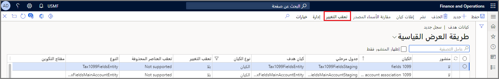

تُمكّنك وظيفة تعقب التغييرات من تصدير البيانات بشكل متزايد من تطبيقات Finance and Operations باستخدام Data Management Framework.
للقيام بذلك، يجب عليك أولاً تمكين تعقب التغييرات للكيانات. إذا لم يتم تمكين تعقب التغييرات، يمكنك فقط تمكين تصدير كامل في كل مرة. 

يدعم تعقب التغييرات كلاً من سيناريوهات إحضار قاعدة بياناتك الخاصة وسيناريوهات عدم إحضار قاعدة بياناتك الخاصة (non-BYOD). ويسمح BYOD بتعقب الحذف إذا كان الكيان يدعمه.

لتمكين تعقب التغييرات، ستحتاج إلى الوصول إلى مساحة عمل **إدارة البيانات**. بالنسبة لسيناريوهات عدم إحضار BYOD، يمكن تمكين تعقب التغييرات من صفحة قائمة كيانات البيانات في مساحة عمل **إدارة البيانات** بواسطة تحديد **تعقب التغيير** في الكيان.

1.  ضمن مساحة عمل **إدارة البيانات**، حدد **تكوين تصدير الكيان إلى قاعدة البيانات**.
2.  في صفحة **مخزن الكيان**، حدد البيانات المراد تصدير البيانات إليها.
3.  حدد **نشر** في جزء الإجراءات. يمكنك نشر أكثر من كيان واحد إلى قاعدة البيانات.
4.  عند نشر الكيان، حدد الكيان.
5.  حدد **تعقب التغيير**. 

    
6.  يمكنك التحديد من العديد من الخيارات لتعقب التغييرات التي تطرأ على بيئتك:
    -  **تمكين الجدول الرئيسي** - تؤدي التغييرات التي يتم إجراؤها على أي حقول في الجدول الأساسي إلى حدوث تغيير في الكيان. التغييرات التي يتم إجراؤها على الحقول في الجداول الثانوية لا تحدث تغييراً في الكيان.
    -  **تمكين الكيان الكامل** - تؤدي التغييرات التي يتم إجراؤها على أي حقول في أي جدول إلى حدوث تغيير في الكيان.
    -  **تمكين الاستعلام المخصص** - تحديد مجموعة من الحقول المخصصة من أي جداول يجب أن تؤدي إلى حدوث تغيير في الكيان.
