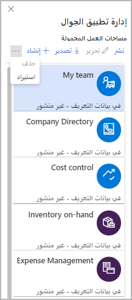
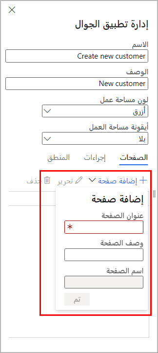
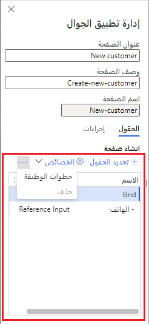
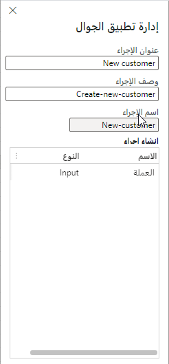

يُستخدم Application Object Server‏ (AOS) لتطبيقات التمويل والعمليات لمشاركة كائنات التطبيق والمعلومات كأداة فعالة لزيادة أداء التطبيق.

يتصل تطبيق الأجهزة المحمولة بـ AOS للحصول على البيانات الوصفية لمساحات العمل المحمولة (والصفحات والحقول التي تظهر على الصفحة)، وللحصول على بيانات للحقول الموجودة على الصفحات. 
 
 

في كل مرة يطلب فيها تطبيق الأجهزة المحمولة بيانات لصفحة ما، تُنشئ AOS جلسة جديدة تستخدم سياق الشخص الذي يستخدم تطبيق الأجهزة المحمولة. ويستخدم AOS بعد ذلك سياق هذا الشخص لفتح النماذج المقابلة (باستخدام عناصر القائمة المقابلة). 

يمكن لـ AOS فتح نماذج متعددة في تتابع سريع وتنفيذ إجراءات على تلك النماذج (على سبيل المثال، التصفية وفتح **مربعات الحقائق**، وتغيير صفحات علامات التبويب والنقر فوق الأزرار). يتم أيضاً تشغيل أي منطق أعمال في النماذج كالمعتاد. من خلال هذه العملية، يجمع AOS قيم البيانات من الحقول المطلوبة ثم يرسل تلك البيانات مرة أخرى إلى تطبيق الأجهزة المحمولة.

## التنقل في تطبيق الأجهزة المحمولة

لبدء العمل مع إطار عمل تطبيق الأجهزة المحمولة، انتقل إلى **الإعدادات > تطبيق الأجهزه المحمولة**.
 

يتكون التنقل في تطبيق الأجهزة المحمولة من أربعة مفاهيم بسيطة: لوحة المعلومات ومساحات العمل والصفحات والإجراءات. 

عند فتح إطار عمل تطبيق الأجهزة المحمولة، يمكنك عرض إدارة مصمم تطبيقات الأجهزة المحمولة. هنا، يمكنك نشر التطبيقات وإلغاء نشرها، واستيراد التطبيقات وتصديرها، وإنشاء تطبيق أجهزة محمولة جديد.
 
عند بدء تشغيل التطبيق، يتم فتحه على لوحة المعلومات. في لوحة المعلومات، لاحظ أنها تحتوي على قائمة بمساحات العمل المتوفرة في بيئة تطبيقات التمويل والعمليات.
 

 

في كل مساحة عمل، يمكنك عرض قائمة بالصفحات المتوفرة لمساحة العمل هذه. 
 

  

في إحدى الصفحات، يمكنك عرض البيانات التي تم تجميعها من صفحة أو أكثر من صفحات تطبيقات التمويل والعمليات.
 
 

تقوم وظيفة خطوة الوظيفة تلقائياً بإنشاء دليل المهام لمستخدم الأعمال، كما هو موضح في الشكل التالي.
 
 

من إحدى الصفحات، يمكنك الانتقال إلى صفحات أخرى للحصول على البيانات ذات الصلة، مثل تفاصيل أو بنود الكيان. في الصفحة، يمكنك عرض قائمة بالإجراءات المتوفرة لهذه الصفحة. تتيح لك الإجراءات إنشاء بيانات موجودة أو تحريرها.
 

 

بعد الانتهاء من تصميم التطبيق الخاص بك، انشره لإتاحته في تطبيق Dynamics 365 for Unified Operations للأجهزة المحمولة‬ على جهازك. لعرض التطبيق المنشور على جهازك الذكي، مثل الهاتف أو الكمبيوتر اللوحي، يمكنك إما لمس الشاشة بإصبعك أو استخدام جهاز تأشير للضغط على زر، وسحب الشاشة لأسفل، ثم تحريرها. تشير هذه الإجراءات إلى التطبيق، مثل الصفحة الرئيسية (لوحة المعلومات) للتطبيق، حيث يمكنك عرض قائمة مساحات العمل لتحديث محتويات الشاشة. يسمى هذا *السحب للتحديث*. 

يمكنك السحب للتحديث في تطبيق الأجهزة المحمولة لجعل تطبيق الأجهزة المحمولة يقوم بتحديث بياناته أو بيانات التعريف الخاصة به في أي وقت. بعد تحرير مساحة عمل موجودة أو نشر مساحة عمل، تأكد من السحب للتحديث في تطبيق الأجهزة المحمولة، إما في قائمة مساحات العمل (إذا أضفت مساحة عمل أو منطق عمل) أو قائمة الصفحات (إذا قمت بتعديل صفحة أو إجراء). تكون مساحات العمل التي تم نشرها في تطبيقات التمويل والعمليات مرئية لجميع المستخدمين. 

في تطبيقات التمويل والعمليات، يقوم أمان عنصر القائمة بإخفاء الصفحات التي لا يمتلك المستخدم حق الوصول إليها تلقائياً. إذا لم يكن لدى المستخدم حق الوصول إلى أي صفحات في مساحة العمل، فسيتم إخفاء مساحة العمل.
يتيح لك مصمم تطبيقات الأجهزة المحمولة تحديد حقول البيانات المحددة من النماذج التي يجب أن تظهر في تطبيق الأجهزة المحمولة.

 
