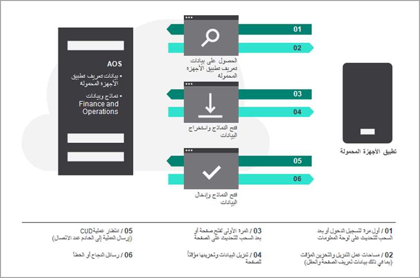

يُستخدم Application Object Server‏ (AOS) لتطبيقات Finance and Operations لمشاركة كائنات التطبيق والمعلومات كأداة فعالة لزيادة أداء التطبيق.The Finance and Operations apps Application Object Server (AOS) is used for sharing application objects and information as an effective tool to increase application performance.

يتصل تطبيق الأجهزة المحمولة بـ AOS للحصول على البيانات الوصفية لمساحات العمل المحمولة (والصفحات والحقول التي تظهر على الصفحة)، وللحصول على بيانات للحقول الموجودة على الصفحات.The mobile app communicates with the AOS to get metadata for the mobile workspaces (and the pages and fields that appear on the page), and to get data for the fields on the pages. 
 
 

في كل مرة يطلب فيها تطبيق الأجهزة المحمولة بيانات لصفحة ما، تُنشئ AOS جلسة جديدة تستخدم سياق الشخص الذي يستخدم تطبيق الأجهزة المحمولة.Each time that the mobile app requests data for a page, AOS creates a new session that uses the context of the person who is using the mobile app. ويستخدم AOS بعد ذلك سياق هذا الشخص لفتح النماذج المقابلة (باستخدام عناصر القائمة المقابلة).AOS then uses that person’s context to open the corresponding forms (by using the corresponding menu items). 

يمكن لـ AOS فتح نماذج متعددة في تتابع سريع وتنفيذ إجراءات على تلك النماذج (على سبيل المثال، التصفية وفتح **مربعات الحقائق**، وتغيير صفحات علامات التبويب والنقر فوق الأزرار).AOS can open multiple forms in quick succession and perform actions on those forms (for example, filtering, opening **Fact Boxes**, changing tab pages, and clicking buttons). يتم أيضاً تشغيل أي منطق أعمال في النماذج كالمعتاد.Any business logic on the forms is also run as usual. من خلال هذه العملية، يجمع AOS قيم البيانات من الحقول المطلوبة ثم يرسل تلك البيانات مرة أخرى إلى تطبيق الأجهزة المحمولة.Through that process, AOS collects the data values from the requested fields and then sends that data back to the mobile app.

## التنقل في تطبيق الأجهزة المحمولةNavigate the mobile app

لبدء العمل مع إطار عمل تطبيق الأجهزة المحمولة، انتقل إلى **الإعدادات > تطبيق الأجهزه المحمولة**.To start working with the mobile app framework, go to **Settings > Mobile app**.
 

يتكون التنقل في تطبيق الأجهزة المحمولة من أربعة مفاهيم بسيطة: لوحة المعلومات ومساحات العمل والصفحات والإجراءات.Navigation in the mobile app consists of four simple concepts: the dashboard, workspaces, pages, and actions. 

عند فتح إطار عمل تطبيق الأجهزة المحمولة، يمكنك عرض إدارة مصمم تطبيقات الأجهزة المحمولة.When the mobile app framework opens, you can view the Manage mobile app designer. هنا، يمكنك نشر التطبيقات وإلغاء نشرها، واستيراد التطبيقات وتصديرها، وإنشاء تطبيق أجهزة محمولة جديد.Here, you can publish and unpublish apps, import and export apps, and create a new mobile app.
 
عند بدء تشغيل التطبيق، يتم فتحه على لوحة المعلومات.When you start the app, it opens on the dashboard. في لوحة المعلومات، لاحظ أنها تحتوي على قائمة بمساحات العمل المتوفرة في بيئة تطبيقات Finance and Operations.On the dashboard, notice that it contains a list of workspaces that are available in your Finance and Operations apps environment.
 

 

في كل مساحة عمل، يمكنك عرض قائمة بالصفحات المتوفرة لمساحة العمل هذه.In each workspace, you can view a list of pages that are available for that workspace. 
 

  

في إحدى الصفحات، يمكنك عرض البيانات التي تم تجميعها من صفحة أو أكثر من صفحات تطبيقات Finance and Operations.On a page, you can view data that is collected from one or more Finance and Operations apps pages.
 
 

تقوم وظيفة خطوة الوظيفة تلقائياً بإنشاء دليل المهام لمستخدم الأعمال، كما هو موضح في الشكل التالي.The job-step functionality automatically generates the task guide for the business user, as shown in the following figure.
 
 

من إحدى الصفحات، يمكنك الانتقال إلى صفحات أخرى للحصول على البيانات ذات الصلة، مثل تفاصيل أو بنود الكيان.From a page, you can go to other pages for related data, such as an entity details or lines. في الصفحة، يمكنك عرض قائمة بالإجراءات المتوفرة لهذه الصفحة.On a page, you can view a list of actions that are available for that page. تتيح لك الإجراءات إنشاء بيانات موجودة أو تحريرها.Actions let you create or edit existing data.
 

 

بعد الانتهاء من تصميم التطبيق الخاص بك، انشره لإتاحته في تطبيق Dynamics 365 for Unified Operations للأجهزة المحمولة‬ على جهازك.After you finish designing your application, publish it to make it available on Dynamics 365 for Unified operations mobile app on your device. لعرض التطبيق المنشور على جهازك الذكي، مثل الهاتف أو الكمبيوتر اللوحي، يمكنك إما لمس الشاشة بإصبعك أو استخدام جهاز تأشير للضغط على زر، وسحب الشاشة لأسفل، ثم تحريرها.To view the published application on your smart device, such as phone or tablet, you can either touch the screen with a finger or use a pointing device to press a button, drag the screen downward, and then release it. تشير هذه الإجراءات إلى التطبيق، مثل الصفحة الرئيسية (لوحة المعلومات) للتطبيق، حيث يمكنك عرض قائمة مساحات العمل لتحديث محتويات الشاشة.These actions signal to the application, such as the main landing page (dashboard) of the app, where you can view the list of workspaces to refresh the contents of the screen. يسمى هذا *السحب للتحديث*.This is called *pull-to-refresh*. 

يمكنك السحب للتحديث في تطبيق الأجهزة المحمولة لجعل تطبيق الأجهزة المحمولة يقوم بتحديث بياناته أو بيانات التعريف الخاصة به في أي وقت.You can pull-to-refresh in the mobile app to make the mobile app update its data or metadata at any time. بعد تحرير مساحة عمل موجودة أو نشر مساحة عمل، تأكد من السحب للتحديث في تطبيق الأجهزة المحمولة، إما في قائمة مساحات العمل (إذا أضفت مساحة عمل أو منطق عمل) أو قائمة الصفحات (إذا قمت بتعديل صفحة أو إجراء).After editing an existing workspace or publishing a workspace, be sure to pull-to-refresh in the mobile app, in either the list of workspaces (if you added a workspace or business logic) or the list of pages (if you modified a page or an action). تكون مساحات العمل التي تم نشرها في تطبيقات Finance and Operations مرئية لجميع المستخدمين.Workspaces that have been published to Finance and Operations apps are visible to all users. 

في تطبيقات Finance and Operations، يقوم أمان عنصر القائمة بإخفاء الصفحات التي لا يمتلك المستخدم حق الوصول إليها تلقائياً.In Finance and Operations apps, menu item security automatically hides pages that the user doesn’t have access to. إذا لم يكن لدى المستخدم حق الوصول إلى أي صفحات في مساحة العمل، فسيتم إخفاء مساحة العمل.If a user doesn’t have access to any pages in a workspace, the workspace is hidden.
يتيح لك مصمم تطبيقات الأجهزة المحمولة تحديد حقول البيانات المحددة من النماذج التي يجب أن تظهر في تطبيق الأجهزة المحمولة.The mobile app designer lets you select the specific data fields from forms that should appear in the mobile app.

 
