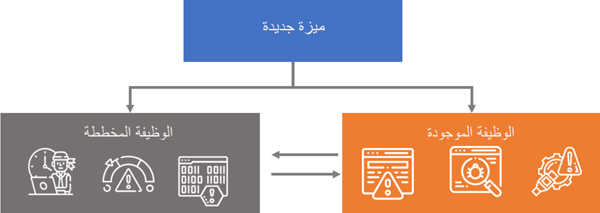

لفهم متطلبات تطوير التخصيصات للتنفيذ الخاص بك، تحتاج إلى معالجة تأثيرات تنفيذ ميزة جديدة وكيف يمكن أن تؤثر على الوظيفة الحالية. تحتاج إلى فهم العمليات الحالية ومقارنة كيف ستحتاج إلى تنفيذها في النظام الجديد. 

لا ينبغي أن تتعلق هذه العمليات بمتطلبات العمل، بل يجب أن تركز على الوضع الحالي وكيف ستؤثر التحسينات أو التغييرات على النظام ككل أثناء التنفيذ. لتصميم عملية وظيفية جديدة، حدد الاحتياجات وتأكد من أنك تعرف العملية خطوة بخطوة لإكمال هذا التطوير.

على سبيل المثال، إذا كانت لديك عمليات شراء تريد أتمتة ولا تستخدمها حالياً، فأنت بحاجة إلى مراعاة هذه الميزة الجديدة مع الحالة الحالية للمشروع وكيفية تأثيرها على الجوانب الأخرى للنظام.

عندما تقوم بتصميم الوثائق الخاصة بالمواصفات الوظيفية، فكلما كانت المواصفات أكثر تفصيلاً، كانت لديك فكرة أفضل عن الجهد المبذول في التخصيصات والتطوير.
 