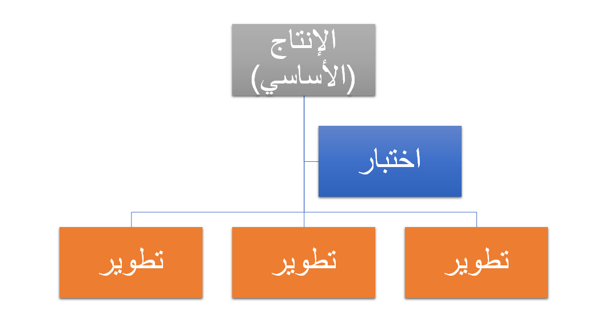

تفيد القدرة على وصف وتحديد نقوش التصميم المناسبة وممارسات عمليات نشر الأكواد لكل مشروع، وستقوم بإعداد المشروع للنجاح مع دعم الميزات والإنتاج.

## إستراتيجيات التفريع

إن فكرة إستراتيجيات التفريع هي الحصول على التكوين الخاص بك لإنشاء تدفق جيد من الأكواد للإنتاج، وأيضاً تمكينك من العمل على مشاريع أكواد متعددة في الوقت نفسه. 

يعد الاحتفاظ ببنية التفريع بسيطة قدر الإمكان بالغ الأهمية في المساعدة على تجنب زيادة تعقيدها بغير سبب ضروري. ستحتاج إلى توسيع الإستراتيجية حسب الحاجة فقط. وقد تحتاج إلى الحصول على إستراتيجية تفريع أكثر تعقيداً إذا كان للتطبيق الكثير من التخصيصات. 

وبشكل عام، سترغب في البدء بإستراتيجية من ثلاثة أفرع على الأقل: أحدها للتطوير وواحد للاختبار والثالث لتحرير الكود الخاص بك إلى مثيل الإنتاج. 

وسيرتبط كل واحد من فروع الكود ببيئة أو أكثر في التنفيذ الخاص بك. للحصول على إستراتيجيات التفريع الأكثر تعقيداً والطرق المختلفة أو إستراتيجيات الإدارة، راجع الارتباطات المرجعية الموجودة في نهاية هذه الوحدة النمطية.

## تدفقات توزيع الأكواد

تختلف تدفقات توزيع الأكواد، أثناء الاتصال بالفروع التي تم إنشاء الكود منها، اختلافاً طفيفاً حسب بعض العوامل. وسيكون عليك مراعاة الغرض الذي تستخدم الأكواد لأجله. على سبيل المثال، ربما يكون الكود مطلوباً للانتقال إلى الإنتاج في أقرب وقت ممكن لإصلاح خطأ. وربما يكون الكود ضرورياً للحصول على وظائف إضافية ليست مهمة للمستقبل القريب. هذه بعض الاعتبارات التي ستساعدك في تحديد مكان توزيع الكود الخاص بك.

بشكل عام، ستحتاج إلى نقل الكود في البيئات، أي، من بيئات التطوير التي تم التحقق فيها منه إلى بيئة اختبار يمكن فيها لعدة مستخدمين تشغيله خلال العملية التي قمت بتعديلها. بعد اختبار الكود، ستحتاج إلى نقله إلى بيئة إصدار أو تشغيل مرحلي ستقوم بتجهيزه ليتم نقله إلى الإنتاج. في تطبيقات Finance and Operations، سيكون من الضروري توزيع الكود في بيئة الاختبار القياسي واختبار القبول من الطبقة 2، ثم تحديده كمرشح إصدار قبل إمكانية ترقيته إلى بيئة الإنتاج لضمان التحقق من صحته.

في إستراتيجيات التفريع وتدفق الأكواد التي تقوم بتطويرها، سيكون عليك تذكر أن هذه يمكن أن تتغير طوال التنفيذ، ولكن التخطيط للتغييرات بالغ الأهمية لأخذ هدف الإنهاء الخاص بالتنفيذ بعين الاعتبار.
 
