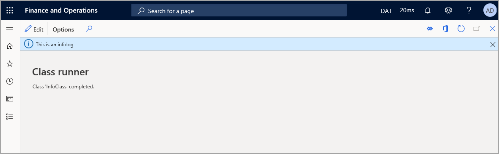

النطاق هو المنطقة التي يوجد بها أحد الأصناف أو يمكن الوصول إليه منها. توجد متغيرات X++‎ وأساليبها داخل نطاق محدد. يمكن تعيين النطاق بواسطة وضع الإقرار واستخدام معرفات الوصول.
 
معرفات الوصول هي `[public]` و`[protected]` و`[private]`.
 
-   **عام** - يمكن استدعاء الأساليب التي تم إقرارها باعتبارها عامة من أي مكان يمكن للفئة الوصول إليه. بالإضافة إلى ذلك، يمكن تجاوز أسلوب عام بواسطة فئة فرعية ما لم يتم إقرار الأسلوب كنهائي.
-   **محمي** - يمكن تجاوز الأساليب المحمية في الفئات الفرعية. يمكن استدعاء الأساليب التي تم إعلانها على أنها محمية فقط من:
    -   الأساليب الموجودة في الفئة.
    -   الأساليب الموجودة في فئة فرعية خاصة بفئة تحتوي على الأسلوب المحمي.
-   **خاص** - يمكن استدعاء الأساليب التي تم إقرارها كخاصة فقط من الأساليب الموجودة في الفئة التي تم إقرار الأسلوب الخاص منها.
    لا يمكن تجاوز أي أسلوب خاص في فئة فرعية. عندما تقوم بإنشاء أسلوب جديد، تكون الكلمة الأساسية للموصل الافتراضي التي تظهر في محرر الأكواد خاصة. وهذا هو الوضع الافتراضي الأكثر محافظة لأقصى حد من الأمان.

## <a name="internal"></a>‏‏داخلي

*داخلي* هي كلمة أساسية في X++‎. لها نفس الدلالات التي في C#‎ انظر [داخلي (مرجع C#‎)](https://docs.microsoft.com/dotnet/csharp/language-reference/keywords/internal/?azure-portal=true).

عندما تقوم بتحديد فئة أو أسلوب كداخلي، فإنه يمكن الوصول إليه فقط من داخل النموذج الذي يتم تعريفه فيه.
```xpp
internal class MyInternalClass
{
   internal void myInternalMethod()
   {
   }
}
```
لاحظ أنه يمكنك تعريف الأساليب الداخلية في الفئات العامة أيضاً.

## <a name="instance-variables"></a>متغيرات المثيل

تحتوي متغيرات المثيل على نطاق كبير ويشار إليها أيضاً باسم حقول الفئات في X++‎. يتم إقرار هذه المتغيرات في إقرار الفئة ويمكن الوصول إليها من أي أسلوب في الفئة والفئات الفرعية التي تقوم بتوسيع الفئة، إذا تم إقرارها كعامة أو محمية.

## <a name="local-variables"></a>المتغيرات المحلية

المتغيرات المحلية لها نطاق صغير. يتم تحديد هذه المتغيرات في أسلوب ويمكن الوصول إليها في هذا الأسلوب فقط.

المحددات هي نوع من المتغيرات المحلية التي يتم تحديدها في أسلوب.

لاستخدام متغير من أحد النطاقات إلى نطاق آخر، يجب تمرير المتغير باستخدام المُحددات. يمكن للأساليب استخدام محددات متعددة. تُعامل المحددات مثل المتغيرات المحلية وتتم تهيئتها بالقيمة من المحدد في استدعاء الأسلوب. في المثال التالي، يكون لأسلوب الفئة مُحددان. وهذا يعطي *method1* إمكانية الوصول إلى أربعة متغيرات. يمكن الوصول إلى متغيرَي المثيل *a* و *b*، ويعمل المحددان *x* و *y* كمتغيرات محلية. يسمح استخدام المحددات بتعيين القيم لهذه المحددات عند استدعاء الأسلوب. إذا تم استدعاء *الأسلوب* باستخدام الكود `Test.method1(a,b);`، فسيتم تعيين المتغير *x* على القيمة **السيارة** وسيتم تعيين المتغير *y* إلى القيمة **20**. ثم يمكنك استخدام قيم متغيرات المحدد لتعيين القيم إلى متغيرات المثيل *c* و *d*.

```xpp
class Test
{
     str a = "Car";
     int b = 20;
     str c;
     int d:

    void method1(str x, int y)
        {
          c = x;
          d = y;
        }
}
```

خذ في اعتبارك أنه عند تمرير قيمة من خلال المحددات، فإنك لا تغيِّر قيمة المتغير الأصلي افتراضياً. ويكون المصطلح الخاص بهذا هو "الاستدعاء بالقيمة" بالمقارنة بالمرجع "استدعاء حسب المرجع". يتم تغيير المتغير المحلي فقط. 

### <a name="example"></a>مثال

في المثال التالي، يكون لدى *method2* متغير محلي *a* بالقيمة 5. تعرض عبارة `info()` الأولى قيمة *a*، وهي 5. وتقوم باستدعاء *method1* وتمرير قيمة المتغير المحلي الخاص به *a*. *Method1* لديه الآن متغير محلي مختلف *a*، بالقيمة 5. ثم يزيد *Method1* القيمة بمقدار واحد، مما يؤدي إلى جعل *a* بقيمة 6. ثم يعرض `info()` العبارة قيمة 6. ستعود الأكواد إلى *method2* وتقوم بتشغيل عبارة `info()` الثانية. سيؤدي ذلك إلى عرض قيمة 5. وذلك لأنه رغم أن اسم المتغير هو نفسه، إلا أن النطاق فريد للأساليب الخاصة به.

```xpp
class infoValue
{
     void method1(int a)
     {
       a = a ++;
       info(int2str(a));
     }

      void method2()
      {
        int a = 5;
        info(int2str(a));
        this.method1(a);
        info(int2str(a));
      }
}

```

توضح الصورة التالية كيفية عرض *المعلومات* في واجهة المستخدم.



