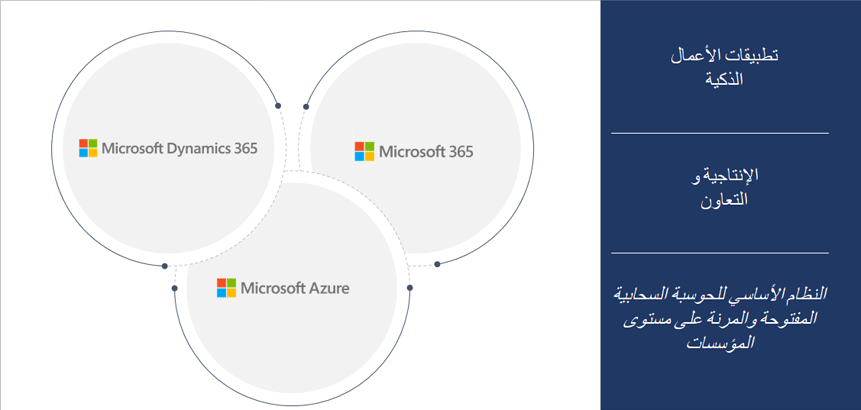

الهدف من الحوسبة السحابية هو تسهيل عمل المؤسسات من خلال السماح لها بالتركيز على ما تفعله وما الذي تكون الأفضل فيه. وتوفر الخدمات السحابية شراء موارد الحوسبة ودعمها وإدارتها. أصبحت المؤسسات الآن ليست بحاجة إلى الحفاظ على مرافق الحوسبة الخاصة بها ويمكنها تركيز طاقتها ووقتها وأموالها على الأهداف الإستراتيجية.

ضع في اعتبارك الحوسبة السحابية مثل مساحة التخزين أو دورات وحدة المعالجة المركزية (CPU) أو أجهزة الكمبيوتر من مؤسسة أخرى تُستخدم كخدمات تأجير. عادة، لا تدفع مبلغاً ثابتاً ولكنك ستدفع مقابل الخدمات السحابية التي تستخدمها. عندما يحتاج عملك إلى التغيير، يتيح لك هذا الموقف خفض تكاليف التشغيل وتشغيل المرافق الخاصة بك بشكل أكثر فاعلية والتوسع. سيكون لعملك احتياجاته الفريدة. ولتلبية هذه الاحتياجات، تقدم Microsoft مجموعة واسعة من الخدمات. 

تقدم سحابة Microsoft خدمات الحوسبة السحابية التي تتسم بالمرونة والفعالية من حيث التكلفة. ستشمل خدمات الحوسبة السحابية من Microsoft بشكل عام قوة الحوسبة والتخزين والشبكات والتحليلات. لمزيد من المعلومات، انظر [مبادئ الحوسبة السحابية والنشر](https://docs.microsoft.com/learn/modules/principles-cloud-computing-dynamics-365-deployment/?azure-portal=true).

توفر سحابة Microsoft نظاماً أساسياً يجتمع بشكل فريد بحيث يمكن لجميع المؤسسات تمكين التحول الرقمي. يتم تقسيم سحابة Microsoft إلى ثلاث خدمات رئيسية:

- Microsoft Azure 
- Microsoft 365
- Microsoft Dynamics 365

## Microsoft Azure
تعمل Microsoft على تمكين حلقة التعليقات الرقمية مع سحابة Microsoft من خلال تقديم سحابة أكثر إنتاجية وهجينة وذكية وموثوق بها لإدارة أعمالك. Azure عبارة عن مجموعة موسعة من خدمات Microsoft التي تساعد مؤسستك في تلبية احتياجات تحديات أعمالها. يمكنك إنشاء التطبيقات وإدارتها ونشرها على شبكة عالمية ضخمة باستخدام الأدوات الموجودة في Azure. 

لمزيد من المعلومات، انظر [مقدمة إلى أساسيات Azure](https://docs.microsoft.com/learn/modules/intro-to-azure-fundamentals/?azure-portal=true). 

## Microsoft 365

Microsoft 365 عبارة عن سحابة إنتاجية تمكّنك من تمكين موظفيك من الإبداع والتعاون مع Windows وOffice 365 وSkype وTeams. يوفر Microsoft 365 الإمكانات الرئيسية التالية:

- تمكين العمل الجماعي وتبسيط سير العمل باستخدام Microsoft Teams. باستخدام Microsoft Teams، يمكنك التعاون والالتقاء والاتصال وتوصيل تطبيقات الأعمال في مكان واحد. 
- ويتيح لك الحفاظ على الإنتاجية أثناء التنقل باستخدام تطبيقات الأجهزة المحمولة كاملة الإمكانات. 
- يساعدك في إنجاز المزيد باستخدام أدوات الذكاء الاصطناعي المضمّنة، حيث تحتوي العديد من التطبيقات على ميزات ذكاء اصطناعي مضمنة. 
- يوفر رؤى لمساعدتك في تمكين موظفيك بالمعلومات والبيانات التي يحتاجونها لإنجاز عملهم. 
- قم بحماية أعمالك بأمان حديث وإدارة احتياجات المخاطر والامتثال باستخدام سحابة Microsoft. 

لمزيد من المعلومات، انظر [ما Microsoft 365؟](https://docs.microsoft.com/learn/modules/what-is-m365/?azure-portal=true) 

## Microsoft Dynamics 365
Microsoft Dynamics 365 يوفر تطبيقات الأعمال الذكية، مع مجموعة كاملة من الحلول عبر التسويق والمبيعات والتجارة وFraud Protection وGuides والخدمة والتمويل والعمليات والموارد البشرية. من خلال تطبيق المعرفة على جميع أنواع البيانات، يُحدث Dynamics 365 ثورة في إدارة علاقات العملاء (CRM) وتخطيط موارد المؤسسة (ERP). 

تساعد هذه المنهجية الشركات في الانتقال من قرارات الأعمال التفاعلية إلى وجهات النظر الإستراتيجية التي تمكّن موظفيها من تسريع نتائج الأعمال.

- تطبيقات Dynamics 365 هي تطبيقات أعمال معيارية تعمل بشكل رائع بمفردها وبشكل أفضل معاً.
- تمكّن تطبيقات Dynamics 365 الشركات من إعادة تصور عمليات الأعمال الخاصة بها ومواءمة مؤسساتها.
- يمكن للعملاء اعتماد تطبيقات فردية في وقت حاجتهم وتمتعهم بالمرونة لإضافة إمكانيات متكاملة جديدة بسرعة.
- يوفر Dynamics 365 نظاماً أساسياً يوحد البيانات الحافلة بذكاء مترابط.
- يربط Microsoft Power Platform الأنظمة في نظام سحابي ذكي وتلقائي وسلس.
- يتيح Microsoft Power Platform للشركاء توسيع التطبيقات وإنشائها لأعمدة محددة في المجال.

 
لمزيد من المعلومات، راجع [مقدمة إلى Microsoft Dynamics 365](https://docs.microsoft.com/learn/modules/introduction-dynamics-365/?azure-portal=true).

