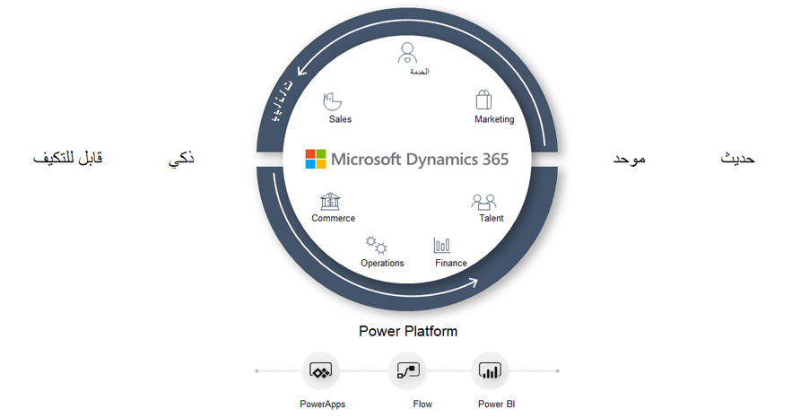

الهدف من الحوسبة السحابية هو تسهيل عمل المؤسسات من خلال السماح لها بالتركيز على ما تفعله وما الذي تكون الأفضل فيه.The aim of cloud computing is to make it easier for organizations to operate by allowing them to concentrate on what they do and what they are best at. وتوفر الخدمات السحابية شراء موارد الحوسبة ودعمها وإدارتها.Cloud services provide the purchase, support, and management of computing resources. أصبحت المؤسسات الآن ليست بحاجة إلى الحفاظ على مرافق الحوسبة الخاصة بها ويمكنها تركيز طاقتها ووقتها وأموالها على الأهداف الإستراتيجية.Organizations are now free from the need to maintain their computing facilities and can concentrate their energy, time, and money on strategic goals.

ضع في اعتبارك الحوسبة السحابية مثل مساحة التخزين أو دورات وحدة المعالجة المركزية (CPU) أو أجهزة الكمبيوتر من مؤسسة أخرى تُستخدم كخدمات تأجير.Consider cloud computing like storage space, CPU cycles, or computers from another organization that are used as renting services. عادة، لا تدفع مبلغاً ثابتاً ولكنك ستدفع مقابل الخدمات السحابية التي تستخدمها.Usually, you don’t pay a fixed sum but will pay for the cloud services that you are using. عندما يحتاج عملك إلى التغيير، يتيح لك هذا الموقف خفض تكاليف التشغيل وتشغيل المرافق الخاصة بك بشكل أكثر فاعلية والتوسع.When your business needs change, this situation lets you lower your operating costs, operate your facilities more effectively, and scale up. سيكون لعملك احتياجاته الفريدة.Your business will have its own unique needs. ولتلبية هذه الاحتياجات، تقدم Microsoft مجموعة واسعة من الخدمات.To meet those needs, Microsoft offers a vast range of services. 

تقدم سحابة Microsoft خدمات الحوسبة السحابية التي تتسم بالمرونة والفعالية من حيث التكلفة.Microsoft cloud offers cloud computing services that are flexible and cost efficient. ستشمل خدمات الحوسبة السحابية من Microsoft بشكل عام قوة الحوسبة والتخزين والشبكات والتحليلات.Microsoft cloud computing services will generally include computing power, storage, networking, and analytics. لمزيد من المعلومات، انظر [مبادئ الحوسبة السحابية والنشر](https://docs.microsoft.com/learn/modules/principles-cloud-computing-dynamics-365-deployment/?azure-portal=true).For more information, see [Principals of cloud computing and deployment](https://docs.microsoft.com/learn/modules/principles-cloud-computing-dynamics-365-deployment/?azure-portal=true).

توفر سحابة Microsoft نظاماً أساسياً يجتمع بشكل فريد بحيث يمكن لجميع المؤسسات تمكين التحول الرقمي.Microsoft cloud provides a platform that uniquely comes together so that all organizations can have digital transformation enabled. يتم تقسيم سحابة Microsoft إلى ثلاث خدمات رئيسية:Microsoft cloud is divided into three main services:

- Microsoft AzureMicrosoft Azure 
- Microsoft 365Microsoft 365
- Microsoft Dynamics 365Microsoft Dynamics 365

## Microsoft AzureMicrosoft Azure
تعمل Microsoft على تمكين حلقة التعليقات الرقمية مع سحابة Microsoft من خلال تقديم سحابة أكثر إنتاجية وهجينة وذكية وموثوق بها لإدارة أعمالك.Microsoft is enabling the digital feedback loop with Microsoft cloud by delivering the more productive, hybrid, intelligent, and trusted cloud to run your business. Azure عبارة عن مجموعة موسعة من خدمات Microsoft التي تساعد مؤسستك في تلبية احتياجات تحديات أعمالها.Azure is an expanding set of Microsoft services that helps your organization meet the needs of its business challenges. يمكنك إنشاء التطبيقات وإدارتها ونشرها على شبكة عالمية ضخمة باستخدام الأدوات الموجودة في Azure.You can build, manage, and deploy applications on a massive global network by using the tools within Azure. 

لمزيد من المعلومات، انظر [مقدمة إلى أساسيات Azure](https://docs.microsoft.com/learn/modules/intro-to-azure-fundamentals/?azure-portal=true).For more information, see [Introduction to Azure Fundamentals](https://docs.microsoft.com/learn/modules/intro-to-azure-fundamentals/?azure-portal=true). 

## Microsoft 365Microsoft 365

Microsoft 365 عبارة عن سحابة إنتاجية تمكّنك من تمكين موظفيك من الإبداع والتعاون مع Windows وOffice 365 وSkype وTeams.Microsoft 365 is a productivity cloud that enables you to empower your employees to be creative and collaborative with Windows, Office 365, Skype, and Teams. يوفر Microsoft 365 الإمكانات الرئيسية التالية:Microsoft 365 provides the following key capabilities:

- تمكين العمل الجماعي وتبسيط سير العمل باستخدام Microsoft Teams.Enables teamwork and simplifies workflow by using Microsoft Teams. باستخدام Microsoft Teams، يمكنك التعاون والالتقاء والاتصال وتوصيل تطبيقات الأعمال في مكان واحد.With Microsoft Teams, you can collaborate, meet, call, and connect business applications in one place. 
- ويتيح لك الحفاظ على الإنتاجية أثناء التنقل باستخدام تطبيقات الأجهزة المحمولة كاملة الإمكانات.Allows you to stay productive on the go with full-power mobile applications. 
- يساعدك في إنجاز المزيد باستخدام أدوات الذكاء الاصطناعي المضمّنة، حيث تحتوي العديد من التطبيقات على ميزات ذكاء اصطناعي مضمنة.Helps you get more done with AI embedded tools; many applications have built-in AI intelligence features. 
- يوفر رؤى لمساعدتك في تمكين موظفيك بالمعلومات والبيانات التي يحتاجونها لإنجاز عملهم.Provides insights to help you empower your employees with information and data that they need to get their work done. 
- قم بحماية أعمالك بأمان حديث وإدارة احتياجات المخاطر والامتثال باستخدام سحابة Microsoft.Protect your business with modern security and manage risk and compliance needs with Microsoft cloud. 

لمزيد من المعلومات، انظر [ما Microsoft 365؟](https://docs.microsoft.com/learn/modules/what-is-m365/?azure-portal=true)For more information, see [What is Microsoft 365?](https://docs.microsoft.com/learn/modules/what-is-m365/?azure-portal=true) 

## Microsoft Dynamics 365Microsoft Dynamics 365
Microsoft Dynamics 365 يوفر تطبيقات الأعمال الذكية، مع مجموعة كاملة من الحلول عبر التسويق والمبيعات والتجارة وFraud Protection وGuides والخدمة والتمويل والعمليات والموارد البشرية.Microsoft Dynamics 365 provides intelligent business applications, with a complete set of solutions across Marketing, Sales, Commerce, Fraud Protection, Guides, Service, Finance, Operations, and Human Resources. من خلال تطبيق المعرفة على جميع أنواع البيانات، يُحدث Dynamics 365 ثورة في إدارة علاقات العملاء (CRM) وتخطيط موارد المؤسسة (ERP).By applying knowledge to all types of data, Dynamics 365 revolutionizes Customer Relationship Management (CRM) and Enterprise Resource Planning (ERP). 

تساعد هذه المنهجية الشركات في الانتقال من قرارات الأعمال التفاعلية إلى وجهات النظر الإستراتيجية التي تمكّن موظفيها من تسريع نتائج الأعمال.This methodology helps companies move from reactive business decisions to strategic perspectives that enable business outcomes to be accelerated by their employees.

- تطبيقات Dynamics 365 هي تطبيقات أعمال معيارية تعمل بشكل رائع بمفردها وبشكل أفضل معاً.Dynamics 365 applications are modular business apps that work great alone and better together.
- تمكّن تطبيقات Dynamics 365 الشركات من إعادة تصور عمليات الأعمال الخاصة بها ومواءمة مؤسساتها.Dynamics 365 applications enable enterprises to reimagine their business processes and align their organizations.
- يمكن للعملاء اعتماد تطبيقات فردية في وقت حاجتهم وتمتعهم بالمرونة لإضافة إمكانيات متكاملة جديدة بسرعة.Customers can adopt individual apps at their time of need and have flexibility to rapidly add new integrated capabilities.
- يوفر Dynamics 365 نظاماً أساسياً يوحد البيانات الحافلة بذكاء مترابط.Dynamics 365 provides a platform that unifies data that is infused with threaded intelligence.
- يربط Microsoft Power Platform الأنظمة في نظام سحابي ذكي وتلقائي وسلس.Microsoft Power Platform connects systems in a seamless, automated, and intelligent cloud ecosystem.
- يتيح Power Platform للشركاء توسيع التطبيقات وإنشائها لأعمدة محددة في المجال.Power Platform allows partners to extend and build apps for specific industry verticals.

 
لمزيد من المعلومات، انظر [مقدمة إلى Microsoft Dynamics 365](https://docs.microsoft.com/learn/modules/introduction-dynamics-365/?azure-portal=true).For more information, see [Introduction to Microsoft Dynamics 365](https://docs.microsoft.com/learn/modules/introduction-dynamics-365/?azure-portal=true).

