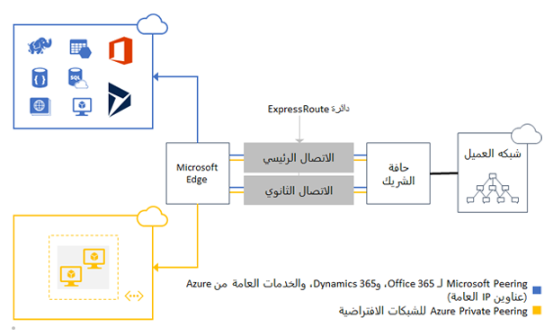
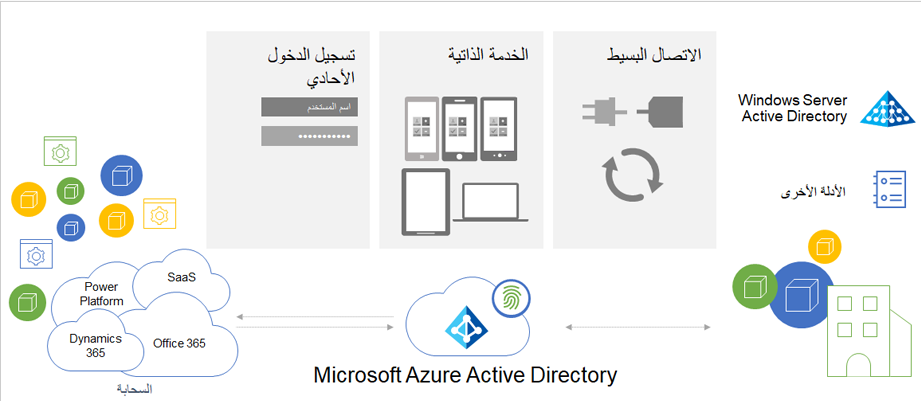
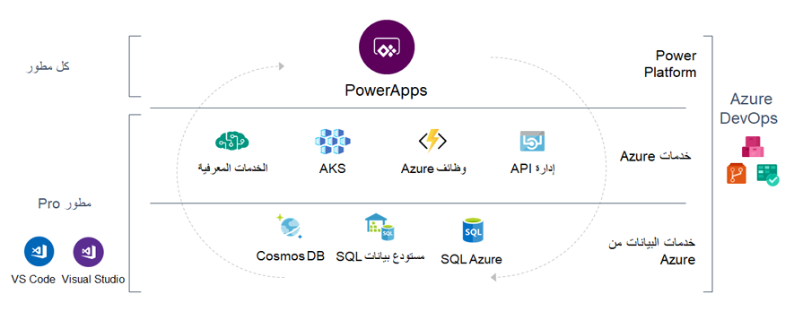

تم عمل تكامل بين تطبيقات Microsoft Azure مع Finance and Operations للمساعدة في تشغيل العديد من الإمكانات المضمنة بها، مثل البحث والذكاء. تقوم الأقسام التالية بمراجعة مفاهيم Microsoft Azure وغيرها من مفاهيم السحابة التي يجب وضعها في الاعتبار عند الترقية إلى حل سحابة Dynamics 365.

## اعتبارات Microsoft Azure

خذ بعين الاعتبار المفاهيم التالية عند العمل مع Microsoft Azure:

- **تحديد مركز بيانات Azure** - ضع في اعتبارك الموضع الذي تريد توزيع مركز بياناتك إليه باستخدام Azure والجوانب الأكثر منطقية لمؤسستك. للحصول على المزيد من المعلومات، راجع [توفُر Dynamics 365 وMicrosoft Power Platform](https://dynamics.microsoft.com/geographic-availability/?azure-portal=true).

   يجب أن تتضمن الاعتبارات الإضافية لاختيار مركز البيانات الخاص بك الاعتبارات القانونية والجغرافية، وسيادة البيانات، واختبار سرعة Azure (زمن الانتقال)، وMicrosoft Azure ExpressRoute. ومن المهم مراعاة أنه يمكن توزيع تطبيقات Finance and Operations على مجموعة فرعية من مناطق Azure. لمزيد من المعلومات، راجع القسم **توافر الخدمة في مناطق Azure** في صفحة [نظرة عامة حول التوزيع عبر السحابة](/dynamics365/fin-ops-core/dev-itpro/deployment/cloud-deployment-overview?azure-portal=true&toc=/dynamics365/finance/toc.json#service-availability-in-azure-regions).

- **التعرف على كيفية عمل المصادقة في Azure** - ضع في اعتبارك كيفية المصادقة مع Azure. ويتم دعم نوعين من مصادقة التطبيقات من خلال Microsoft Azure Active Directory (Azure AD): مصادقة تطبيق العميل الأصلي ومصادقة تطبيق الويب.

- **إعادة النظر في تصميم الحل الخاص بك باستخدام Microsoft cloud** - أعد تقييم البنية الأساسية الحالية في AX 2012، وتأكد من أنك تتبع أحدث ممارسات Microsoft. يجب أيضاً مراعاة وظيفة Dynamics 365 الجديدة التي يمكنك استبدال تخصيصات 2012 AX بها. باستخدام أدوات وخدمات Microsoft في سحابة Microsoft، توفر الترقية إلى Dynamics 365 فرصة لتحديث بنية الحلول الخاصة بك باستخدام التطبيقات والخدمات المصممة لهذا الغرض خارج تطبيقات Finance and Operations. على سبيل المثال، ما تم تطويره أعلى AX 2012 كتكامل مخصص أو وحدة نمطية مخصصة قد ينتقل اليوم إلى خدمات تكامل Azure أو تطبيق قائم لغرض معين أعلى Microsoft Power Apps.

## مناطق Azure

يمكن توزيع تطبيقات Finance and Operations في مجموعة فرعية من مراكز بيانات Microsoft Azure باستخدام Microsoft Dynamics 365 Lifecycle Services. يتوفر Azure بشكل عام في مراكز البيانات والمواقع الجغرافية حول العالم. باستخدام تطبيقات Finance and Operations، يمكن للعملاء تحديد المنطقة أو مركز البيانات الذي سيتم فيه تخزين بيانات العملاء. قد تقوم Microsoft بنسخ البيانات إلى مناطق أخرى لضمان استمرارية البيانات، ولكنك لن تقوم بنسخ بيانات العميل أو نقلها خارج الموقع الجغرافي.

للحصول على المزيد من المعلومات، راجع [توفُر Dynamics 365 وMicrosoft Power Platform](https://dynamics.microsoft.com/geographic-availability/?azure-portal=true).

بعد أن تفكر في الوقت الذي تريد فيه أن يكون لديك مركز بيانات Azure، يجب أن تفكر في موقع مرافق الإنتاج أو المستودع أو المستخدمين أو معظم قاعدة عملائك. يجب تحديد عوامل الموقع هذه قبل بدء التنفيذ. يمكنك تغيير المناطق لاحقاً في المشروع، على الرغم من أن هذا الجهد كبير ويمكن أن يشمل وقت التعطل عن العمل.

## Azure ExpressRoute

يمثل Azure ExpressRoute أداة اختيارية تُستخدم في مقر عملك أو في بيئة الترتيب لإنشاء روابط خاصة بين مراكز بيانات Azure والبنية الأساسية. ارتباطات ExpressRoute لا يمكن الوصول إليها على الإنترنت العام، وتوفر موثوقية أكبر وسرعات أعلى ومعدلات زمن انتقال أقل من اتصالات الإنترنت القياسية.

تساعدك ExpressRoute في إنشاء اتصالات مخصصة عالية الكفاءة بين مواقعك في الموقع ومراكز بيانات Azure. تعد دائرة ExpressRoute ارتباطاً منطقياً من خلال موفر شبكة بين شبكة العميل في الموقع وخدمات Microsoft cloud service. لا تنتقل اتصالات ExpressRoute عبر الإنترنت العام، وهي توفر موثوقية أكبر وسرعات أسرع وزمن انتقال أقل من اتصالات الإنترنت العادية. ضع في اعتبارك أن ExpressRoute تحتاج إلى التكوين لكل بلد / منطقة لديك فيها هذا المتطلب.

لمزيد من المعلومات، راجع تطبيقات [Azure ExpressRoute وFinance and Operations](/dynamics365/fin-ops-core/dev-itpro/deployment/expressroute/?azure-portal=true)، وقسم **متطلبات الشبكة** في [متطلبات النظام لعمليات التوزيع في السحابة](/dynamics365/fin-ops-core/fin-ops/get-started/system-requirements?azure-portal=true#network-requirements).

## Azure Active Directory

تستخدم تطبيقات Finance and Operations خدمات Azure Active Directory (Azure AD) لكافة احتياجات المصادقة وإدارة الهوية. يدعم Azure AD الاتصال البسيط لتطبيقات السحابة والاتحاد مع الدلائل الأخرى، بما في ذلك تطبيق Azure المحلي. يحتوي Azure AD على مدخل الإدارة الخاص به لإدارة المستخدمين، بينما يعرض أيضاً واجهات برمجة التطبيقات (API) لإدارة المستخدم. يعد Azure AD موفر هوية رئيسياً. للوصول إلى النظام، يجب توفير المستخدمين في مثيل Finance and Operations، ويجب أن يتوفر لهم حساب Azure AD صالح في مستأجر معتمد. يدعم Azure AD أيضاً تسجيل الدخول الأحادي (SSO) مع الخدمات الأخرى التي تستخدم نفس المستأجر (على سبيل المثال Office 365 وDynamics 365 Sales).

لمزيد من المعلومات، راجع [حماية الهوية والوصول باستخدام Azure Active Directory](/learn/paths/m365-identity/?azure-portal=true).

## Microsoft Power Platform

تقدم Microsoft cloud العديد من المفاهيم الجديدة التي تقدم طرقاً جديدة لتصميم الحل. يحتوي كل من Dynamics 365، وMicrosoft Power Platform، وAzure على نظام بنائي منسق خارج تطبيقات Finance and Operations التي يمكنك الاستفادة منها لتوسيع الحل والتكامل معه بسلاسة.

تعد Microsoft Power Platform مجموعة منتجات تقدم حلول أعمال مبتكرة عبر نظام أساسي متكامل بسلاسة. يسمح كل من Power BI، وPower Apps، وPower Automate، وPower Virtual Agents لأي شركة بتحليل وتصور أداء الأعمال في الوقت الفعلي، وإنشاء تطبيقات مخصصة بسرعة، وأتمتة مهام سير العمل، ودمج إمكانات الذكاء الاصطناعي.

يوفر Microsoft Power Platform واجهة بأكواد قليلة لأي مستخدم لإنشاء تطبيقات مخصصة بسرعة مع توفير أدوات فعالة للمطورين المحترفين في الوقت نفسه. يتيح لك هذا التوفير إمكانية دمج الحلول المبتكرة عبر Azure، وMicrosoft 365، وDynamics 365، والتطبيقات المستقلة. عند تقاطع هذه المنتجات يكمن التحول الرقمي، الذي يمنح العميل القدرة على الابتكار في أي مكان مع إطلاق العنان للقيمة في كل مكان.

## Dataverse

تمثل Microsoft Dataverse خدمة بيانات قائمة على السحابة بعدد قليل من الأكواد وشبكة تطبيقات تتيح لك استخدام الاتصال والأمان المحسّن لخدمات Microsoft. يتصل Dataverse بكافة واجهات Microsoft Power Platform بحيث يمكن إدارة الشركة وأتمتتها وتحسينها بالكامل. باستخدام الكيانات والحقول القياسية والقدرة على تحديد العلاقات بين بياناتك، تم تصميم Dataverse للحصول على حلول فعالة وقابلة للتوسعة.

تم تصميم Dataverse للاتصال بتطبيقات Finance and Operations. يمكنك استخدام الأدوات المضمنة، مثل الكتابة المزدوجة، التي تمكنك من مشاركة البيانات عبر تطبيقات Dynamics 365 بسلاسة وسرعة.

بالإضافة إلى ميزة الكتابة المزدوجة، تتوفر جميع كيانات OData في تطبيقات Finance and Operations ككيانات ظاهرية في Dataverse. الآن، يمكنك إعداد تجارب في تطبيقات مشاركة العملاء باستخدام البيانات مباشرةً من تطبيقات Finance and Operations مع الإمكانية الكاملة للإنشاء والقراءة والتحديث والكتابة، دون الحاجة إلى النسخ إلى Dataverse. يمكنك استخدام مداخل Power Apps لإنشاء مواقع ويب خارجية تمكِّن سيناريوهات التعاون لعمليات الأعمال في تطبيقات Finance and Operations.

توفر الكيانات الظاهرية آلية لك لاستخدام Microsoft Power Platform مع تطبيقات Finance and Operations دون الحاجة إلى نسخ البيانات فعلياً إلى Dataverse. استخدم هذا الدليل لتحديد ما إذا كانت المتطلبات ستحتاج إلى كتابة مزدوجة أو تكامل بيانات أو كيانات ظاهرية. الكيانات الظاهرية وأداة دمج البيانات / الكتابة المزدوجة هي تقنيات تكميلية، مما يعني أنه يمكن استخدامها معاً، إذا لزم الأمر.

## لا حدود لاستخدامات Microsoft Power Platform وAzure معاً

تواصل Microsoft تقديم الخدمات داخل Azure وMicrosoft Power Platform، مما سيؤدي إلى تمكين الأشخاص والمؤسسات للقيام بالمزيد. علاوة على ذلك، لن تواجه أي حدود مع استخدام Power Apps لأنها تتمتع باتصال واسع النطاق في Azure لخدمات الحوسبة أو واجهة برمجة التطبيقات (API)، مثل Azure Functions أو إدارة واجهة برمجة التطبيقات (API) أو Azure Kubernetes Service ‏(AKS). يمكن أيضاً لـ Power Apps الاتصال بكافة خدمات بيانات Azure، مثل Azure SQL أو Azure Cosmos DB أو مستودع بيانات SQL. بالإضافة إلى ذلك، تعمل جميع أدوات التطوير القياسية. يمكنك استخدام Visual Studio لكتابة المكونات الإضافية، وكتابة الأكواد لكتابة عناصر التحكم المخصصة، واستخدام Azure DevOps في التوزيع.

