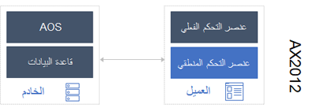

Finance and Operations هو تطبيق لتخطيط موارد المؤسسة مُعاد تصوره يهدف تصميمه إلى التوزيع عبر السحابة، بمعني أنك ستجد اختلافات مهمة في البنية إذا كنت تقوم بالترقية من AX 2012.Finance and Operations is a reimagined ERP application that is designed for cloud deployment, meaning that you will find significant differences in the architecture if you are upgrading from AX 2012. ونظراً إلى أن مؤسستك تبدأ الترقية إلى Dynamics 365، فإنك بحاجه إلى فهم اختلافات البنية هذه بحيث يمكنك اتخاذ قرارات ستساعد على تنفيذ الترقية بشكلٍ سلس قدر الإمكان.As your organization begins upgrading to Dynamics 365, you need to understand these architecture differences so that you can make decisions that will help the upgrade be as seamless as possible. 

تعمل تطبيقات Finance and Operations على نظام أساسي جديد بشكلٍ ملحوظ يمكّنك من الاستعداد لاستخدام الخدمات السحابية.Finance and Operations apps run on a significantly new platform that enables you to be cloud ready. ضع في اعتبارك أن بعض الميزات تم إهمالها أو إعادة بناؤها بإضافة ميزات.Keep in mind that some features have been deprecated or have been refactored with feature adds. إضافة إلى ذلك، سيتم تزويد ترجمة كل اللغات الخاصة بواجهة المستخدم بمعظم الترجمات التنظيمية لأكثر 30 دولة أو منطقة.Additionally, all language translation for the user interface will ship with most of the regulatory localizations for over thirty countries or regions. 

تستعرض القائمة الآتية اختلافات البنية الأساسية بين AX 2012 وتطبيقات Finance and Operations، ويتم عرضها في المخطط الآتي.The following list reviews key architecture differences between AX 2012 and Finance and Operations apps, and is shown in the following diagram.

 
- **الأدوات** – يستخدم المطورون الآن Visual Studio لتطوير Dynamics 365.**Tools** – Developers now use Visual Studio to develop for Dynamics 365.

    > [!NOTE]
    > تشتمل الأجهزة الظاهرية التي يتم توزيعها في الإصدار 10.0.13 (تحديث النظام الأساسي 37) أو الإصدار الأحدث على Visual Studio 2017.Virtual machines that are deployed on version 10.0.13 (Platform update 37) or later contain Visual Studio 2017. يعد الإصدار 10.0.16 (تحديث النظام الأساسي 40) هو الإصدار الأخير مع دعم Visual Studio 2015.Version 10.0.16 (Platform update 40) is the final release with support for Visual Studio 2015. لن تتمكن الأجهزة الظاهرية التي تتضمن Visual Studio 2015فقط من التحديث إلى الإصدار 10.0.17 (تحديث النظام الأساسي 41).Virtual machines with only Visual Studio 2015 will not be able to update to version 10.0.17 (Platform update 41). للحصول على مزيد من المعلومات، [راجع ميزات النظام الأساسي التي تمت إزالتها أو المهملة](https://docs.microsoft.com/dynamics365/fin-ops-core/dev-itpro/get-started/removed-deprecated-features-platform-updates/?azure-portal=true).For more information, see [Removed or deprecated platform features](https://docs.microsoft.com/dynamics365/fin-ops-core/dev-itpro/get-started/removed-deprecated-features-platform-updates/?azure-portal=true).  

    AX لم تعد أدوات التطوير MorphX مستخدمة.AX MorphX development tools are no longer used. يعمل المطورون الآن في بيئة المطورين الخاصة بهم.Developers now work in their own developer environment. تتوفر كافة الأدوات التي يحتاج اليها المطور لتوسيع نطاق التطبيق ليناسب احتياجات مؤسستك في Visual Studio.All tools that a developer needs to extend the application to fit the needs of your organization are available in Visual Studio. Azure DevOps يتم استخدامه للتحكم في المصدر والإصدار.Azure DevOps is used for source and version control. ومن الضروري مراعاة ترخيص Visual Studio للمطورين عند قيامك بالترقية إلى Dynamics 365.It is important that you consider licensing for Visual Studio for your developers when you are upgrading to Dynamics 365. 

- **العميل** - يتم تشغيل Dynamics 365 على عميل تابع جزئياً يدعم HTML 5.**Client** – Dynamics 365 runs on an HTML 5 thin client. لذلك، لن تتمكن بعد الآن من استخدام عميل غني مثل العميل الذي تم استخدامه AX 2012.Therefore, you will no longer use a rich client like the one that was used in AX 2012. إضافة إلى ذلك، لم يعد مدخل الشركة على الإنترنت في Microsoft SharePoint أو تطبيقات SharePoint الحديثة موجوداً.Additionally, Enterprise Portal on Microsoft SharePoint or SharePoint Modern Apps no longer exist. يمكن الوصول إلى كل ما يتعلق بالتطبيق في العميل التابع جزئياً من خلال مستعرض الويب.Everything for the application can be accessed in the thin client through a web browser. يمكنك أيضاً الوصول إلى تطبيق Dynamics 365 على الأجهزة التي تعمل بنظام Android وiOS.You can also access the Dynamics 365 app on iOS and Android devices.

- **خدمات إدارة البيانات** – تتوفر خدمات إدارة البيانات لسيناريوهات التكامل لدعم أعمالك.**Data management services** – Data management services are in place for integration scenarios to support your business. يدعم إطار عمل إدارة البيانات استخدام كيانات البيانات في سيناريوهات إدارة البيانات الأساسية الآتية:The data management framework supports the use of data entities in the following core data management scenarios: 
    -   ترحيل البياناتData migration
    -   إعداد التكوينات ونسخهاSetting up and copying configurations
    -   التكاملIntegration 

    للحصول على مزيد من المعلومات، راجع [التعامل مع إدارة البيانات في تطبيقات Finance and Operations](https://docs.microsoft.com/learn/modules/work-data-management-finance-operations/?azure-portal=true).For more information, see [Work with data management in Finance and Operations apps](https://docs.microsoft.com/learn/modules/work-data-management-finance-operations/?azure-portal=true). 

- **خادم التطبيق/النظام الأساسي للخدمات السحابية** – عند الترقية من AX 2012، لن تستخدم Windows Server بعد الآن؛ حيث إن Dynamics 365 يستخدم Azure compute.**Application server/cloud platform** – When upgrading from AX 2012, you will no longer be using Windows Server; Dynamics 365 uses Azure compute. تم تحويل حزمة إدارة مدير عمليات مركز النظام إلى تمكين قياس تتبع الاستخدام، الذي يمنحك وMicrosoft القدرة على تتبع الأخطاء والمشاكل في التطبيق بسرعة ثم حلها بطريقه سريعة وشفافة.The System Center Operations Manager management pack has been transformed into telemetry enablement, which gives you and Microsoft the ability to track bugs and issues with the application quickly and then resolve them in a quick and transparent manner. يتم دمج Application Object Server‏ (AOS) وعميل AX وموصل الأعمال في وقت التشغيل العام الذي يعمل على تمكين إمكانات REST وOData.Application Object Server (AOS), AX client, and Business Connector have been combined into a Common Runtime that enables REST and OData capabilities. إضافة إلى ذلك، تم تحويل كود تطبيق AX إلى مكدس التطبيق الذي تم تقسيمه إلى عدة حزم، بما في ذلك مجموعة التطبيق وأساسيات التطبيق والنظام الأساسي للتطبيق والمزيد.Additionally, AX application code has been transformed into an application stack that’s been split into several packages, including Application Suite, Application Foundation, and Application Platform, and many more.  

- **البيانات** – يتمثل التغيير الأساسي في البيانات من AX 2012 في أنك لن تعد بحاجة إلى استخدام SQL Server 2014 لبياناتك.**Data** – A major change in data from AX 2012 is that you will no longer use SQL Server 2014 for your data. يستخدم Dynamics 365 مخزن Azure SQL وMicrosoft Azure (مخزن البيانات الثنائية الكبيرة الذي يمكن استخدامه لتطوير المستندات وإدارة الملفات غير المنظمة)، بالإضافة إلى خدماتSQL Server Reporting Services ‎‎(SSRS ‏‎)‏ وPower BI.Dynamics 365 uses Azure SQL and Microsoft Azure Storage (blob storage that can be used to develop documents and manage unstructured files), along with SQL Server Reporting Services (SSRS) and Power BI. 

- **الهوية** – في AX 2012، تتم إدارة الهوية باستخدام Active directory.**Identity** – In AX 2012, identity is managed with Active Directory. باستخدام Dynamics 365، تتم إدارة الهوية من خلال Azure Active Directory (Azure AD).With Dynamics 365, identity is managed through Azure Active Directory (Azure AD). وبشكلٍ أساسي، يعد Azure AD دليلاً نشطاً تتم إدارته في سحابة Azure.Essentially, Azure AD is an active directory that is managed in the Azure cloud.

## البنية المنطقيةLogical architecture
كما ذكر سابقاً، يعد Azure AD وAZURE SQL مكونان أساسيان في Dynamics 365 المستضاف في السحابة.As mentioned, Azure AD and Azure SQL are two main components of cloud-hosted Dynamics 365. تستعرض القائمة الآتية قواعد بيانات Dynamics 365.The following list reviews the databases for Dynamics 365.

- **قاعده البيانات الأساسية (AXDB)** – قاعدة البيانات هذه تعد قاعدة البيانات الأساسية والتي تتوفر فيها بيانات التشغيل الخاصة بالتطبيق.**Primary DB (AXDB)** – This database is your primary database and where your production data lives for the application. 

- **قاعده البيانات الثانوية (AXDB)** – سيتم نسخ بيانات من قاعدة البيانات الأساسية إلى قاعده البيانات الثانوية لأغراض الاستعادة من الكوارث.**Secondary DB (AXDB)** – Data from your primary database will be replicated to the secondary database for disaster recovery purposes. باستخدام Azure، يمكنك إنشاء قواعد البيانات في مناطق مختلفة.With Azure, you can stand up your databases in different regions. ويحدث النسخ المتماثل للبيانات في غضون ثوانٍ.The data replication is happening within seconds. 

- **مخزن الكيانات (AXDW)** – يمكن أن يتوفر لديك بيانات مجمعة، مثل القياسات والأبعاد المجمعة، ونقل تلك البيانات إلى مخزن الكيانات AXDW.**Entity store (AXDW)** – You can have aggregated data, such as aggregated measures and dimensions, and move that data to the AXDW Entity store. ويتم تحسين قاعده البيانات هذه لتحليلات البيانات.This database is optimized for data analytics. 

- **Management reporter (MR)** -يتم استخدام قاعده البيانات هذه لبيانات Management reporter إذا كنت تستخدم financial reporting في Dynamics 365.**Management reporter (MR)** – This database is used for Management reporter data if you are using financial reporting in Dynamics 365. (تتوفر Management reporter الآن باسم Financial reporting في Dynamics 365.)(Management reporter is now named Financial reporting in Dynamics 365.)

- **‏‫إحضار قاعدة بياناتك الخاصة‬ (BYOD)** -لا تعمل Microsoft على إدارة قاعده البيانات هذه.**Bring your own database (BYOD)** – This database is not managed by Microsoft. تُتيح وظيفة BYOD للمسؤولين إمكانية تكوين قاعده بياناتهم الخاصة ثم تصدير كيان بيانات واحد أو أكثر متوفر في Dynamics 365 إلى قاعده البيانات.The BYOD function allows administrators to configure their own database and then export one or more of the data entities that are available in Dynamics 365 into the database.

- **Compute‎** – يتم تشغيل جميع مكونات التطبيق لديك، بما في ذلك Application Object Server‏ (AOS) والدفعات وخدمات SQL Server Reporting Services (SSRS) في Azure compute.**Compute** – All your application components, including AOS, Batch, and SSRS, run on Azure compute.

- **Lifecycle Services** – مدخل تعاون يوفر بيئة ومجموعه من الخدمات المحدثة بشكلٍ منتظم يمكنها مساعدتك على إدارة دورة حياه البرنامج الخاصة بعمليات التنفيذ.**Lifecycle Services** – A collaboration portal that provides an environment and a set of regularly updated services that can help you manage the application life cycle of your implementations. للحصول على مزيد من المعلومات، راجع [بدء العمل باستخدام Lifecycle Services لتطبيقات Finance and Operations](https://docs.microsoft.com/learn/modules/get-started-lifecycle-services-finance-operations/?azure-portal=true).For more information, see [Get started with Lifecycle Services for Finance and Operations apps](https://docs.microsoft.com/learn/modules/get-started-lifecycle-services-finance-operations/?azure-portal=true) . 
- موصل تطبيقات **Finance and Operations** – يسمح بتكامل Microsoft Power Automate وPower Apps وdata integrator وAzure Logic Apps مع Finance and Operations.**Finance and Operations apps Connector** – Allows Microsoft Power Automate, Power Apps, data integrator, and Azure Logic Apps to integrate with Finance and Operations. يمكن للتطبيق الخارجي استخدام المشغل والإجراءات المتاحة للتكامل معها.An external application can use the available trigger and actions to integrate with them.

- تطبيق **Finance and Operations** – يتضمن ذلك النظام الأساسي لـ Dynamics 365 والتطبيق، الذي يسمح لك باستخدام وظائف التطبيق التبادلي واستخدام تطبيقات Dynamics 365 الأخرى مثل Dynamics 365 Commerce وDynamics 365 Supply Chain Management.**Finance and Operations app** – This includes the Platform for Dynamics 365, and the Application, which allows you to use the cross-application functionality and to use other Dynamics 365 apps like Dynamics 365 Commerce and Dynamics 365 Supply Chain Management. قد تتضمن ميزة **نماذج الجهات الخارجية** حلول موردي البرامج المستقلين (ISV) الأخرى التي تساعدك على إثراء المنتج ليتناسب مع أعمالك.The **Third Party Models** feature might include other ISV solutions that help you enrich the product to work for your business. تشتمل ميزة **نماذج العميل** على تخصيصات خاصه بالعميل.The **Customer models** feature includes customer-specific customizations. وبشكلٍ أكثر تحديداً، تعد ميزة "نماذج العميل" ملحقات للتطبيق.More specifically, customer models are extensions of the application. ستتم تغطيه هذه المعلومات في وحدة لاحقه.This information will be covered in a later module. 

 
 
## بنية وقت التشغيلRuntime architecture
الآن، بعد أن تعرفت على اختلافات البنية الأساسية، يمكنك معرفه المزيد عن اختلافات بنيه وقت التشغيل بين AX 2012 وتطبيقات Finance and Operations.Now that you have learned about the main architectural differences, you can learn about the runtime architecture differences between AX 2012 and Finance and Operations apps. 

### AX 2012 – العميل الغنيAX 2012 – rich client 
AX 2012 يستخدم عميلاً غنياً يستعمل Windows Server.AX 2012 uses a rich client that uses Windows Server. يحدث زمن الانتقال المرتفع بين عنصر التحكم المنطقي وخادم كائنات التطبيق (AOS)، بينما يحدث زمن الانتقال المنخفض بين عناصر التحكم الفعلية والمنطقية.A high latency occurs between the logical control and the AOS, and a low latency occurs between the physical and logical controls. يتم تشغيل X + + على المستويين (العميل والخادم) ويشكل حاله العميل.X++ runs on both tiers (client and server) and forms the state of the client. إضافة إلى ذلك، يدعم خادم الوحدة الطرفية استخدام شبكه اتصال واسعة النطاق (WAN).Additionally, the terminal server supports wide area network (WAN) usage. 

 
 
### Finance and Operations– عميل المستعرضFinance and Operations – browser client
باستخدام تطبيقات Finance and Operations، فإنك تعمل على عميل تابع جزئياً يمكِنك الوصول إليه عبر مستعرض ويب.With Finance and Operations apps, you are running on a thin client that you access through a web browser. يتضمن العميل التابع جزئياً زمن انتقال منخفض بين عنصر التحكم المنطقي وخادم كائنات التطبيق (AOS)، بينما يحدث زمن الانتقال المرتفع بين عناصر التحكم الفعلية والمنطقية.The thin client contains a low latency between logical control and the AOS, and a high latency between the physical control and logical control. يتم تشغيل X + + على مستوى الخادم فقط، ويتم كذلك تخزين حاله تطبيق النموذج على الخادم.X++ runs solely on the server tier, and the form application state is also stored on the server. تحافظ قيم دلتا على حاله التحكم في المزامنة، ويقوم خادم الويب بدعم استخدام شبكه اتصال واسعة النطاق (WAN).Deltas keep control state in sync, and the webserver supports WAN usage. 
 
 

