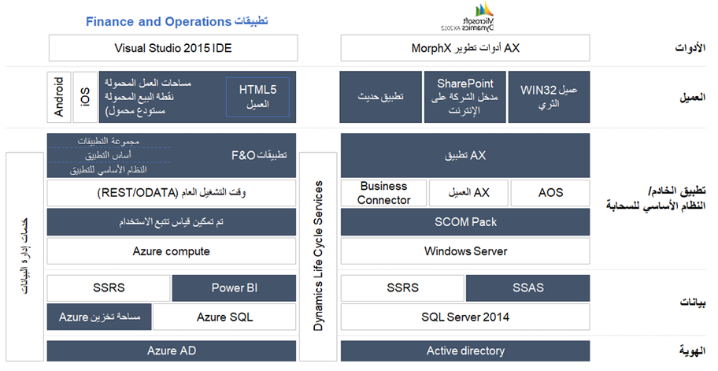

Finance and Operations هو تطبيق لتخطيط موارد المؤسسة مُعاد تصوره يهدف تصميمه إلى التوزيع عبر السحابة، بمعني أنك ستجد اختلافات مهمة في البنية إذا كنت تقوم بالترقية من AX 2012. ونظراً إلى أن مؤسستك تبدأ الترقية إلى Dynamics 365، فإنك بحاجه إلى فهم اختلافات البنية هذه بحيث يمكنك اتخاذ قرارات ستساعد على تنفيذ الترقية بشكلٍ سلس قدر الإمكان. 

تعمل تطبيقات Finance and Operations على نظام أساسي جديد بشكلٍ ملحوظ يمكّنك من الاستعداد لاستخدام الخدمات السحابية. ضع في اعتبارك أن بعض الميزات تم إهمالها أو إعادة بناؤها بإضافة ميزات. إضافة إلى ذلك، سيتم تزويد ترجمة كل اللغات الخاصة بواجهة المستخدم بمعظم الترجمات التنظيمية لأكثر 30 دولة أو منطقة. 

تستعرض القائمة الآتية اختلافات البنية الأساسية بين AX 2012 وتطبيقات Finance and Operations، ويتم عرضها في المخطط الآتي.

 
- **الأدوات** – يستخدم المطورون الآن Visual Studio لتطوير Dynamics 365.

    > [!NOTE]
    > تشتمل الأجهزة الظاهرية التي يتم توزيعها في الإصدار 10.0.13 (تحديث النظام الأساسي 37) أو الإصدار الأحدث على Visual Studio 2017. يعد الإصدار 10.0.16 (تحديث النظام الأساسي 40) هو الإصدار الأخير مع دعم Visual Studio 2015. لن تتمكن الأجهزة الظاهرية التي تتضمن Visual Studio 2015فقط من التحديث إلى الإصدار 10.0.17 (تحديث النظام الأساسي 41). للحصول على مزيد من المعلومات، [راجع ميزات النظام الأساسي التي تمت إزالتها أو المهملة](https://docs.microsoft.com/dynamics365/fin-ops-core/dev-itpro/get-started/removed-deprecated-features-platform-updates/?azure-portal=true).  

    AX لم تعد أدوات التطوير MorphX مستخدمة. يعمل المطورون الآن في بيئة المطورين الخاصة بهم. تتوفر كافة الأدوات التي يحتاج اليها المطور لتوسيع نطاق التطبيق ليناسب احتياجات مؤسستك في Visual Studio. Azure DevOps يتم استخدامه للتحكم في المصدر والإصدار. ومن الضروري مراعاة ترخيص Visual Studio للمطورين عند قيامك بالترقية إلى Dynamics 365. 

- **العميل** - يتم تشغيل Dynamics 365 على عميل تابع جزئياً يدعم HTML 5. لذلك، لن تتمكن بعد الآن من استخدام عميل غني مثل العميل الذي تم استخدامه AX 2012. إضافة إلى ذلك، لم يعد مدخل الشركة على الإنترنت في Microsoft SharePoint أو تطبيقات SharePoint الحديثة موجوداً. يمكن الوصول إلى كل ما يتعلق بالتطبيق في العميل التابع جزئياً من خلال مستعرض الويب. يمكنك أيضاً الوصول إلى تطبيق Dynamics 365 على الأجهزة التي تعمل بنظام Android وiOS.

- **خدمات إدارة البيانات** – تتوفر خدمات إدارة البيانات لسيناريوهات التكامل لدعم أعمالك. يدعم إطار عمل إدارة البيانات استخدام كيانات البيانات في سيناريوهات إدارة البيانات الأساسية الآتية: 
    -   ترحيل البيانات
    -   إعداد التكوينات ونسخها
    -   التكامل 

    للحصول على مزيد من المعلومات، راجع [التعامل مع إدارة البيانات في تطبيقات Finance and Operations](https://docs.microsoft.com/learn/modules/work-data-management-finance-operations/?azure-portal=true). 

- **خادم التطبيق/النظام الأساسي للخدمات السحابية** – عند الترقية من AX 2012، لن تستخدم Windows Server بعد الآن؛ حيث إن Dynamics 365 يستخدم Azure compute. تم تحويل حزمة إدارة مدير عمليات مركز النظام إلى تمكين قياس تتبع الاستخدام، الذي يمنحك وMicrosoft القدرة على تتبع الأخطاء والمشاكل في التطبيق بسرعة ثم حلها بطريقه سريعة وشفافة. يتم دمج Application Object Server‏ (AOS) وعميل AX وموصل الأعمال في وقت التشغيل العام الذي يعمل على تمكين إمكانات REST وOData. إضافة إلى ذلك، تم تحويل كود تطبيق AX إلى مكدس التطبيق الذي تم تقسيمه إلى عدة حزم، بما في ذلك مجموعة التطبيق وأساسيات التطبيق والنظام الأساسي للتطبيق والمزيد.  

- **البيانات** – يتمثل التغيير الأساسي في البيانات من AX 2012 في أنك لن تعد بحاجة إلى استخدام SQL Server 2014 لبياناتك. يستخدم Dynamics 365 مخزن Azure SQL وMicrosoft Azure (مخزن البيانات الثنائية الكبيرة الذي يمكن استخدامه لتطوير المستندات وإدارة الملفات غير المنظمة)، بالإضافة إلى خدماتSQL Server Reporting Services ‎‎(SSRS ‏‎)‏ وPower BI. 

- **الهوية** – في AX 2012، تتم إدارة الهوية باستخدام Active directory. باستخدام Dynamics 365، تتم إدارة الهوية من خلال Azure Active Directory (Azure AD). وبشكلٍ أساسي، يعد Azure AD دليلاً نشطاً تتم إدارته في سحابة Azure.

## البنية المنطقية
كما ذكر سابقاً، يعد Azure AD وAZURE SQL مكونان أساسيان في Dynamics 365 المستضاف في السحابة. تستعرض القائمة الآتية قواعد بيانات Dynamics 365.

- **قاعده البيانات الأساسية (AXDB)** – قاعدة البيانات هذه تعد قاعدة البيانات الأساسية والتي تتوفر فيها بيانات التشغيل الخاصة بالتطبيق. 

- **قاعده البيانات الثانوية (AXDB)** – سيتم نسخ بيانات من قاعدة البيانات الأساسية إلى قاعده البيانات الثانوية لأغراض الاستعادة من الكوارث. باستخدام Azure، يمكنك إنشاء قواعد البيانات في مناطق مختلفة. ويحدث النسخ المتماثل للبيانات في غضون ثوانٍ. 

- **مخزن الكيانات (AXDW)** – يمكن أن يتوفر لديك بيانات مجمعة، مثل القياسات والأبعاد المجمعة، ونقل تلك البيانات إلى مخزن الكيانات AXDW. ويتم تحسين قاعده البيانات هذه لتحليلات البيانات. 

- **Management reporter (MR)** -يتم استخدام قاعده البيانات هذه لبيانات Management reporter إذا كنت تستخدم financial reporting في Dynamics 365. (تتوفر Management reporter الآن باسم Financial reporting في Dynamics 365.)

- **‏‫إحضار قاعدة بياناتك الخاصة‬ (BYOD)** -لا تعمل Microsoft على إدارة قاعده البيانات هذه. تُتيح وظيفة BYOD للمسؤولين إمكانية تكوين قاعده بياناتهم الخاصة ثم تصدير كيان بيانات واحد أو أكثر متوفر في Dynamics 365 إلى قاعده البيانات.

- **Compute‎** – يتم تشغيل جميع مكونات التطبيق لديك، بما في ذلك Application Object Server‏ (AOS) والدفعات وخدمات SQL Server Reporting Services (SSRS) في Azure compute.

- **Lifecycle Services** – مدخل تعاون يوفر بيئة ومجموعه من الخدمات المحدثة بشكلٍ منتظم يمكنها مساعدتك على إدارة دورة حياه البرنامج الخاصة بعمليات التنفيذ. للحصول على مزيد من المعلومات، راجع [بدء العمل باستخدام Lifecycle Services لتطبيقات Finance and Operations](https://docs.microsoft.com/learn/modules/get-started-lifecycle-services-finance-operations/?azure-portal=true). 
- موصل تطبيقات **Finance and Operations** – يسمح بتكامل Microsoft Power Automate وPower Apps وdata integrator وAzure Logic Apps مع Finance and Operations. يمكن للتطبيق الخارجي استخدام المشغل والإجراءات المتاحة للتكامل معها.

- تطبيق **Finance and Operations** – يتضمن ذلك النظام الأساسي لـ Dynamics 365 والتطبيق، الذي يسمح لك باستخدام وظائف التطبيق التبادلي واستخدام تطبيقات Dynamics 365 الأخرى مثل Dynamics 365 Commerce وDynamics 365 Supply Chain Management. قد تتضمن ميزة **نماذج الجهات الخارجية** حلول موردي البرامج المستقلين (ISV) الأخرى التي تساعدك على إثراء المنتج ليتناسب مع أعمالك. تشتمل ميزة **نماذج العميل** على تخصيصات خاصه بالعميل. وبشكلٍ أكثر تحديداً، تعد ميزة "نماذج العميل" ملحقات للتطبيق. ستتم تغطيه هذه المعلومات في وحدة لاحقه. 

 
 
## بنية وقت التشغيل
الآن، بعد أن تعرفت على اختلافات البنية الأساسية، يمكنك معرفه المزيد عن اختلافات بنيه وقت التشغيل بين AX 2012 وتطبيقات Finance and Operations. 

### AX 2012 – العميل الغني 
AX 2012 يستخدم عميلاً غنياً يستعمل Windows Server. يحدث زمن الانتقال المرتفع بين عنصر التحكم المنطقي وخادم كائنات التطبيق (AOS)، بينما يحدث زمن الانتقال المنخفض بين عناصر التحكم الفعلية والمنطقية. يتم تشغيل X + + على المستويين (العميل والخادم) ويشكل حاله العميل. إضافة إلى ذلك، يدعم خادم الوحدة الطرفية استخدام شبكه اتصال واسعة النطاق (WAN). 

 
 
### Finance and Operations– عميل المستعرض
باستخدام تطبيقات Finance and Operations، فإنك تعمل على عميل تابع جزئياً يمكِنك الوصول إليه عبر مستعرض ويب. يتضمن العميل التابع جزئياً زمن انتقال منخفض بين عنصر التحكم المنطقي وخادم كائنات التطبيق (AOS)، بينما يحدث زمن الانتقال المرتفع بين عناصر التحكم الفعلية والمنطقية. يتم تشغيل X + + على مستوى الخادم فقط، ويتم كذلك تخزين حاله تطبيق النموذج على الخادم. تحافظ قيم دلتا على حاله التحكم في المزامنة، ويقوم خادم الويب بدعم استخدام شبكه اتصال واسعة النطاق (WAN). 
 
 

