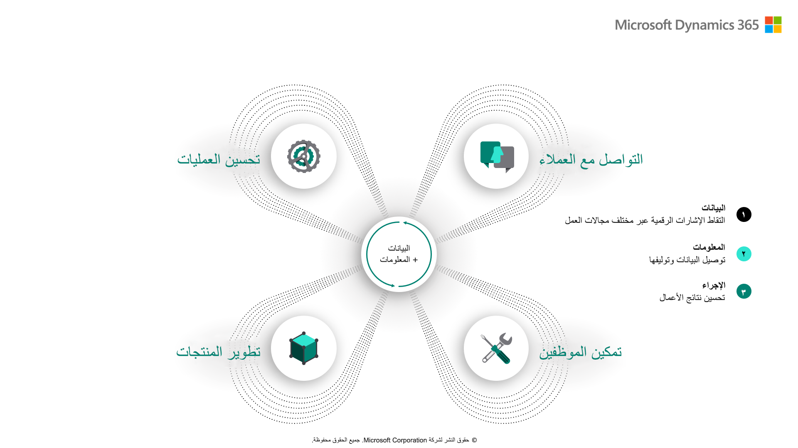

تسمح Dynamics 365 business applications للمؤسسات بتحويل مؤسستها رقمياً. تزيل التطبيقات تعقيد أنظمة إدارة علاقات العملاء (CRM) وإدارة موارد المؤسسة (ERP) المنفصلة عن طريق إنشاء تطبيقات أعمال معيارية حديثة تعمل معاً على نظام أساسي واحد. تمنح التطبيقات المؤسسات المرونة في اعتماد التكنولوجيا عندما تحتاج إليها للمساعدة في تحسين نتائج الأعمال.

التحول الرقمي هو دمج التكنولوجيا الرقمية في جميع مجالات الأعمال. الهدف من التحول الرقمي هو تغيير كيفية عمل المؤسسات وتقديم قيمة للعملاء.

شاهد الفيديو التالي، حيث يشرح نائب رئيس شركة Microsoft، جيمس فيليبس، التحول الرقمي.

> [!VIDEO https://www.microsoft.com/videoplayer/embed/RE4kn34]

### حلقة التغذية الراجعة الرقمية

تشير حلقة التعليقات الرقمية إلى إطار العمل المستخدم لتسليط الضوء على كيفية تمكين التحول الرقمي. في مركز الإطار توجد البيانات. تظهر البيانات من كل شيء. كل منتج متشابك مع القياس عن بعد والقدرة على جمع البيانات. على سبيل المثال، يعرف منظم الحرارة في منزلك متى تقوم بتغيير درجة الحرارة.

للاضطراب والابتكار، يجب أن تتبنى الصناعات استراتيجية تربط عملائها وموظفيها ومنتجاتها وعملياتها بأكبر قدر ممكن من الفعالية. تحتاج المؤسسات إلى تبسيط أعمالها للاستجابة لمتطلبات العملاء وتجميع البيانات عبر المؤسسة بحيث يمكن للتحليلات المساعدة في توفير الرؤى. 

من خلال الاستفادة من تطبيقات Dynamics 365 business، يمكن للمؤسسات:

- **إشراك العملاء وبناء العلاقات** - إعادة تصور كيفية التفاعل مع العملاء من خلال إنشاء تجارب تسويقية ومبيعات وخدمة مخصصة باستخدام البيانات والذكاء لتحسين كل تفاعل.
- **تحسين العمليات** - تحسين الخدمة وزيادة الكفاءة وتقليل التكاليف من خلال التوجيه الذكي والتعليمي الذي يتم تضمينه في جميع عمليات عملك. 
- **تمكين الموظفين** - توظيف أفضل المواهب وإشراكها وإطلاقها لأداء أفضل أعمالهم باستخدام البيانات والرؤى المتوفرة في مكان العمل. 
- **تحويل المنتجات والخدمات** - استخدم البيانات كأصل إستراتيجي لتحديد فرص السوق الجديدة، وإنتاج منتجات مبتكرة، وإنشاء تجارب عملاء استثنائية مع عرض شامل لعملائك وعملياتك.

توضح الصورة التالية كيف تساعد حلقة التعليقات الرقمية في تمكين الموظفين وإشراك العملاء وتحسين العمليات وتحويل المنتجات.

> [!div class="mx-imgBorder"]
> 

شاهد الفيديو التالي لشرح نائب رئيس شركة Microsoft جيمس فيليبس لكيفية إنشاء تطبيقات Microsoft بغرض دعم التحول الرقمي.

> [!VIDEO https://www.microsoft.com/videoplayer/embed/RE4kn35]

الآن بعد أن راجعت التحول الرقمي للأعمال في Microsoft، يمكنك مراجعة كيف يمكن أن تساعد تطبيقات الأعمال في دفع التحول الرقمي الخاص بك.
