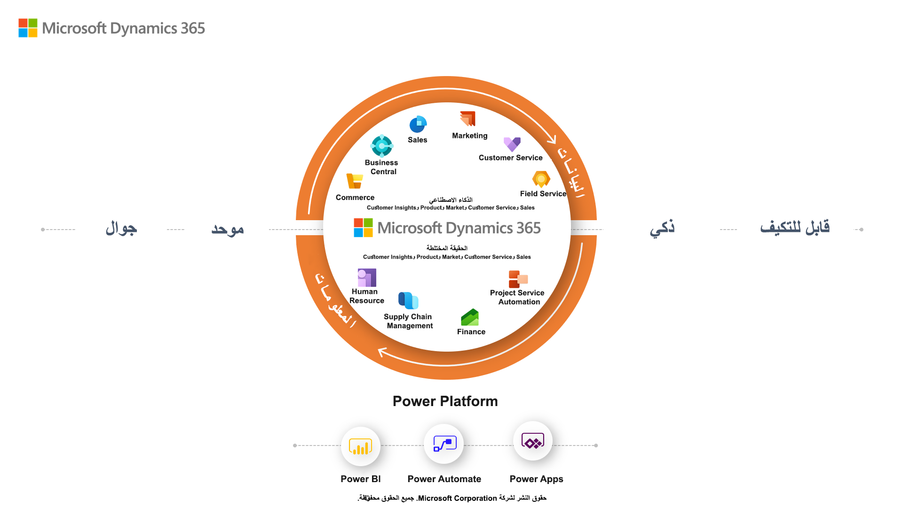

يوضح الرسم التالي كيف تم إنشاء Microsoft Dynamics ‏365 المضمن في Microsoft Power Platform مع البيانات والذكاء المشترك.

> [!div class="mx-imgBorder"]
> 

### التطبيقات المستندة إلى النماذج 

وتشتق تطبيقات Dynamics 365 التالية من CRM والتطبيقات المستندة إلى النماذج التي يتم إنشاؤها علي نظام Microsoft Dataverse الأساسي:

- **Dynamics 365 Sales** - يمكّنك من بناء علاقات قوية مع عملائك واتخاذ الإجراءات بناءً على الرؤى وإغلاق المبيعات بشكل أسرع. استخدم المبيعات لتتبع حساباتك وجهات الاتصال الخاصة بك، وتعزيز مبيعاتك من العميل المتوقع إلى الطلب، وإنشاء ضمانات المبيعات، وإنشاء قوائم التسويق والحملات. يمكنك حتى متابعة حالات الخدمة المرتبطة بحسابات أو فرص معينة. 
- **Dynamics 365 Customer Service** - تتيح لك كسب العملاء مدى الحياة. قم ببناء علاقات عملاء رائعة من خلال التركيز على رضا العملاء الممتاز من خلال تطبيق خدمة العملاء. توفر خدمة العملاء العديد من الميزات والأدوات التي تساعدك على إدارة الخدمات التي تقدمها للعملاء. 
- **Dynamics 365 Field Service** - تساعدك على تقديم الخدمة في الموقع لمواقع العملاء. يجمع التطبيق بين أتمتة سير العمل وخوارزميات الجدولة والتنقل لمساعدتك في إعداد العمال المتنقلين للنجاح عندما يكونون في الموقع مع العملاء الذين يقومون بإصلاح المشكلات.
- **Dynamics 365 Marketing** - تطبيق للتسويق الآلي يساعد في تحويل العملاء المحتملين إلى علاقات عمل. التطبيق سهل الاستخدام، ويعمل بسلاسة مع Dynamics 365 Sales، ويحتوي على معلومات عمل مضمنة. استخدم Marketing لإنشاء رسائل بريد إلكتروني رسومية ومشاركة المعلومات عبر فرق المبيعات والتسويق والمزيد. 

### تطبيقات Finance and Operations

تطبيقات Dynamics 365 التالية مشتقة من ERP:

- **Dynamics 365 Commerce** - يقدم حلاً شاملاً متعدد القنوات يوحد المكتب الخلفي والمتجر ومركز الاتصال والتجارب الرقمية. تمكنك Commerce من بناء ولاء للعلامة التجارية من خلال مشاركات العملاء الشخصية، وزيادة الإيرادات من خلال تحسين إنتاجية الموظفين، وتحسين العمليات لتقليل التكاليف، وزيادة كفاءة سلسلة التوريد.
- **Dynamics 365 Finance** - يساعدك على أتمتة وتحديث عملياتك المالية العالمية. راقب الأداء في الوقت الفعلي، وتوقع النتائج المستقبلية، واتخذ قرارات تعتمد على البيانات لدفع نمو الأعمال. استخدم Finance لتوجيه القرارات المالية الإستراتيجية باستخدام الذكاء الاصطناعي، وتوحيد العمليات المالية وأتمتتها، وتقليل النفقات التشغيلية، وتقليل التعقيد المالي العالمي والمخاطر.
- **Dynamics 365 Human Resources** - يبسط العديد من مهام حفظ الدفاتر وأتمتة العديد من عمليات التوظيف. تشمل هذه العمليات الاحتفاظ بالموظفين، وإدارة المزايا، والتدريب، ومراجعات الأداء، وإدارة التغيير. توفر الموارد البشرية أيضاً إطاراً لموظفي الموارد البشرية لإدارة مجالات الرقابة.
- **Dynamics 365 Supply Chain Management** - يساعدك على تحويل عمليات التصنيع وسلسلة التوريد الخاصة بك. استخدم الرؤى التنبؤية والذكاء من الذكاء الاصطناعي وإنترنت الأشياء (IoT) عبر التخطيط والإنتاج والمخزون والمستودعات وإدارة النقل. يمكن لإدارة Supply Chain Management زيادة الكفاءة التشغيلية وجودة المنتج والربحية. استخدم Supply Chain Management للابتكار من خلال عمليات التصنيع الذكية، وتحديث إدارة المستودعات، وتحسين أداء الإنتاج، وزيادة عمر أصولك إلى أقصى حد، وأتمتة سلسلة التوريد الخاصة بك وتبسيطها.

### Business Central

يعد Microsoft Dynamics 365 Business Central أحد حلول إدارة الأعمال للمؤسسات الصغيرة والمتوسطة الحجم الذي يعمل على أتمتة عمليات الأعمال وتبسيطها ويساعدك على إدارة أعمالك. يساعدك Business Central، القابل للتكيف والغني بالميزات، على إدارة عمليات عملك، بما في ذلك التمويل والتصنيع والمبيعات والشحن وإدارة المشاريع والخدمات والمزيد.

### منتجات أخرى

ستتم أيضاً مناقشة المنتجات التالية في هذه الدورة التدريبية وستدعم تطبيقات Dynamics 365 business:

- **Adobe Experience Cloud** - يقدم تجارب عملاء استثنائية. قم بتحويل رحلة العميل وتحسين المبيعات وعائد الاستثمار (ROI) عندما تجمع Microsoft Dynamics ‏365 مع حلول Adobe ‏Experience Cloud.
- **AI Builder** - يسمح للجميع بالعمل مع الذكاء الاصطناعي. امنح كل فرد في مؤسستك القدرة على إضافة قدرات الذكاء الاصطناعي إلى التطبيقات التي ينشئونها ويستخدمونها، بغض النظر عن خبرتهم التقنية.
- **Azure DevOps** - مجمع التطوير (Dev) والعمليات (Ops) ،DevOps هو اتحاد الأشخاص والعمليات والتكنولوجيا لتقديم القيمة باستمرار للعملاء. Azure DevOps يتيح الأدوار المنعزلة سابقاً، مثل التطوير وعمليات تكنولوجيا المعلومات وهندسة الجودة والأمن، للتنسيق والتعاون لإنتاج منتجات أفضل وأكثر موثوقية. من خلال تبني ثقافة DevOps جنباً إلى جنب مع ممارسات وأدوات Azure DevOps تكتسب الفرق القدرة على الاستجابة بشكل أفضل لاحتياجات العملاء، وزيادة الثقة في التطبيقات التي يقومون بإنشائها، وتحقيق أهداف العمل بشكل أسرع.
- **Dynamics 365 Customer Insights** - يستخدم نظاماً أساسياً لبيانات العملاء بديهياً ومرناً لإطلاق العنان للرؤى وتعزيز تجارب العملاء المخصصة. قم بتوحيد جميع بيانات العملاء عبر مجموعة كاملة من المصادر للحصول على عرض واحد للعملاء.
- **Dynamics 365 Customer Voice** - يتيح لك التقاط ملاحظات العملاء والموظفين وتحليلها والتصرف بناءً عليها من خلال حل مسح مؤسسي بسيط ولكنه قوي.
- **Dynamics 365 Fraud Protection** - يساعد على حماية أعمال التجارة الإلكترونية وعملائك من الاحتيال للمساعدة في تقليل التكاليف وتحقيق إيرادات أعلى وتحسين تجربة تسوق العملاء.
- **Dynamics 365 Remote Assist** - يساعدك على العمل معاً من أي مكان. اسمح للفنيين بالتعاون بشكل أكثر كفاءة من خلال العمل معاً من مواقع مختلفة باستخدام Remote Assist على HoloLens، Android، أو أجهزة iOS.
- **Dynamics 365 Virtual Agent for Customer Service** - يوفر خدمة عملاء استثنائية مع مندوبين افتراضيين أذكياء وقابلين للتكيف. تمكين خبراء خدمة العملاء من إنشاء الروبوتات وتحسينها باستخدام الرؤى المستندة إلى الذكاء الاصطناعي.
- **LinkedIn Sales Navigator** - يوحد تجربة البيع حول العلاقات. تجمع Microsoft Relationship Sales بين LinkedIn Sales Navigator وMicrosoft Dynamics 365 Sales لتمكين البائعين لديك من دفع مشاركة أكثر تخصيصاً وذات مغزى مع المشترين.
- **بوابات Microsoft Power Apps** - تسمح لأي شخص، سواء داخل مؤسستك أو خارجها، بالتفاعل مع بيانات Dataverse باستخدام البوابات.
- **Microsoft Power BI** - يُمكِّن الجميع في كل مستوى من مستويات مؤسستك من اتخاذ قرارات واثقة باستخدام تحليلات محدثة.

الآن بعد أن راجعت تطبيقات Microsoft التي تتناولها هذه الدورة التدريبية، يمكنك استكشاف كيفية دعم الذكاء الاصطناعي لـ Microsoft business applications.
