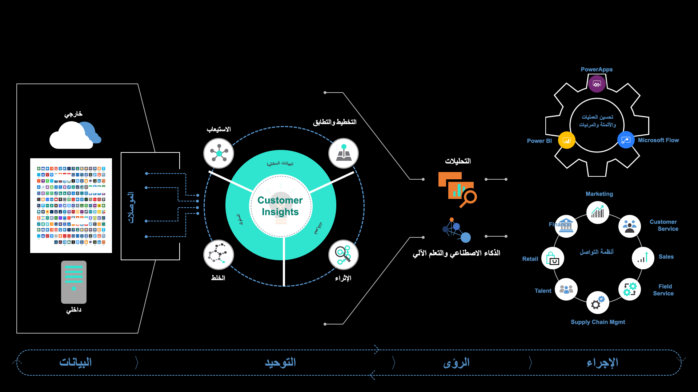
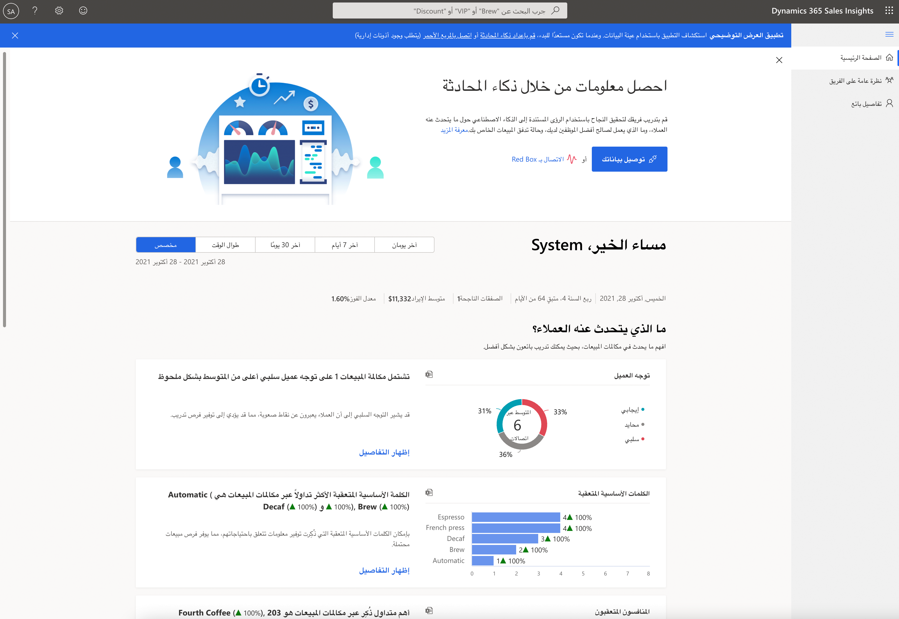
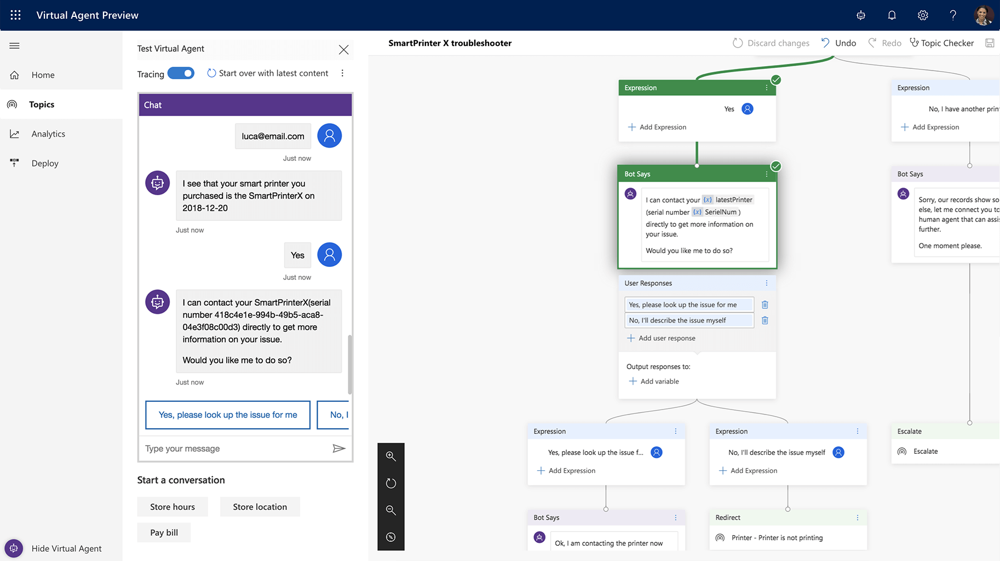
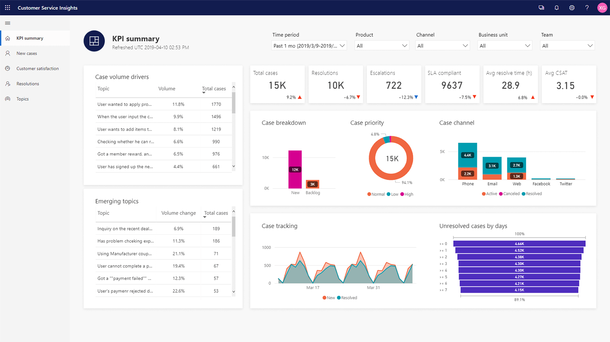
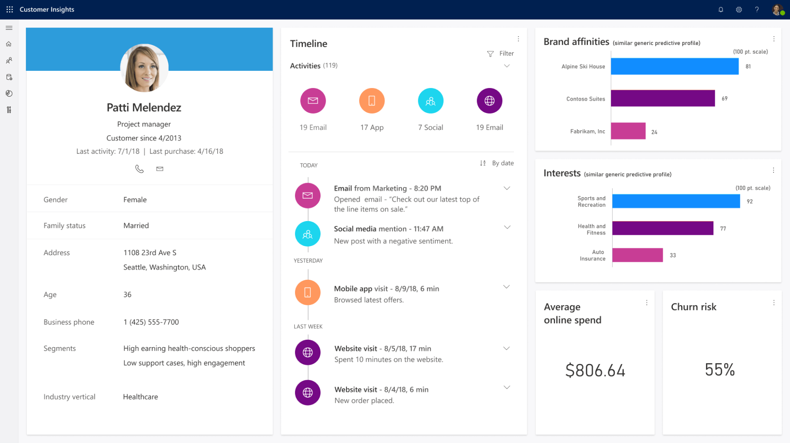

الذكاء الاصطناعي (AI) عبارة عن مجموعة من الخوارزميات التي تستخدمها أجهزة الكمبيوتر لتحليل البيانات والتوصل إلى استنتاج. في بعض المواقف، يمكن للذكاء الاصطناعي تدريب نفسه. يمكن للذكاء الاصطناعي الوصول إلى استنتاج يعتمد على البيانات المتاحة. في حالات أخرى، يمكنك تدريب الذكاء الاصطناعي باستمرار من خلال التعليقات والتعديلات المتكررة. كلما زادت البيانات التي يمتلكها الكمبيوتر، زادت قدرته على تكوين افتراضات منفصلة أو دقيقة. بعد ذلك، يمكنك التصرف بناءً على تلك الافتراضات والاستنتاجات، أو يمكنك تعديلها أكثر.

تُظهر الصورة التالية كيفية تشغيل الذكاء الاصطناعي على Microsoft Dataverse لدعم Dynamics 365. 

 

هناك طريقة أخرى للنظر في الذكاء الاصطناعي وهي من خلال التفكير والفهم والتفاعل:

- **الاستدلال** - يأخذ الذكاء الاصطناعي بيانات جوهرية ويضيف منطقاً حتى تتمكن من فهمه واتخاذ القرارات بناءً على تلك البيانات. على سبيل المثال، بالنظر إلى بيانات الأداء، يمكن للذكاء الاصطناعي أن يتعلم العثور على إشارات تحذيرية تشير إلى احتمال فشل إحدى المعدات. يستمر الذكاء الاصطناعي في التعلم ويصبح أكثر دقة بمرور الوقت مع استمرار تغذيته بالمزيد من البيانات.
- **الفهم** - يساعد الذكاء الاصطناعي الأشخاص على فهم وتفسير بيانات بيئتهم وعالمهم. على سبيل المثال، يساعد الذكاء الاصطناعي في العثور على معنى النص والكلام والصور.
- **التفاعل** - يوسع الذكاء الاصطناعي براعة الإنسان ويقلل الحواجز بين البشر والآلات. يسمح للآلات بالتواصل مع البشر بطريقة أكثر طبيعية من خلال التعرف على أنماط الكلام البشري.

عندما تطلب شفهياً من هاتفك ضبط منبه الصباح، فأنت تستخدم الذكاء الاصطناعي (AI). عندما تحصل على توصيات فيلم من خدمة البث الخاصة بك، فأنت تستخدم الذكاء الاصطناعي (AI).

في مثال الهاتف، يستخدم الذكاء الاصطناعي فهم اللغة الطبيعية. من خلال حديثك، يفهم الكمبيوتر ما تحاول القيام به ثم يتصرف وفقاً لذلك. يؤكد هاتفك الوقت الذي تريد أن تستيقظ فيه ثم يقوم بتكوين المنبه.

في مثال خدمة البث، يستخدم الذكاء الاصطناعي التعلم الآلي. تستند خدمة البث إلى اقتراح الفيلم على سجل المشاهدة وجميع المتغيرات التي قد تؤثر على الاقتراح، بما في ذلك:

- نوع الفيلم.
- الممثلون.
- كيف صنفت أفلام مماثلة.
- ما الذي سيشاهده المشاهدون الآخرون الذين يتمتعون بتجربة مشاهدة فيلم مماثلة بعد ذلك.
- ما اخترت عدم مشاهدته.

ما اخترت عدم مشاهدته في كلا السيناريوهين، فإن الحساب الذي يحدث معقد للغاية بالنسبة لمجموعة بسيطة من الخوارزميات.

يمكن لكل مؤسسة الاستفادة من خدمات الذكاء الاصطناعي المنشأة مسبقاً لجلب المزيد من المعرفة لكل موظف. يمكنك أيضاً الاستفادة من نظام أساسي للذكاء الاصطناعي للمحادثة مع خدمات الذكاء الاصطناعي المنشأة مسبقاً لتشغيل المندوبين الرقميين وتقديم المعرفة للعملاء. عند تحسين العمليات التجارية باستخدام الذكاء الاصطناعي، يمكنك استخدام حلول المصادر المجمعة أو إنشاء حل مخصص للذكاء الاصطناعي. عند تقديم الذكاء الاصطناعي إلى كل موظف، تحتاج إلى فهم كيفية استهلاك الموظفين للذكاء الاصطناعي وكيف يمكن لنماذج الذكاء الاصطناعي الجديدة تحويل جميع الموظفين إلى علماء بيانات.

يمنح AI Builder الجميع في مؤسستك القدرة على إضافة قدرات الذكاء الاصطناعي إلى التطبيقات التي ينشئونها ويستخدمونها، بغض النظر عن قدراتهم التقنية. التعليمات البرمجية/التعليمات البرمجية المنخفضة للذكاء الاصطناعي جزء من Microsoft Power Platform ويتطلب استخدام Dataverse.

### الذكاء الاصطناعي في Dynamics 365

باستخدام الذكاء الاصطناعي في Dynamics 365، تحصل الشركات على رؤى متعمقة ويمكن أن تجعل كل نقطة اتصال أكثر صلة واستجابة من خلال الرؤى المستندة إلى البيانات حول احتياجات وسلوكيات العملاء.

في Dynamics 365 Commerce، تستخدم Dynamics 365 Fraud Protection الذكاء الاصطناعي لحماية أعمال التجارة الإلكترونية وعملائك من الاحتيال. تساعد هذه الحماية في تقليل التكاليف وتحقيق أرباح أعلى وتحسين تجربة التسوق لعملائك.

تُظهر لقطة الشاشة التالية واجهة Dynamics 365 Fraud Protection المدعومة من الذكاء الاصطناعي.

> [!div class="mx-imgBorder"]
> 
 
في Dynamics 365 Sales، يستخدم Dynamics 365 Sales Insights الذكاء الاصطناعي لزيادة المبيعات وتحسين القرارات. باستخدام الرؤى المدعومة بالذكاء الاصطناعي، يمكنك كسب المزيد من الصفقات من خلال تحسين تفاعل كل عميل ونشاط مبيعات وقرار عمل باستخدام ذكاء المبيعات.

تُظهر لقطة الشاشة التالية واجهة Dynamics 365 Sales Insights المدعومة من الذكاء الاصطناعي.

> [!div class="mx-imgBorder"]
> 

 
في Dynamics 365 Customer Service، يستخدم Dynamics 365 Virtual Agent for Customer Service الذكاء الاصطناعي لتوفير خدمة عملاء استثنائية مع مندوبين افتراضيين أذكياء وقابلين للتكيف. يمكنك تمكين خبراء خدمة العملاء من إنشاء الروبوتات وتحسينها باستخدام رؤى تستند إلى الذكاء الاصطناعي لزيادة الإنتاجية.

تُظهر لقطة الشاشة التالية واجهة Dynamics 365 Virtual Agent for Customer Service المدعومة من الذكاء الاصطناعي.

في Dynamics 365 Customer Service، يستخدم Dynamics 365 Customer Service Insights الذكاء الاصطناعي لاتخاذ قرارات أفضل وتحسين رضا العملاء بشكل استباقي.

تُظهر لقطة الشاشة التالية واجهة Dynamics 365 Customer Service Insights المدعومة من الذكاء الاصطناعي.

> [!div class="mx-imgBorder"]
> 

في Dynamics 365 Sales وDynamics 365 Marketing وDynamics 365 Customer Service، يستخدم Dynamics 365 Customer Insights الذكاء الاصطناعي لإنشاء نظام أساسي لبيانات العملاء بديهي ومرن يفتح لك الرؤى ويعزز تجارب العملاء المخصصة. توحيد جميع بيانات العملاء عبر النطاق الكامل للمصادر للحصول على عرض واحد للعملاء. 

تُظهر لقطة الشاشة التالية واجهة Dynamics 365 Customer Insights المدعومة من الذكاء الاصطناعي.

> [!div class="mx-imgBorder"]
> 

الآن بعد أن استكشفت الذكاء الاصطناعي، يمكنك مراجعة كيف يمزج الواقع المختلط بين العالمين المادي والرقمي لدعم تطبيقات الأعمال.
