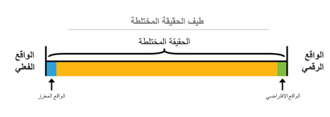

الواقع المختلط هو نتيجة لمزج العالم المادي مع العالم الرقمي. إنه التطور التالي في التفاعل بين الإنسان والكمبيوتر والبيئة ويطلق العنان للاحتمالات التي، قبل الآن، لم يكن يتخيلها سوى الإنسان. أصبح الواقع المختلط ممكناً بفضل التقدم في رؤية الكمبيوتر، وقوة المعالجة الرسومية، وتكنولوجيا العرض، وأنظمة الإدخال.

ثلاثة مكونات رئيسية للواقع المختلط هي المدخلات البشرية، ومعالجة الكمبيوتر، والمدخلات البيئية. يتم جمع المدخلات البشرية من خلال التفاعل بين الإنسان والكمبيوتر (HCI). يحدث الإدخال البشري من خلال مجموعة متنوعة من الوسائل مثل لوحات المفاتيح، والفأرة، واللمس، والحبر، والصوت، وحتى تعقب Kinect للهيكل العظمي. ويشار إلى التفاعل بين الكمبيوتر والبيئات على أنه الإدراك. يمكنك إنشاء الإدراك من خلال التقاط المدخلات البيئية مثل تعقب الرأس والأسطح (رسم الخرائط المكانية) والحدود (الفهم المكاني) والإضاءة المحيطة والصوت البيئي والتعرف على الأشياء والموقع.

يوضح الرسم التالي كيفية تفاعل البشر والبيئة ومعالجة الكمبيوتر. 

> [!div class="mx-imgBorder"]
> 

الجمع بين HCI مع الإدراك يوفر الفرصة لخلق تجارب الواقع المختلط الحقيقي. الحركة التي تحدث في العالم المادي تترجم إلى حركة في العالم الرقمي. تؤثر الحدود في العالم المادي على تجارب التطبيقات، مثل لعب الألعاب أو موضع الكائن، في العالم الرقمي. 
 
ونظراً لأن الواقع المختلط يمزج بين العالمين المادي والرقمي على حد سواء، فإن هاتين الحقيقتين تحددان الغايات القطبية لما يُشار إليه بطيف الواقع المختلط. من جهة، لدينا الواقع المادي الذي يعيش فيه البشر؛ ومن جهة أخرى لدينا الواقع الرقمي المقابل.

يظهر الرسم التالي طيف الواقع المختلط.

> [!div class="mx-imgBorder"]
> 

- **الواقع المادي القريب** - يظل المستخدمون حاضرين في بيئتهم المادية ولا يتم أبداً تصديق أنهم تركوا تلك البيئة.
- **الواقع المختلط تماماً** - هذه التجارب مزيج العالم الحقيقي والعالم الرقمي. 
- **الواقع الرقمي القريب** - يواجه المستخدمون بيئة رقمية بالكامل ولا يدركون ما يحدث في البيئة المادية المحيطة بهم.
     
تركز استراتيجية الواقع المختلط من Microsoft على الواقع المختلط تماماً، مما يوفر تجربة واقع مختلط غامرة بشكل كبير حيث يمكن للمستخدمين حل مشكلات العالم الحقيقي. قد تأتي هذه التجارب في شكل خبرات تدريب معززة أو تصميم منتج افتراضي أو تعاون افتراضي مع الزملاء.

- **الأجهزة ثلاثية الأبعاد** - تتميز هذه الأجهزة بقدرة الجهاز على وضع المحتوى الرقمي في العالم الحقيقي مثل Microsoft HoloLens.
- **الأجهزة الغامرة** - تتميز هذه الأجهزة بقدرة الجهاز على إنشاء شعور بوجوده - إخفاء العالم المادي واستبداله بتجربة رقمية. 
     
في كثير من الأحيان، من الأفضل التفكير في نوع التجربة التي يرغب مطور التطبيق أو اللعبة في إنشائها. وعادة، ستستهدف التجارب نقطة معينة أو جزءاً محدداً من الطيف. 

تحتوي تطبيقات Dynamics 365 على العديد من الأدوات المتاحة للتعاون في الواقع المختلط:

 - Microsoft HoloLens 
 - Dynamics 365 Guides
 - Dynamics 365 Remote Assist

### Microsoft HoloLens

باستخدام Microsoft HoloLens، يمكن للموظفين العمل بشكل أكثر ذكاءً، وعرض الواقع المختلط، واستكشاف الأخطاء وإصلاحها، والتنفيذ بثقة وسرعة. 

يمكنهم التحرك بحرية وسحب المعلومات الهامة للعرض والتركيز على المهمة في الوضع حر اليدين لأداء العمل. 

تظهر الصورة التالية فني مع HoloLens ويستخدم الواقع المختلط.

### Dynamics 365 Guides

تحسين فعالية التدريب وفهم كيفية أداء الموظفين مع Dynamics 365 Guides، أداة الواقع المختلط للتعلم.

تظهر الصورة التالية فني مع HoloLens ويستخدم Guides.

 

### Dynamics 365 Remote Assist

ساعد الموظفين على العمل سوياً حتى عندما يكونون بعيدين عن بعضهم البعض. Dynamics 365 Remote Assist هو أداة الواقع المختلط للتعاون الفوري.

تظهر الصورة التالية فني مع HoloLens ويستخدم Remote Assist.

 

الآن، بعد أن استكشفت مجموعة من تطبيقات الأعمال من Microsoft، يمكنك تجربة فحص سريع للمعرفة.
