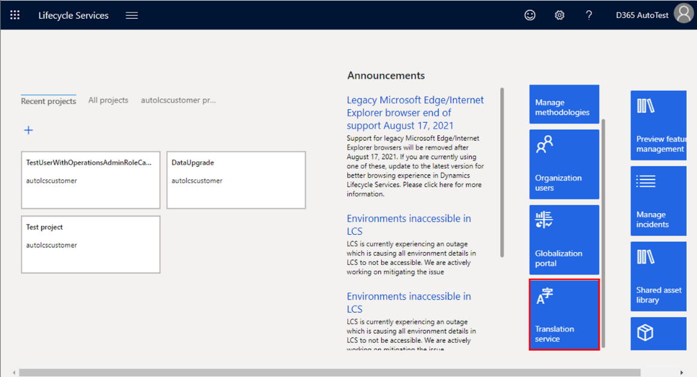
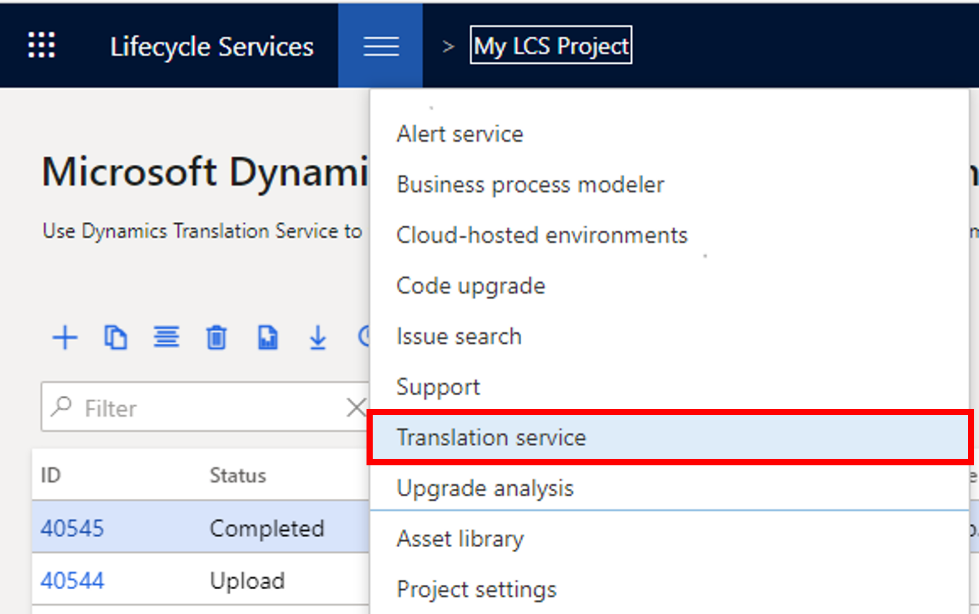

يمكنك الوصول إلى Dynamics 365 Translation Service من الصفحة الرئيسية لـ [Lifecycle Services](https://lcs.dynamics.com/?azure-portal=true) أو من داخل مشروع Lifecycle Services.

-   **الصفحة الرئيسية لـ Lifecycle Services** - سجّل الدخول إلى Lifecycle Services وانتقل إلى الجانب الأيمن من الصفحة. حدد الإطار المتجانب **Translation service** لفتح عرض لوحة المعلومات لخدمة Dynamics 365 Translation Service.

    > [!div class="mx-imgBorder"]
    > 

-   **مشروع Lifecycle Services** - أنشئ مشروعاً جديداً أو افتح مشروعاً موجوداً. يجب أن يكون نوع مشروع Lifecycle Services **التنفيذ** أو **الترحيل وإنشاء الحلول والتعلم**. على لوحة معلومات **المشروع**، في قسم **الأدوات الإضافية**، حدد الإطار المتجانب **Translation service**. أو بدلاً من ذلك، في لوحة معلومات المشروع، حدد الزر **قائمة**، وحدد **Translation service**.

    > [!div class="mx-imgBorder"]
    > 

عندما تقوم بالوصول إلى Translation Service مباشرةً من الصفحة الرئيسية لـ Lifecycle Services وتقوم بإنشاء طلب ترجمة، يمكنك تحديد أي منتج Translation Service مدعوم لطلبك. ستعرض لوحة المعلومات الموجودة في هذه الصفحة جميع الطلبات التي تم إجراؤها من الصفحة الرئيسية (خارج مشروع Lifecycle Services) بواسطة مستخدمين من مؤسستك.

عند الوصول إلى Translation Service من مشروع Lifecycle Services وإنشاء طلب ترجمة، سيتم ملء حقل المنتج تلقائياً بالمنتج المرتبط بمشروع Lifecycle Services. لا يمكنك تحديد منتج مختلف لهذا الطلب. ستعرض لوحة المعلومات الموجودة في هذه الصفحة الطلبات التي تم إجراؤها بواسطة المستخدمين ضمن مشروع Lifecycle Services نفسه. بالإضافة إلى ذلك، إذا تم حذف مشروع Lifecycle Services، فسيتم حذف جميع الطلبات المرتبطة.

وفي كلتا الحالتين، سيكون لدى المستخدمين الذين يمكنهم عرض الطلب حق الوصول للقراءة ولكن يجب أن يأخذوا ملكية الطلب في لوحة المعلومات لإعادة إنشائه.
