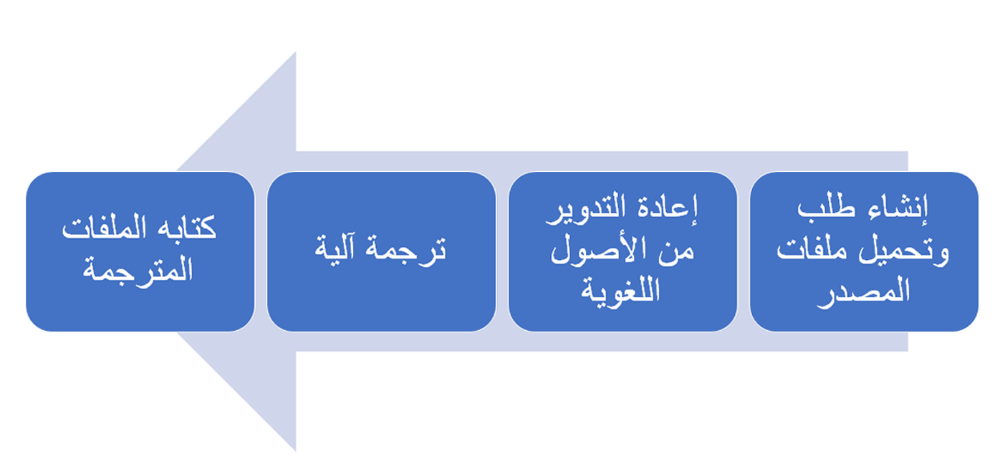

يوضح الرسم التوضيحي التالي، على مستوى عالٍ، كيفية عمل Translation Service.

> [!div class="mx-imgBorder"]
> 

هناك ثلاثة أنواع من الطلبات التي يمكنك إجراؤها من خلال Dynamics 365 Translation Service هي:

-   **الترجمة** - ترجمة ملفات أو وثائق واجهة المستخدم (UI) عن طريق تحميل ملفات المصدر الخاصة بك، واختيارياً، ملفات ذاكرة الترجمة. ستقوم Translation Service بإنشاء ملفات الإخراج لمراجعة الترجمة وملفات التنسيق الأصلي المترجمة.

-   **إعادة الإنشاء** - إعادة توليد/إعادة إنشاء الملفات الأصلية تلقائياً عن طريق تحميل ملف مضغوط للمنشور الذي تم تحريره (مراجعة الترجمة) XLIFF لملفات واجهة المستخدم أو docx. لملفات التوثيق. ستقبل Translation Service الترجمات التي تمت مراجعتها، إذا كانت صالحة، وستكتب إلى ملفات التنسيق الأصلية المترجمة المُعاد إنشاؤها.

-   **المحاذاة** - إنشاء ذاكرة ترجمة XLIFF عن طريق تحميل ملف مصدر والملف الهدف المترجم المقابل لاستخدامه في طلبات الترجمة.

عند إنشاء طلب ترجمة جديد، يمكنك اختيار ترجمة ملفات واجهة المستخدم أو ملفات الوثائق. راجع وثائق Dynamics 365 Translation Service الخاصة بـ [المنتجات وتنسيقات الملفات المدعومة](/dynamics365/fin-ops-core/dev-itpro/lifecycle-services/translation-service-overview?azure-portal=true#supported-products).
