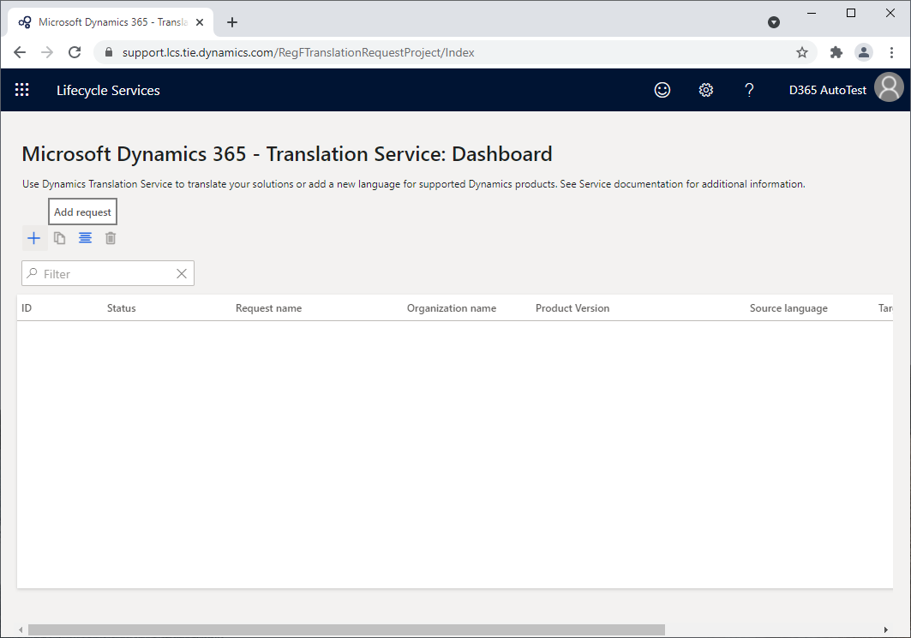
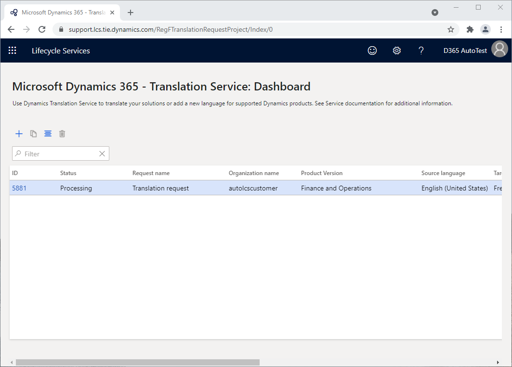
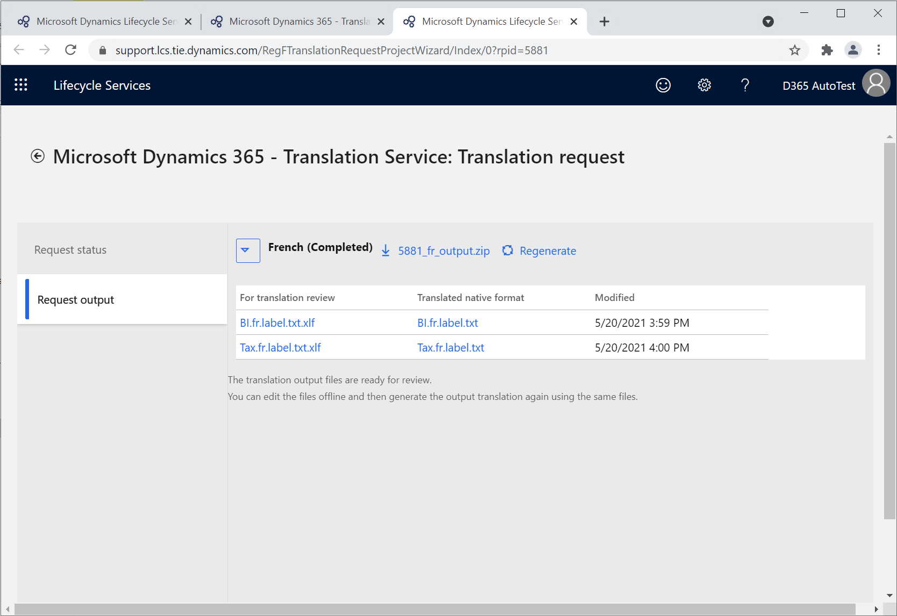
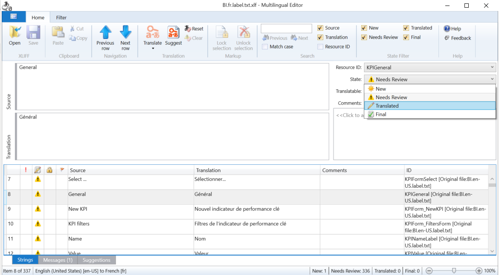
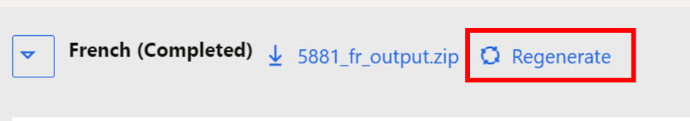
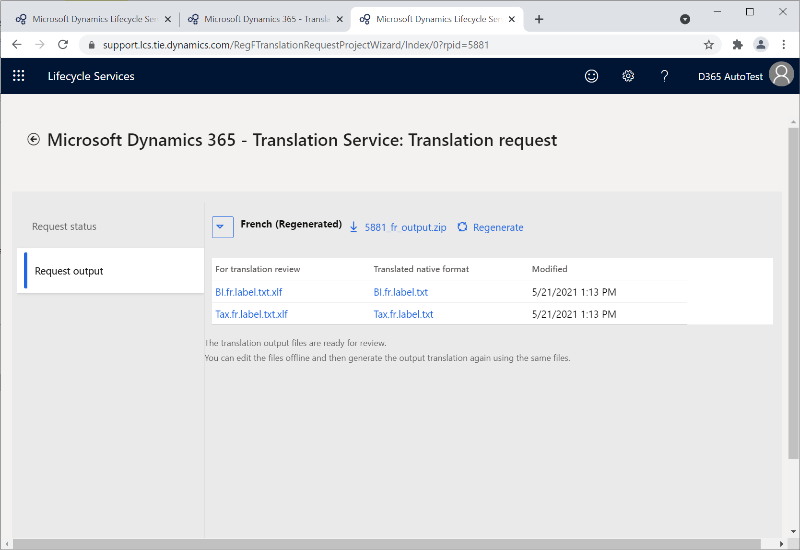

لهذا التمرين، ستحتاج إلى إرسال ملف أو أكثر من ملفات واجهه المستخدم (UI) لطلب الترجمة. راجع وثائق Dynamics 365 Translation Service [لعرض المنتجات المدعومة وتنسيقات الملفات المدعومة.](/dynamics365/fin-ops-core/dev-itpro/lifecycle-services/translation-service-overview?azure-portal=true#supported-products)

في هذا التمرين، ستقوم بما يلي:

-   أرسل طلبًا لترجمة ملفات واجهة المستخدم باستخدام لوحة معلومات Translation Service.

-   راجع مخرجات الترجمة.

-   حرّر ذاكرة ترجمة XLIFF التي تم إنشاؤها.

-   أعد إنشاء طلب الترجمة مستخدمًا ذاكرة الترجمة الجديدة.

-   راجع الطلب المُعاد إنشاؤه.

## إنشاء طلب ترجمة

لإنشاء طلب ترجمة، اتبع الخطوات التالية:

1.  يمكنك الوصول إلى لوحة معلومات Translation Service من مشروع Lifecycle Services أو صفحة [Lifecycle Services](https://lcs.dynamics.com/?azure-portal=true) الرئيسية.

1.  لإنشاء طلب ترجمه جديد، حدد رمز علامة الجمع (**+**) في شريط القائمة.

    > [!div class="mx-imgBorder"]
    > 

1.  أدخل تفاصيل الطلب.

    |     الحقل                            |     الوصف                                                                                                                                                                                                                              |
    |--------------------------------------|----------------------------------------------------------------------------------------------------------------------------------------------------------------------------------------------------------------------------------------------|
    |     اسم الطلب                     |     أدخل اسماً للطلب.                                                                                                                                                                                                          |
    |     نوع الملف                        |     حدد **واجهة المستخدم**.                                                                                                                                                                                                                 |
    |     اسم المنتج                     |     حدد اسم المنتج. في حال الوصول إلى Translation Service من مشروع Lifecycle Services، يجري ملء هذا الحقل تلقائياً ويكون للقراءة فقط.                                                                         |
    |     إصدار المنتج                |     حدد إصدار المنتج. في حال الوصول إلى Translation Service من مشروع Lifecycle Services، سيعرض هذا الحقل معلومات إصدار المنتج الافتراضي من المشروع.‬   ورغم ذلك، يمكنك تحديد إصداراً مختلفاً.    |
    |     لغة مصدر الترجمة    |     حدد لغة ملفات المصدر التي يتم تحميلها.                                                                                                                                                                         |
    |     لغة الترجمة الهدف    |     حدد لغة أو أكثر من لغات الهدف باستخدام خانة الاختيار الموجودة بالقرب من اسم اللغة.                                                                                                                                                    |

    > [!NOTE]
    > إن أسماء اللغات التي تظهر بخط **غامق** هي لغات التوفر العام (GA) لمنتجات Microsoft Dynamics 365. تستخدم Dynamics 365 Translation Service نماذج الترجمة الآلية التي يتم تخصيصها باستخدام المصطلحات من منتجات Microsoft Dynamics 365 لهذه اللغات. بالنسبة للغات التي لا تندرج ضمن لغات التوفر العام، يستخدم النظام نماذج المجال العامة. لتحقيق أقصى استفادة من نماذج الترجمة الآلية لأصول Microsoft Dynamics 365 اللغوية التي توفر Microsoft تدريبًا عليها، تأكد من تحديد **الإنجليزية (الولايات المتحدة)** كلغة المصدر أو اللغة الهدف.

1.  تحقق من إدخال تفاصيل الطلب بشكل صحيح، ثم حدد **إنشاء**.

1.  قم بإنشاء ملف واحد مضغوط يشمل جميع ملفات واجهة المستخدم باللغة المصدر التي تريد الترجمة منها. يمكن أن يشتمل الملف المضغوط على أنواع ملفات مختلفة، إذا كانت أنواع الملفات مدعومة للمنتج، ولكن لا يمكن أن يحتوي على مجلدات.

1.  ضمن **تحميل الملفات لترجمتها**، حدد رمز علامة الجمع (**+**) لتحميل ملفاتك.

1.  ضمن **تحميل ملفات ذاكرة ترجمة XLIFF**، يمكنك تحميل ملفات ذاكرة الترجمة بشكل اختياري لاستخدامها أثناء ترجمة الطلب. إذا كانت لديك ملفات ذاكرة ترجمة XLIFF من طلب ترجمة سابق لواجهة المستخدم، أو إذا استخدمت الأداة Align لإنشاء ملف ذاكرة ترجمة XLIFF، فقم بإنشاء ملف مضغوط يحتوي على جميع ملفات ذاكرة الترجمة قبل تحميلها. إذا قمت بتحميل ملفات ذاكرة الترجمة، فيمكنك أيضًا إنشاء نظام ترجمة آلية مخصص يتم تدريبه معها. لهذا التمرين، حدد **لا**.

1.  لبدء عملية الترجمة، حدد **إرسال** بعد الانتهاء من تحميل ملفاتك.

## عرض النتائج النهائية لطلب الترجمة

بعد إرسال الطلب، سيتم إنشاء معرّف طلب جديد في لوحة معلومات Translation Service وسيتم إرسال إعلام عبر البريد الإلكتروني. إذا قمت بتقديم طلب الترجمة بالعديد من اللغات الهدف، فسيتم عرض حالة كل لغة من اللغات الهدف في سطر منفصل بنفس معرّف الطلب.

> [!div class="mx-imgBorder"]
> 

1.  حدد معرّف الطلب الخاص بطلبك. تعرض علامة التبويب **حالة الطلب** قائمة الملفات المصدر التي قمت بتحميلها وتحديثها بملخص معلومات الطلب.

1.  حدد علامة التبويب **إخراج الطلب** لعرض النتيجة النهائية لطلبك. بعد انتهاء معالجة الطلب، ستتلقى إعلاماً عبر البريد الإلكتروني من Translation Service وستظهر الحالة **(مكتمل)** بجوار كل لغة من اللغات الهدف.

    > [!NOTE]
    > يعتمد وقت المعالجة على عدد الطلبات الموجودة في قائمة انتظار Dynamics 365 Translation Service وعدد الكلمات الموجودة في ملفات المصدر التي ترسلها. بالإضافة إلى ذلك، إذا قمت بإنشاء نظام ترجمة آلية مخصص، فقد يتطلب هذا الطلب وقتاً إضافياً لتدريب النموذج المخصص.

1.  سيظهر ارتباط تنزيل مع الملفات من إخراج الطلب بجوار اسم اللغة، بعد انتهاء معالجة طلب إحدى اللغات. قم بتنزيل الملف المضغوط واستخراجه لعرض المجلدات الموجودة بداخله. سيتم عرض مجلدين، **لمراجعة الترجمة** و **التنسيق الأصلي المترجم**، يحتويان على أنواع الملفات التالية:

    -   المجلد **لمراجعة الترجمة** - يحتوي على ملفات بتنسيق XLIFF والتي ينبغي عليك مراجعتها وتحرير الترجمات حسب الحاجة. يمكنك تحرير هذه الملفات في تطبيق Multilingual Editor.
    
    -   بينما المجلد **التنسيق الأصلي المترجم** - يحتوي على الترجمات في تنسيقها الأصلي. إن التنسيق الأصلي يعني أن الملف لا يزال بنفس تنسيق الملف المصدر الذي أرسلته.

    بالإضافة إلى ذلك، يمكنك توسيع القائمة المنسدلة بجوار اسم اللغة لعرض جدول يعرض كل ملف فردي ويعكس بنية المجلد للملف المضغوط.

    > [!div class="mx-imgBorder"]
    > 

## مراجعة الترجمات وتحريرها

نوصيك باستخدام تطبيق [Multilingual Editor](https://developer.microsoft.com/windows/downloads/multilingual-app-toolkit/?azure-portal=true) المجاني أو أي محرر XLIFF تفضله، لكي تتمكن من مراجعة الترجمات وتحريرها. باستخدام هذه الأداة، يمكنك منع إجراء تغييرات غير مرغوب فيها على ملف XLIFF. يعرض المثال التالي تطبيق Multilingual Editor قيد الاستخدام.

1.  ضمن العمود **لمراجعة الترجمة**، حدد اسم الملف لتنزيل ملف XLIFF.

1.  افتح الملف في تطبيق Multilingual Editor. عند ظهور خطأ عند فتح الملف، رجاءً تجاهل الرسالة مع تحديد علامة تبويب **السلاسل** الموجودة في في الزاوية السفلية اليمنى من النافذة.

1.  للتحقق من الترجمات، يمكنك تطبيق عامل تصفية لإظهار السلاسل الموجودة في الحالة **تتطلب المراجعة**. ستعمل هذه الميزة على تصفية الترجمات التي تمت ترجمتها آلياً أو إعادة تدويرها من سلسلة باستخدام معرّف مورد مختلف.

    > [!div class="mx-imgBorder"]
    > 
 
1.  بعد مراجعتك للترجمات وتحريرها والتأكد من أنها ذات جودة متوقعة، ضع عليها علامة **مترجمة** أو **نهائية** أو **معتمدة** كي يمكن استخدامها للطلبات المستقبلية.

## إعادة إنشاء طلب ترجمة

ستحتاج إلى إعادة إنشاء التنسيقات الأصلية المترجمة، بعد الانتهاء من مراجعة الترجمات وتحريرها في XLIFF.

1.  حدد الزر **إعادة إنشاء** الموجود بجوار قسم اللغة الهدف. ‎سيفتح جزء **تحميل الملف**.

    > [!div class="mx-imgBorder"]
    > 

1.  اضغط ملفات XLIFF التي تم تحريرها، ثم حدد **تحميل**. لا تغيّر اسم ملف XLIFF الذي قدمته Translation Service في الأصل.

1.  قم بتأكيد عملية التحميل، في موجه الأوامر. ستقوم علامة التبويب **إخراج الطلب** بتحديث المحتوى.

1.  قم بتوسيع عقدة اللغة الهدف التي قمت بإعادة إنشائها للتحقق من الطابع الزمني **المعدّل**.

    > [!div class="mx-imgBorder"]
    > 

1.  قم بتنزيل الملف المضغوط ثم استخراجه. افتح ملفات التنسيق الأصلي التي تمت ترجمتها لعرض الترجمات المُعاد إنشاؤها.
