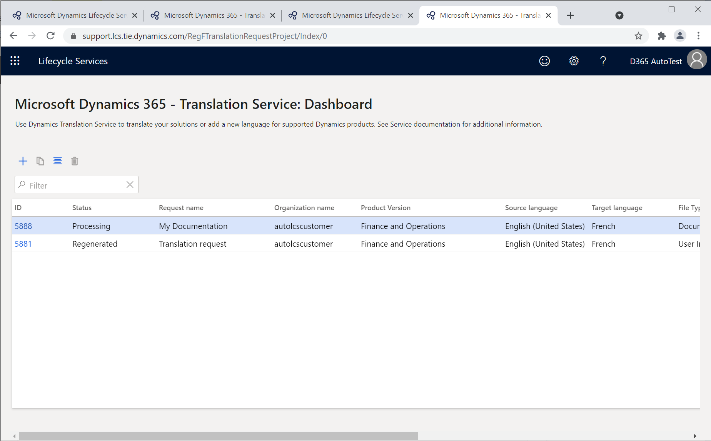
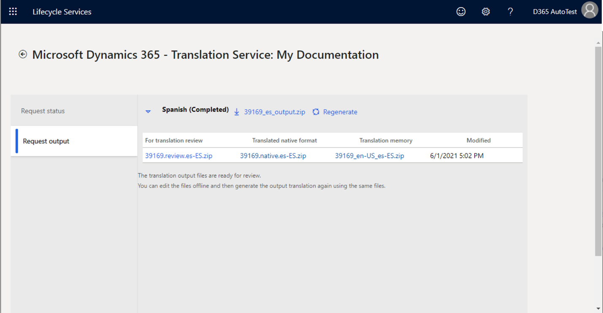
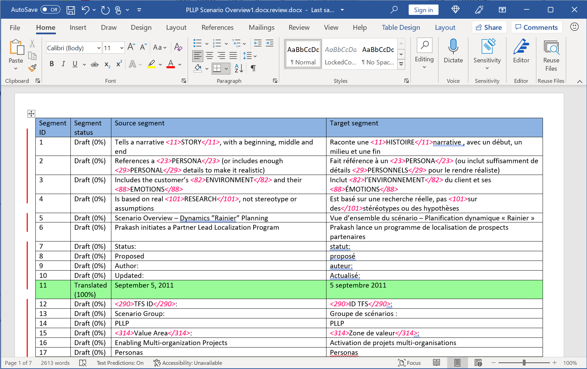
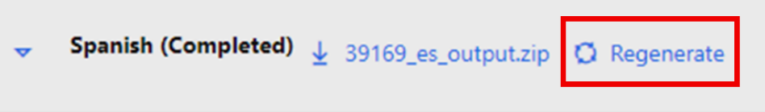

بالنسبة لهذا التمرين، ستحتاج إلى إرسال ملف أو أكثر من ملفات التوثيق بتنسيق .docx لطلب الترجمة. نوصي بتحميل ملفات المستندات Microsoft Word الفعلية إلى جانب محتوى المستند. وتجنب استخدام ملف تسمية جرى حفظه بتنسيق .docx.

في هذا التمرين، ستقوم بما يلي:

-   أرسل طلب لترجمة ملفات التوثيق باستخدام لوحة معلومات Translation Service.

-   راجع مخرجات الترجمة.

-   ابدأ تحرير سلاسل المستند المترجمة.

-   أعد إنشاء طلب الترجمة بالسلاسل المحدثة.

-   راجع الطلب المُعاد إنشاؤه.

## إنشاء طلب ترجمة

لإنشاء طلب ترجمة، اتبع الخطوات التالية:

1.  يمكنك الوصول إلى لوحة معلومات Translation Service من مشروع Lifecycle Services أو صفحة [Lifecycle Services](https://lcs.dynamics.com/?azure-portal=true) الرئيسية.

1.  لإنشاء طلب ترجمه جديد، حدد رمز علامة الجمع (**+**) في شريط القائمة.

    > [!div class="mx-imgBorder"]
    > 

1.  أدخل تفاصيل الطلب.

    |     الحقل                            |     الوصف                                                                                                                                                                                                                              |
    |--------------------------------------|----------------------------------------------------------------------------------------------------------------------------------------------------------------------------------------------------------------------------------------------|
    |     اسم الطلب                     |     أدخل اسماً للطلب.                                                                                                                                                                                                          |
    |     نوع الملف                        |     حدد **التوثيق**.                                                                                                                                                                                                                    |
    |     اسم المنتج                     |     حدد اسم المنتج. في حال الوصول إلى Translation Service من مشروع Lifecycle Services، يجري ملء هذا الحقل تلقائياً ويكون للقراءة فقط.                                                                         |
    |     إصدار المنتج                |     حدد إصدار المنتج. ‏‫في حال الوصول إلى Translation Service من مشروع Lifecycle Services، سيعرض هذا الحقل معلومات إصدار المنتج الافتراضي من المشروع.‬ ورغم ذلك، يمكنك تحديد إصداراً مختلفاً.    |
    |     لغة مصدر الترجمة    |     حدد اللغة المصدر للملفات التي تقوم بتحميلها.                                                                                                                                                                         |
    |     لغة الترجمة الهدف    |     حدد لغة أو أكثر من لغات الهدف باستخدام خانة الاختيار الموجودة بالقرب من اسم اللغة.                                                                                                                                                    |

    > [!NOTE]
    > إن أسماء اللغات التي تظهر بخط **غامق** هي لغات التوفر العام (GA) لمنتجات Microsoft Dynamics 365. تستخدم Dynamics 365 Translation Service نماذج الترجمة الآلية التي يتم تخصيصها باستخدام المصطلحات من منتجات Microsoft Dynamics 365 لهذه اللغات. بالنسبة للغات التي لا تندرج ضمن لغات التوفر العام، يستخدم النظام نماذج المجال العامة. لتحقيق أقصى استفادة من نماذج الترجمة الآلية لأصول Microsoft Dynamics 365 اللغوية التي توفر Microsoft تدريبًا عليها، تأكد من تحديد **الإنجليزية (الولايات المتحدة)** كلغة المصدر أو اللغة الهدف.

1.  تحقق من إدخال تفاصيل الطلب بشكل صحيح، ثم حدد **إنشاء**.

1.  أنشئ ملفاً واحداً مضغوطاً يشمل كافة ملفات التوثيق بتنسيق .docx باللغة المصدر التي تريد الترجمة منها.

1.  ضمن **تحميل الملفات لترجمتها**، حدد رمز علامة الجمع (**+**) لتحميل ملفاتك.

1.  ضمن **تحميل ملفات ذاكرة ترجمة XLIFF أو TMX**، يمكنك تحميل ملفات ذاكرة الترجمة بشكلٍ اختياري بتنسيق XLIFF أو TMX لاستخدامها مع الطلب. أنشئ ملفاً مضغوطاً واحداً يحتوي على ملفات ذاكرة الترجمة قبل تحميلها. إذا بدأت تحميل ملفات ذاكرة الترجمة، يمكنك اختيار إنشاء نظام ترجمة آلية مخصص. لهذا التمرين، حدد **لا**.

1.  لبدء عملية الترجمة، حدد **إرسال** بعد الانتهاء من تحميل ملفاتك.

## عرض النتائج النهائية لطلب الترجمة

بعد إرسالك الطلب، سيتم إنشاء معرّف طلب جديد في لوحة معلومات Translation Service وسيتم إرسال إعلام عبر البريد الإلكتروني. إذا قمت بتقديم طلب الترجمة بالعديد من اللغات الهدف، فسيتم عرض حالة كل لغة من اللغات الهدف في سطر منفصل بنفس معرّف الطلب.

> [!div class="mx-imgBorder"]
> 

1.  حدد معرّف الطلب الخاص بطلبك. ستعرض علامة التبويب **حالة الطلب** قائمة الملفات المصدر التي بدأت تحميلها وتحديثها بملخص معلومات الطلب.

1.  حدد علامة التبويب **إخراج الطلب** لعرض النتيجة النهائية لطلبك. بعد انتهاء معالجة الطلب، ستتلقى إعلاماً عبر البريد الإلكتروني من Translation Service وستظهر الحالة **(مكتمل)** بجوار كل لغة من اللغات الهدف.

    > [!NOTE]
    > تستغرق ملفات التوثيق وقتاً أطول في المعالجة مقارنة بملفات واجهة المستخدم. إضافةً إلى ذلك، إذا أنشأت نظام ترجمة آلية مخصص، سيتطلب هذا الطلب وقتاً إضافياً لتدريب النموذج. وفي كلا الحالتين، تتخذ طلبات التوثيق هذه عادةً مدة معالجة لثلاثة أيام عمل.

1.  سيظهر ارتباط تنزيل مع الملفات من إخراج الطلب بجوار اسم اللغة، بعد انتهاء معالجة طلب إحدى اللغات. ابدأ تنزيل الملف المضغوط واستخراجه لعرض المجلدات الموجودة بداخله. ستحتوي مجلدات **لمراجعة الترجمة** و **التنسيق الأصلي المترجم** و **ذاكرة الترجمة** على أنواع الملفات التالية:

    - **لمراجعة الترجمة** - يحتوي على ملفات بتنسيق .docx والتي ينبغي عليك مراجعتها وتحرير الترجمات حسب الحاجة. يعرض الملف اللغة المصدر واللغة الهدف بجانب بعضهما البعض.

    - بينما المجلد **التنسيق الأصلي المترجم** - يحتوي على الترجمات في تنسيقها الأصلي. إن التنسيق الأصلي يعني أن الملف لا يزال بنفس تنسيق الملف المصدر الذي أرسلته.

    - **ذاكره الترجمة** - تحتوي على ذاكرة الترجمة بتنسيق TMX. يمكنك تحميل هذا الملف كذاكرة ترجمة عند إرسال طلبات ترجمة توثيق مستقبلية.

    إضافةً إلى ذلك، يمكنك توسيع القائمة المنسدلة بجوار اسم اللغة لعرض جدول يعكس بنية المجلد للملف المضغوط.

    > [!div class="mx-imgBorder"]
    > 

## مراجعة الترجمات وتحريرها

لمراجعة الترجمات وتحريرها، اتبع الخطوات التالية:

1.  في مجلد **لمراجعة الترجمة**، افتح الملف بتنسيق .docx في Microsoft Word. يوفر الملف طريقة عرض جدول ملائمة تمنحك مقارنة جنباً إلى جنب للنص الموجود في اللغة المصدر واللغة الهدف.

1.  ابدأ إجراء التغييرات اللازمة على الترجمة بتعديل النص في عمود **الشريحة الهدف**. تأكد من مراعاة الإرشادات التالية.

    > [!div class="mx-imgBorder"]
    > 

    > [!NOTE]
    > عند تحرير ملف بتنسيق .docx، تأكد من اتباع تلك الإرشادات:
    > - حرر النص الموجود في عمود **الشريحة الهدف** فقط.
    > - تجنب إضافة الصفوف أو إزالتها.
    > - تجنب تغيير ترتيب الصفوف أو الأعمدة.
    > - تجنب إضافة العلامات الحمراء أو إزالتها. حيث تمثل معظم العلامات الحمراء التنسيق والأنماط. إذا كان من اللازم تحريك العلامات الحمراء، تأكد من عدم تبديل علامة البدء (مثل \<116\>) وعلامة الإنهاء (\</116\>).

1.  بعد تحرير الترجمات الهدف، احفظ الملف.

## إعادة إنشاء طلب الترجمة

ستحتاج إلى إعادة إنشاء الترجمة بتطبيق الترجمات الأخيرة، بعد الانتهاء من مراجعة الملف بتنسيق .docx وتحريره.

1.  حدد الزر **إعادة إنشاء** الموجود بجوار قسم اللغة الهدف. ‎سيفتح جزء **تحميل الملف**.

    > [!div class="mx-imgBorder"]
    > 

1.  اضغط ملفات .docx التي تم تحريرها، ثم حدد **تحميل**. لا تغيّر أسماء الملف الذي قدمته Translation Service في الأصل.

1.  قم بتأكيد عملية التحميل، في موجه الأوامر. ستقوم علامة التبويب **إخراج الطلب** بتحديث المحتوى.

1.  ابدأ توسيع عقدة اللغة الهدف التي أعدت إنشائها للتحقق من الطابع الزمني **المعدل**، ثم ابدأ تنزيل ملفات الإخراج المحدثة.

1.  ابدأ تنزيل الملف المضغوط مرةً أخرى ثم استخرجه. افتح الملف في مجلد **التنسيق الأصلي المترجم‬‏‫** لعرض الترجمات المُعاد إنشاؤها.
