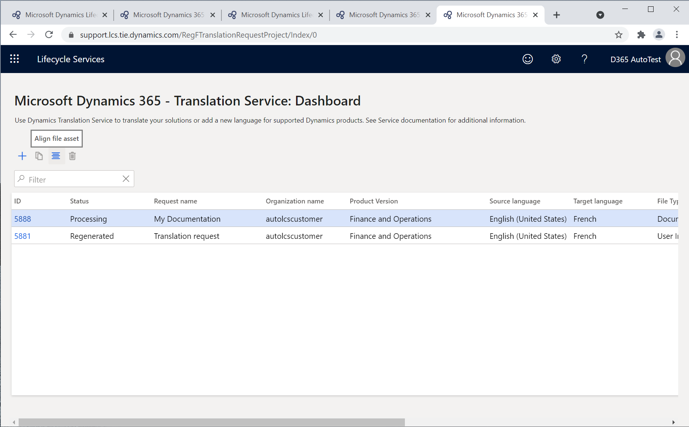
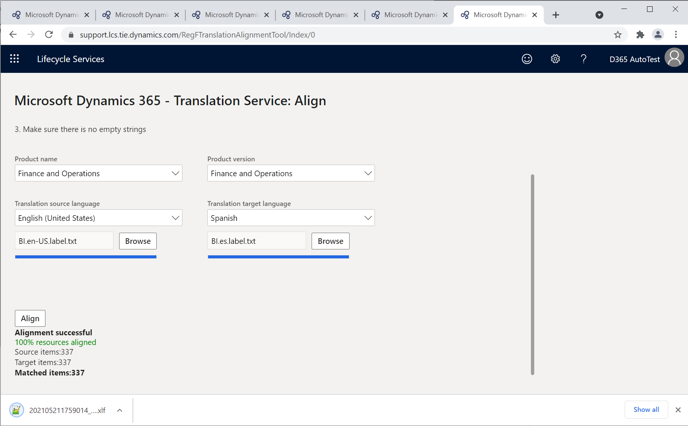

تستخدم Dynamics 365 Translation Service ملف تنسيق ملف تبادل تعريب XML ‏(XLIFF) ثنائي اللغة لتخزين أزواج من السلاسل بين لغة المصدر ولغة الهدف. يمكنك استخدام ملفات XLIFF هذه باعتبارها ذاكرة ترجمة عند إرسال طلب ترجمة لإعادة استخدام السلاسل المتطابقة. في Dynamics 365 Translation Service، يمكنك الحصول على ملف ذاكرة ترجمة XLIFF بطريقتين:

-   **إكمال طلب ترجمة** - عند اكتمال طلب ترجمة واجهة المستخدم في Dynamics 365 Translation Service، فإنه يوفر ملف XLIFF TM كجزءٍ من إخراج الطلب. يمكنك استخدام ذاكرة الترجمة هذه لطلبات ترجمة واجهة المستخدم المستقبلية.

-   **تشغيل أداة Align "المحاذاة"** - عند وجود ملفات مترجمة مسبقاً، وكان لديك أيضاً ملفات مصدر مطابقة، يمكنك استخدام أداة Align "المحاذاة" لإنشاء ملف XLIFF TM.

> [!NOTE]
> تدعم أداة Align "المحاذاة" حالياً ملفات واجهة المستخدم فقط، إلا انه يمكن استخدام ملف XLIFF الناتج كذاكرة ترجمة لطلبات واجهة المستخدم أو التوثيق.

## قبل البدء

لإنشاء ملف ذاكرة ترجمة باستخدام Dynamics 365 Translation Service، ستحتاج إلى ملف واجهة مستخدم مترجم مسبقاً بالإضافة إلى ملف المصدر المطابق له. لإنشاء ملف أفضل XLIFF TM، تأكد من تلبية الشروط التالية قبل إرسال طلب المحاذاة.

-   يحتوي ملف المصدر وملف الهدف على نفس عدد الموارد.

-   الموارد تكون بنفس الترتيب الموجود في الملف المصدر والملف الهدف.

-   ولا توجد سلاسل فارغة. يبين الرسم التوضيحي التالي أمثلة على السلاسل الفارغة في الملف المصدر والملف الهدف.

> [!div class="mx-imgBorder"]
> 

في هذا التمرين، ستقوم بما يلي:

-   ابدأ تشغيل أداة Align "المحاذاة" لإنشاء ملف XLIFF TM.

-   راجع الترجمات الموجودة في ملف XLIFF TM.

## إنشاء ملف ذاكرة ترجمة

لإنشاء ملف ذاكرة ترجمة، اتبع الخطوات التالية:

1.  على لوحة معلومات Translation Service، حدد أداة **Align "المحاذاة"** لفتح أداه Align "المحاذاة".

    > [!div class="mx-imgBorder"]
    > 

1.  في صفحة **Align "المحاذاة"**، أدخل تفاصيل الطلب ثم ابدأ تحميل ملفات واجهة المستخدم المصدر والهدف.

    |        الحقل                         |     الوصف                                                                                                                                                                                                                              |
    |--------------------------------------|----------------------------------------------------------------------------------------------------------------------------------------------------------------------------------------------------------------------------------------------|
    |     اسم المنتج                     |     حدد اسم المنتج. في حال الوصول إلى Translation Service من مشروع Lifecycle Services، يجري ملء هذا الحقل تلقائياً ويكون للقراءة فقط.                                                                         |
    |     إصدار المنتج                |     حدد إصدار المنتج. إذا وصلت إلى Translation Service من مشروع Lifecycle Services، سيعرض هذا الحقل معلومات إصدار المنتج الافتراضي من المشروع.‬ ورغم ذلك، يمكنك تحديد إصداراً مختلفاً.    |
    |     لغة مصدر الترجمة    |     حدد اللغة المصدر للملفات التي يتم تحميلها.                                                                                                                                                                         |
    |     اللغة الهدف للترجمة    |     حدد اللغة الهدف.                                                                                                                                                    |

1.  حدد **محاذاة** لإرسال الطلب. عند اكتمال المحاذاة، ستلخص الرسالة النتائج وسيجري تنزيل XLIFF.

    > [!div class="mx-imgBorder"]
    > 

## مراجعة ذاكرة الترجمة

نوصي باستخدام تطبيق [Multilingual Editor](https://developer.microsoft.com/windows/downloads/multilingual-app-toolkit/?azure-portal=true) المجاني أو محرر XLIFF آخر لمراجعة الترجمات وتحريرها في ملف XLIFF الذي توفره Dynamics 365 Translation Service.

1.  افتح ملف XLIFF في تطبيق Multilingual Editor. عند ظهور خطأ عند فتح الملف، رجاءً تجاهل الرسالة مع تحديد علامة تبويب **السلاسل** الموجودة في في الزاوية السفلية اليمنى من النافذة.

1.  عند إنشاء ملف XLIFF باستخدام أداة Align "المحاذاة"، تُوضع علامة على جميع الترجمات باعتبارها **مترجمة** لأن وحدات الترجمة التي جرى محاذاتها تنتج عن الترجمات الجيدة المعروفة. ابدأ تعديل أي ترجمة لا تكون راضٍ عنها، ثم ضع علامة عليها باعتبارها **مترجمة** أو **نهائية** أو **معتمدة‬‏‫** عند الاكتمال. يمكنك الآن استخدام ملف XLIFF الموجود في طلبات الترجمة المستقبلية باعتبارها ذاكرة ترجمة.

> [!div class="mx-imgBorder"]
> 
