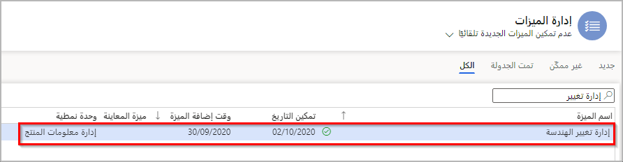
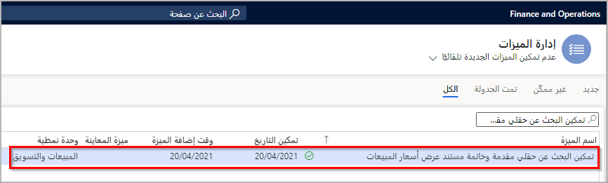

قبل استخدام الوظيفة الإضافية لإدارة التغيير الهندسي لـ Microsoft Dynamics 365 Supply Chain Management، يجب تمكين الميزة ومفتاح التكوين.

لتمكين ميزة **إدارة التغيير الهندسي** اتبع الخطوات التالية:

1. انتقل إلى **إدارة النظام > مساحات العمل > إدارة الميزات**.

1. حدد علامة التبويب **‎الكل**.

1. ابحث عن **إدارة التغيير الهندسي**.

1. حدد الزر **تمكين** في الجزء السفلي الأيمن من الشاشة.

> [!div class="mx-imgBorder"]
> 

إذا كنت ترغب في تمكين إدارة التغيير الهندسي على المنتجات الحالية في النظام، فيجب عليك أيضاً تمكين ميزة **تمكين إدارة التغيير على المنتجات الحالية**.

عندما تقوم بتمكين إدارة التغيير لمنتج موجود، يمكنك إنشاء إصدارات من هذا المنتج وتتبع التغييرات التي تم إجراؤها عليه طوال دورة حياته. لتمكين إدارة التغيير، تحتاج إلى تحويل المنتجات ذات الصلة إلى *أصناف هندسية* (يشار إليها أيضاً باسم المنتجات الهندسية).

> [!div class="mx-imgBorder"]
> 

بعد ذلك، ستحتاج إلى تشغيل مفتاح التكوين لإدارة التغيير الهندسي باتباع الخطوات التالية:

1. ضع نظامك في وضع الصيانة. لمزيد من المعلومات، راجع [وضع الصيانة](/dynamics365/fin-ops-core/dev-itpro/sysadmin/maintenance-mode/?azure-portal=true).

1. انتقل إلى **إدارة النظام> الإعداد > تكوين الترخيص**.

1. قم بتوسيع العقدة **التجارة** .

1. حدد خانة الاختيار **إدارة التغيير الهندسي** .

1. قم بإيقاف تشغيل وضع الصيانة.

> [!NOTE]
> يجب تشغيل مفتاح تكوين إضافي حتى تتمكن من العمل مع إصدارات المنتج. لمزيد من المعلومات، راجع [إنشاء مجموعات أبعاد المنتج باستخدام بُعد الإصدار](/learn/modules/set-up-versioned-products-engineering-change-management/5-dimension-groups/?azure-portal=true).

الآن بعد أن قمت بتمكين الميزات المطلوبة لاستخدام وظيفة إدارة التغيير الهندسي، فأنت جاهز لإعداد الوظائف التي سيستخدمها عملك.
