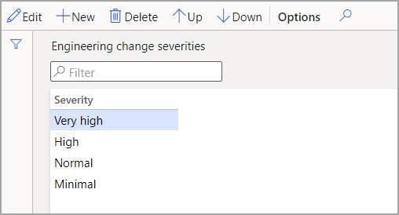

تشير درجات خطورة الهندسية إلى مستوى التأثير الذي ينطبق على المنتجات في أمر التغيير الهندسي.Engineering severities indicate the level of impact that applies to the products in an engineering change order.

لإنشاء درجات الخطورة هذه، انتقل إلى **إدارة التغيير الهندسي** > **الإعداد** > **إدارة التغيير الهندسي** > **درجات خطورة التغيير الهندسي**.To create these severities, go to **Engineering change management** > **Setup** > **Engineering change management** > **Engineering change severities**.

> [!div class="mx-imgBorder"]
> 

تعرض قائمة **درجات خطورة التغيير الهندسي** خطورة أو إلحاح مستوى تأثير تغيير معين على المنتج.The **Engineering change severities** list shows the severity or urgency of the level of impact of a specific change to a product. يشير السهمان **لأعلى** و **لأسفل** ترتيب التحديدات كما تظهر في القائمة المنسدلة.The **Up** and **Down** arrows signify the order of the selections as they appear in a drop-down list.

باستخدام درجات الخطورة هذه، يمكن إعداد القواعد لتطبيقها على كل مستوى تقوم بإنشائه.Using these severities, rules can be set up to apply to each level that you create.
