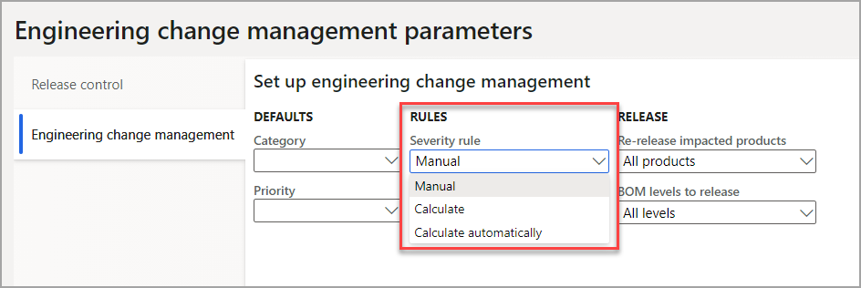
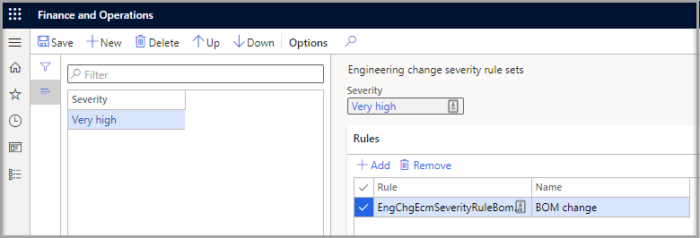

تُستخدم مجموعات قواعد الخطورة لحساب خطورة أمر التغيير تلقائياً. عندما يقوم النظام بتقييم خطورة، فإنه يعالج القواعد التي تم تكوينها في المعلمات. 

لاستخدام مجموعات قواعد الخطورة، افتح صفحة **المعلمات**، وقم بتعيين حقل **قاعدة الخطورة** إلى **حساب** أو **حساب تلقائياً**.

**إدارة التغيير الهندسي** > **الإعداد** > **معلمات إدارة التغيير الهندسي**.

> [!div class="mx-imgBorder"]
> 

يمكن تحديد القواعد لتطبيقها على مستويات الخطورة المختلفة التي تم إعدادها. يعالج النظام القواعد التي تظهر فيها على الصفحة، من أعلى إلى أسفل.

> [!div class="mx-imgBorder"]
> 

لإنشاء مجموعة قواعد، اتبع الخطوات التالية:

1. حدد **جديد**.

1. حدد **الخطورة** من القائمة المنسدلة لدرجات الخطورة التي تم إنشاؤها.

1. حدد **إضافة** في علامة التبويب السريعة **قواعد**.

1. حدد قاعدة من القائمة المنسدلة **قاعدة**. الاختيارات هي:

    - التأثير الإجمالي للتغيير

    - تغيير المسار

    - تغيير السمة

    - تغيير قائمة مكونات الصنف

    - تغيير المستند

