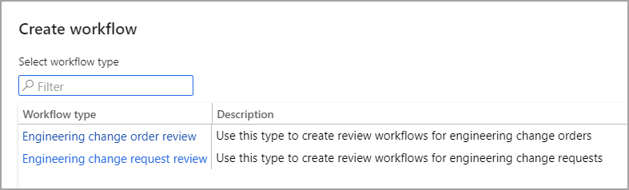
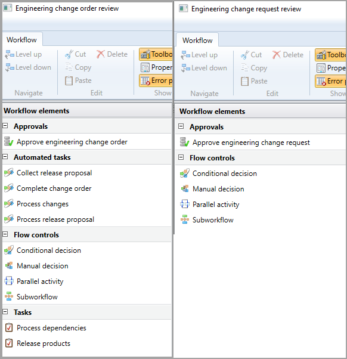

يتم دعم إدارة التغيير الهندسي بشكل كامل من خلال مهام سير العمل المصممة خصيصاً لطلبات أوامر التغيير ومراجعات طلبات التغيير.Engineering change management is fully supported by workflows designed specifically for change order requests and change request reviews. ويمكن العثور على مهام سير العمل هذه في **إدارة التغيير الهندسي** > **الإعداد** > **مهام سير العمل الهندسي**.These workflows can be found at **Engineering change management** > **Setup** > **Engineering workflows**.

> [!div class="mx-imgBorder"]
> 

في مصمم سير العمل، تكون العناصر والمهام خاصة بالهندسة، ويمكن تصميم مهام سير العمل حسب الحاجة.In the workflow designer, the elements and tasks are specific for engineering, and the workflows can be designed as needed.

> [!div class="mx-imgBorder"]
> 

لمزيد من المعلومات حول كيفية إنشاء مهام سير عمل، راجع [التعامل مع عمليات سير العمل في تطبيقات Finance and Operations](https://docs.microsoft.com/learn/modules/create-use-workflows-finance-operations/?azure-portal=true).To learn more about how to create workflows, see [Work with workflows in Finance and Operations apps](https://docs.microsoft.com/learn/modules/create-use-workflows-finance-operations/?azure-portal=true).

## جهات الموافقة على سير العملWorkflow approvers

وبعض حملة الأسهم النموذجيين الذين يمكن تعيينهم كجهات موافقة على مهام سير العمل الهندسي هم:Some typical stakeholders who could be set up as approvers in the engineering workflows are:

- **مالكو المنتجات** - لمزيد من المعلومات عن مالكي المنتجات، راجع [مالكو المنتجات](https://docs.microsoft.com/dynamics365/supply-chain/engineering-change-management/product-owner/?azure-portal=true).**Product owners** - For more information about product owners, see  [Product owners](https://docs.microsoft.com/dynamics365/supply-chain/engineering-change-management/product-owner/?azure-portal=true).

- **قائد الفريق المسؤول** - يوضح حقل **المهندس** في عرض **الرأس** لأمر التغيير الهندسي المهندس الذي أنشأ أمر التغيير الهندسي.**Responsible team lead** - The  **Engineer** field in the  **Header** view of the engineering change order shows the engineer who created the engineering change order. إذا كان المهندس أحد أعضاء فريق محدد في النظام، فإن حقل **المسؤول** يظهر قائد هذا الفريق.If the engineer belongs to a team defined in the system, the **Responsible** field shows the leader of that team.

- **قسم الشؤون المالية** - قد يضطر قسم الشؤون المالية إلى مراجعة الحالات التي قد ينطوي التغيير فيها على تكاليف عالية.**Finance department** - The Finance department might have to review cases where the change may involve high costs.
