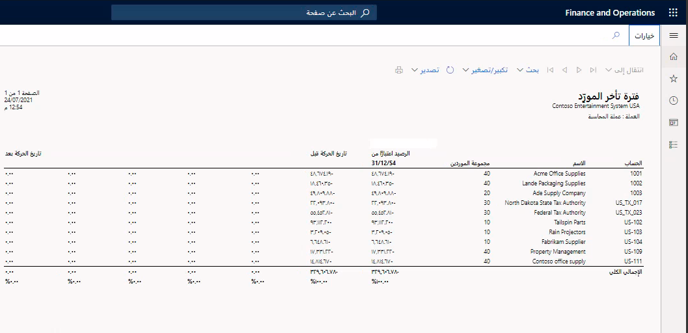
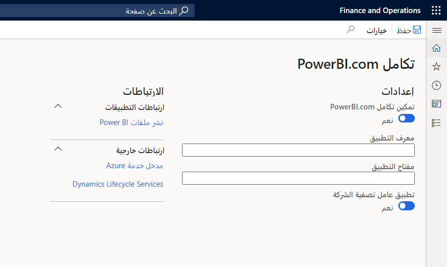

كمطور، قد تحتاج إلى تطوير التقارير لتلبية احتياجات الأعمال. وبالتالي، يجب فهم أنواع التقارير في تطبيقات Finance and Operations والقدرات الخاصة بها؛ حتى تتمكن من تحديد نوع التقرير الذي يجب تطويره.

تتوفر العديد من خيارات التقارير كي تستخدمها، بما في ذلك SSRS وPower BI وFinancial Reporting. 
 
## تقارير SSRS

يمكن تعريف التقارير ببساطة على أنها أي رسوم مرئية لمجموعة بيانات مهيكلة. وقد يشمل هذا بيانات الحركة التي يتم تقديمها في تخطيط جدولي وطرق عرض رسومية متقدمة لمعلومات مجمعة. لحساب هذا التعريف الواسع، تقدم تطبيقات Finance and Operations العديد من الأدوات لإنتاج تقارير تفي بمتطلبات الأعمال المعقدة. وإحدى هذه الأدوات SSRS.

توفر تقارير SSRS الميزات التالية:

-   إمكانات إدارة المستندات في المكتب الخلفي، بما في ذلك دعم البريد الإلكتروني، وعمليات التنفيذ الدفعية المجدولة، ووظيفة أرشيف الطباعة.
-   طرق عرض ذات محددات مع التنقل عبر الاستعراض إلى صفحات تطبيقات Finance and Operations والتقارير الأخرى.
-   إنتاج مستندات عالية الدقة للتوافق مع ممارسات الأعمال التنظيمية المحلية.

## Power BI

تتيح لك تطبيقات Finance and Operations تثبيت الإطارات المتجانبة ولوحات المعلومات والتقارير من حساب PowerBI.com إلى مساحات العمل. يمكنك تكوين Power BI عن طريق التنقل إلى **إدارة النظام > الإعداد > تكوين PowerBI.com.**

توفر تطبيقات Finance and Operations تقارير تفاعلية يتم تضمينها بسلاسة في مساحات عمل التطبيق. بإمكان مساحات العمل استخدام مرئيات ومخططات معلومات رسومية ثرية يدعمها Power BI. تشتمل هذه المرئيات ومخططات المعلومات الرسومية على العديد من عناصر التحكم التي توفرها أطراف ثالثة. ولذلك، يمكن لمساحات العمل توفير تجربة مرئية عالية الوضوح وتفاعلية. يمكنك التفاعل مع البيانات عن طريق تحديد المرئيات أو لمسها في الصفحة لرؤية السبب والأثر، كما يمكنك إجراء عمليات ماذا-لو بسيطة دون ترك مساحة العمل.
