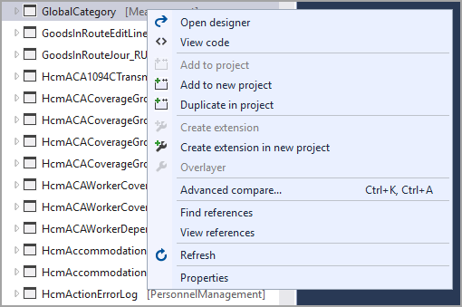

توفر الإضافات عملية تحديث سلسة للمطورين. على الرغم من أن تعديل الرمز الأساسي قد يستغرق وقتاً أقل، إلا أن هذا ليس خياراً في تطبيقات Finance and Operations. في حين أن التراكب يمكن أن يوفر الوقت مقدماً، فقد ينتهي بك الأمر إلى قضاء المزيد من الوقت لاحقاً في إصلاح الكود بعد طرح تحديث أو إصلاح عاجل للتطبيق. تتطلب التخصيصات التي يتم إجراؤها باستخدام التراكب ترقيات الرموز ووقتاً إضافياً لإعادة ترجمة الرموز واختباراً مكثفاً ومكلفاً. يمكن أن تجعل التكاليف المتضمنة في هذه المهام الترقية إلى الإصدارات الأحدث من التطبيقات أمراً شاقاً. نظراً لأن النماذج ذات التخصيصات المتراكبة مضمنة في نفس الحزمة مثل الكائنات الأساسية، فإن دورات الترجمة تستغرق وقتاً أطول في الأداء وتكون توزيعات الحزم أكبر.

يمكن توسيع معظم العناصر في AOT إذا كنت تشير إلى النماذج الضرورية. إذا حاولت إنشاء ملحق ولاحظت أن خيار **إنشاء الملحق** يبدو باهتاً، فهذا مؤشر على أنك بحاجة إلى تحديث معلمات النموذج الخاص بك.

يمكنك تحديث النماذج التي تشير إليها من خلال خيار **إدارة النماذج** عن طريق تحديد **تحديثات معلمات النماذج**. سيتم فتح مربع حوار، مما يسمح لك باختيار النموذج الذي تريد أن يقيم مشروعك فيه، وبعد ذلك يمكنك تحديد مراجع نماذج إضافية.

النماذج الأكثر شيوعاً للرجوع إليها هي Application Common وApplication Foundation وApplication Platform وApplicationSuite وDirectory.

لتحديث معلمات النماذج، اتبع الخطوات التالية:

1.  في Visual Studio، حدد قائمة **Dynamics 365** في الشريط.
2.  حدد قائمة **إدارة النماذج**.
3.  حدد **تحديث معلمات النماذج**.
4.  في حقل **اسم النموذج**، حدد نموذجك من القائمة المنسدلة. حدد **التالي**.
5.  في صفحة **تحديد الحزم المشار إليها**، حدد المربع بجوار النماذج التي تريد الرجوع إليها، مما يعني النماذج التي تريد استخدامها لإنشاء ملحقات.
6.  حدد **التالي**. سترى ملخصاً للنماذج التي اخترتها.
7.  حدد **إنهاء**.

يمكن إنشاء نماذج الملحقات باستخدام معالج **إنشاء النموذج**. في نافذة **تحديد الحزمة**، حدد خيار **إنشاء حزمة جديدة** بدلاً من **تحديد حزمة موجودة**.

تعمل نماذج التوسيع على تبسيط وتحسين أداء الإصدارات، واختبار التنفيذ التلقائي، وعمليات التوزيع، والتسليم للعملاء. من وجهة نظر الخدمة، تقوم Microsoft بالتثبيت والتصحيحات والترقيات في السحابة بحيث لا تتأثر تخصيصاتك. باستخدام نموذج التوسيع، لا يؤدي إجراء إنشاء إلى إعادة ترجمة التطبيق بأكمله.
