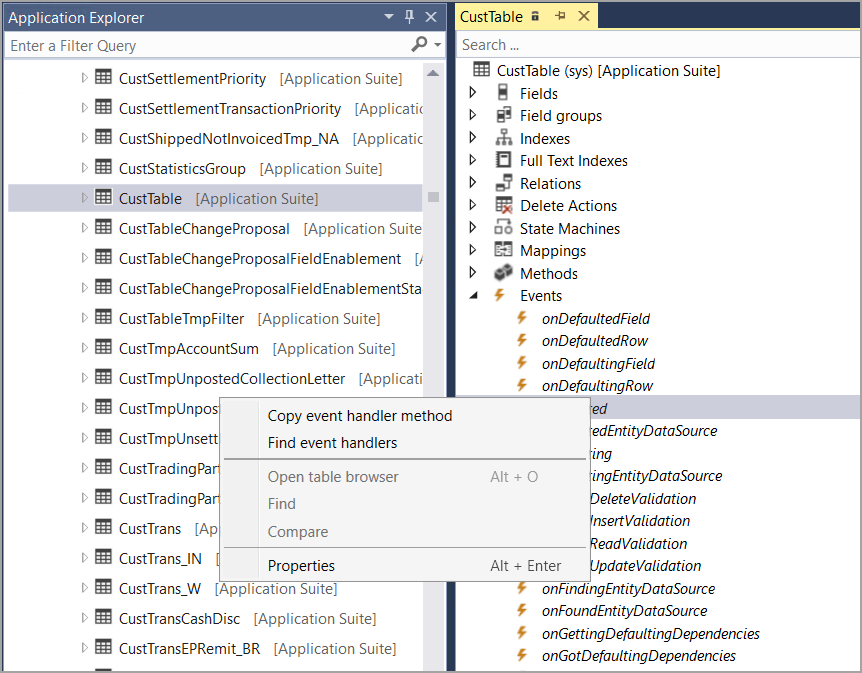

عندما تحتاج إلى تغيير سلوك عنصر ما، فإنك تنشئ ملحقاً لذلك العنصر. تتطلب بعض العناصر كتابة تعليمات برمجية لتغيير سلوكها، مثل إضافة معالج الأحداث. في حالات أخرى، يمكنك إنشاء ملحق للفئة لتغيير تكوين العنصر.

## <a name="class-extensions"></a>ملحقات الفئة 

لتوسيع منطق الأعمال المرتبط بجدول، يمكنك إنشاء فئة زيادة. إذا كنت ترغب في إضافة حقل معرّف آخر إلى الجدول وتعبئته، فيمكنك إنشاء معالج أحداث البيانات لحدث الإدراج، ثم تنفيذ المنطق لملء الحقل الجديد في معالج الأحداث هذا. يمكنك إنشاء فئة تقوي الجدول وتتيح الوصول إلى حقول الجدول وطرقه بطريقة سهلة القراءة. عند إنشاء ملحق فئة، يجب عليك تزيينه بالسمة `ExtensionOf`، واستخدام اللاحقة`_Extension`، والإشارة إلى الفئة باعتبارها `final`.

فيما يلي مثال لإنشاء فئة توسع `InventTable`. يمكن بعد ذلك إضافة الطرق إلى هذه الفئة المعززة حيث يتم استخدام التعليق.
```xpp
[ExtensionOf(tableStr(InventTable))]
final class InventTableNew_Extension
{
    public void newDefaultInventLocationId()
     {
     //enter your code here
     }
}
```
## <a name="event-handlers"></a>معالجات الأحداث 

معالج الأحداث هو وسيلة لك لكتابة أو نسخ التعليمات البرمجية إلى عنصر يتم تشغيله عند حدوث حدث معين، بالمثل عندما يتم تعديل حقل أو عندما يتم مسح أحد السجلات. تحتوي بعض العناصر، مثل الجداول والنماذج، على عقدة **الأحداث** في نافذة المصمم والتي، عند توسيعها، تسرد كافة الاحداث المرتبطة بهذا العنصر. إذا كنت بحاجة إلى إضافة سلوك إضافي غير موجود حالياً في عنصر ما، فيجب عليك إنشاء ملحق لهذا العنصر، ثم إضافة معالج الأحداث إلى العنصر الممتد.

فيما يلي طرق معالجات الأحداث التي يتم سحبها من جدول `CustTable`. يمكن نسخ هذه الأساليب وإضافتها إلى العنصر الممتد أو الفئة الخاصة بك بالنقر بزر الماوس الأيمن فوق الحدث في نافذة مصمم العناصر ثمّ تحديد **نسخ طريقة معالج الأحداث**.

[](../media/copy-event-handler.png#lightbox)

-   **`OnDeleted` حدث** - هذا هو معالج ما بعد الأحداث الذي يتم تشغيله عند حذف سجل في الجدول. يمكنك استخدام هذا، على سبيل المثال، لعرض رسالة سجل معلومات بعد حذف أحد السجلات.
```xpp
/// <summary>
///
/// </summary>
/// <param name="sender"></param>
/// <param name="e"></param>
[DataEventHandler(tableStr(CustTable), DataEventType::Deleted)]
public static void CustTable_onDeleted(Common sender, DataEventArgs e)
{
}
```
-   **`OnInserting` حدث** - يتم تشغيل هذا عند إدخال البيانات. علي سبيل المثال، يمكن أن يتم تشغيل هذا عند إضافة عميل جديد إلى تطبيقات التمويل والعمليات.
```xpp
/// <summary>
///
/// </summary>
/// <param name="sender"></param>
/// <param name="e"></param>
[DataEventHandler(tableStr(CustTable), DataEventType::Inserting)]
public static void CustTable_onInserting(Common sender, DataEventArgs e)
{
}
```
-   **`OnValidatedWrite` حدث** - هذا هو معالج ما بعد الأحداث الذي يتم تشغيله بعد إدخال البيانات. يستخدم هذا للتحقق من صحة البيانات التي تتم كتابتها على صفحة، مثل التأكد من أن عمر العميل لا يقل عن 18 عاماً عن طريق التحقق من تاريخ الميلاد.
```xpp
/// <summary>
///
/// </summary>
/// <param name="sender"></param>
/// <param name="e"></param>
[DataEventHandler(tableStr(CustTable), DataEventType::ValidatedWrite)]
public static void CustTable_onValidatedWrite(Common sender, DataEventArgs e)
{
}
```

## <a name="chain-of-command"></a>سلسله الأوامر 

يمكنك تضمين المنطق حول الطرق المحددة في الفئة الأساسية التي تقوم بزيادتها. يمكنك أيضاً توسيع منطق الطرق العامة والمحمية دون الحاجة إلى استخدام معالجات الأحداث.

عند تضمين طريقة، يمكنك الوصول إلى الطرق العامة والمحمية بالإضافة إلى متغيرات الفئة الأساسية. يؤدي استخدام برنامج تضمين حول طريقة والكلمة الأساسية `next` إلى إنشاء سلسلة أوامر (CoC).

سلسلة الأوامر هي نموذج تصميم يتم فيه معالجة الطلب بواسطة سلسلة من أجهزة الاستقبال. ويتم استخدام فئة الملحق لتضمين الطرق المحمية أو العامة للفئات والجداول وكيانات البيانات والنماذج. يجب أن تكون على دراية ببعض القيود عند تضمين الطرق:

-   يجب أن يكون لطريقة برنامج التضمين نفس توقيع الطريقة الأساسية.
-   عند زيادة فئات النموذج، يمكن تضمين الطرق على مستوى الجذر فقط، وليس الطرق المحددة في الفئات المتداخلة.

تلزم طرق برنامج التضمين في فئة ملحقة لاستدعاء `next` دائماً بحيث يتم استدعاء طريقة `next` في السلسلة وأخيراً، يتم استدعاء التنفيذ الأصلي دائماً. تضمن هذه العملية أن كل طريقة في السلسلة تدخل في النتيجة. يجب أن تستدعي الطريقة **`next()`** دون شروط.
