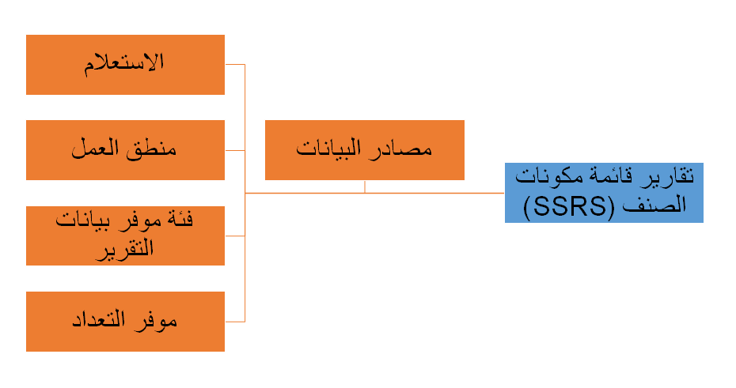

تستخدم التقارير مصادر البيانات لسحب البيانات. SQL Server Reporting Services (SSRS) وPower BI هما أداتان لإعداد التقارير تستخدمان مصادر البيانات. تغطي هذه الوحدة إنشاء مصادر البيانات وتعديلها لأداتي إعداد التقارير هاتين.

تستخدم SSRS مجموعات البيانات التي يتم تعريفها بواسطة مصدر البيانات. يمكنك تعيين مصدر بيانات لتقرير SSRS من خلال Visual Studio. 

في معلمات التقرير، يمكنك تحديد مصدر البيانات لمجموعة البيانات ونوع مصدر البيانات. يمكن أن يكون نوع مصدر البيانات على النحو التالي: 

- **الاستعلام** - نوع مصدر البيانات الاستعلام يستخدم استعلاماً موجوداً أو استعلاماً جديداً.

- **منطق الأعمال** – استخدم هذا النوع للحصول على مصدر بيانات بخلاف تطبيقات Finance and Operations. 

- **فئة موفر بيانات التقارير** – يمكنك استخدام هذا النوع في حالة عدم إمكانية استخدام الاستعلام بمفرده. في هذه الحالة، يلزم وجود منطق إضافي لتشغيل التقرير. إلى جانب فئة موفر بيانات التقارير (RDP)، يلزم وجود فئة عقد أيضاً لتعريف معلمات التقرير. 

- **موفر تعداد** – يمكن استخدام موفر تعداد AX عندما تكون معلمة التقرير من نوع التعداد لتصفية طريقة عرض التقرير.  

إذا كنت بحاجة إلى تعديل مصدر بيانات، فستحتاج إلى توسيع الجداول أو فئات موفر بيانات التقارير (RDP) لإجراء التعديلات.

يمكن لـ Power BI الاتصال بمصادر البيانات، بدءاً من الملفات، وقواعد البيانات، ومجموعات بيانات Power BI وتدفقات البيانات الخاصة به الأخرى، وقواعد بيانات Azure، والخدمات عبر الإنترنت، ووصولاً إلى عناوين URL على الويب. 

استخدم الإجراء التالي للاتصال بمصدر بيانات لإنشاء تقرير Power BI.

1.  في شريط الأدوات Power BI، حدد الزر **إحضار البيانات**. يتم عرض مصادر البيانات الأكثر شيوعاً، ولكن يمكنك تحديد المزيد للوصول إلى القائمة بأكملها.

2.  بعد تحديد مصدر البيانات، حدد **اتصال**.

3.  يتم عرض نافذة اتصال يمكنك من خلالها تحديد اتصال البيانات وإدخال أية بيانات اعتماد مطلوبة. حدد **موافق**.

4.  ستظهر صفحة **‏‏المتصفح**. يمكنك إما تحديد الزر **تحميل** لتحميل جميع البيانات، وإما تحديد **تحرير** لتعديل الاستعلام.

عند الانتهاء من هذه الخطوات، سيتم توصيل Power BI بمصدر بيانات يمكنك استخدامه لإنشاء التقارير ومؤثرات عرض البيانات.
