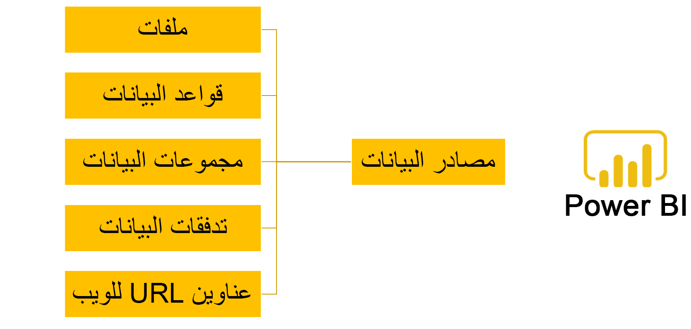

تستخدم التقارير مصادر البيانات لسحب البيانات.Reports use data sources to pull data. SQL Server Reporting Services (SSRS) وPower BI هما أداتان لإعداد التقارير تستخدمان مصادر البيانات.SQL Server Reporting Services (SSRS) and Power BI are two reporting tools that use data sources. تغطي هذه الوحدة إنشاء مصادر البيانات وتعديلها لأداتي إعداد التقارير هاتين.This unit covers the creation and modification of data sources for these reporting tools.

تستخدم SSRS مجموعات البيانات التي يتم تعريفها بواسطة مصدر البيانات.SSRS uses data sets that are defined by a data source. يمكنك تعيين مصدر بيانات لتقرير SSRS من خلال Visual Studio.You can assign a data source to an SSRS report through Visual Studio. 

في معلمات التقرير، يمكنك تحديد مصدر البيانات لمجموعة البيانات ونوع مصدر البيانات.In the report parameters, you can select the data source for the data set and the data source type. يمكن أن يكون نوع مصدر البيانات على النحو التالي:The data source type can be the following: 

- **الاستعلام** - نوع مصدر البيانات الاستعلام يستخدم استعلاماً موجوداً أو استعلاماً جديداً.**Query** - A query data source type uses an existing query or a new query.

- **منطق الأعمال** – استخدم هذا النوع للحصول على مصدر بيانات بخلاف تطبيقات Finance and Operations.**Business logic** – Use this type to get a data source other than Finance and Operations apps. 

- **فئة موفر بيانات التقارير** – يمكنك استخدام هذا النوع في حالة عدم إمكانية استخدام الاستعلام بمفرده.**Report data provider class** – You can use this type when a query cannot be used alone. في هذه الحالة، يلزم وجود منطق إضافي لتشغيل التقرير.In this case, additional logic is needed to run the report. إلى جانب فئة موفر بيانات التقارير (RDP)، يلزم وجود فئة عقد أيضاً لتعريف معلمات التقرير.Along with the RDP class, a contract class is also needed to define the report parameters. 

- **موفر تعداد** – يمكن استخدام موفر تعداد AX عندما تكون معلمة التقرير من نوع التعداد لتصفية طريقة عرض التقرير.**Enum provider** – An AX enum provider can be used when the report parameter is an Enum type to filter the report view.  

إذا كنت بحاجة إلى تعديل مصدر بيانات، فستحتاج إلى توسيع الجداول أو فئات موفر بيانات التقارير (RDP) لإجراء التعديلات.If you need to modify a data source, you will need to extend the tables or RDP classes to make modifications.

يمكن لـ Power BI الاتصال بمصادر البيانات، بدءاً من الملفات، وقواعد البيانات، ومجموعات بيانات Power BI وتدفقات البيانات الخاصة به الأخرى، وقواعد بيانات Azure، والخدمات عبر الإنترنت، ووصولاً إلى عناوين URL على الويب.Power BI can connect to data sources, ranging from files, databases, other Power BI datasets and data flows, Azure databases, online services, and even web URLs. 

استخدم الإجراء التالي للاتصال بمصدر بيانات لإنشاء تقرير Power BI.Use the following procedure to connect to a data source to create a Power BI report.

1.  في شريط الأدوات Power BI، حدد الزر **إحضار البيانات**.In the Power BI toolbar, select the **Get Data** button. يتم عرض مصادر البيانات الأكثر شيوعاً، ولكن يمكنك تحديد المزيد للوصول إلى القائمة بأكملها.The most common data sources are displayed, but you can select more to get access to the entire list.

2.  بعد تحديد مصدر البيانات، حدد **اتصال**.After you have selected the data source, select **Connect**.

3.  يتم عرض نافذة اتصال يمكنك من خلالها تحديد اتصال البيانات وإدخال أية بيانات اعتماد مطلوبة.A connection window is displayed where you can specify the data connection and enter any required credentials. حدد **موافق**.Select **OK**.

4.  ستظهر صفحة **‏‏المتصفح**.The **Navigator** page will appear. يمكنك إما تحديد الزر **تحميل** لتحميل جميع البيانات، وإما تحديد **تحرير** لتعديل الاستعلام.You can either select the **Load** button to load all the data, or you can select **Edit** to modify the query.

عند الانتهاء من هذه الخطوات، سيتم توصيل Power BI بمصدر بيانات يمكنك استخدامه لإنشاء التقارير ومؤثرات عرض البيانات.When you have completed these steps, Power BI will be connected to a data source that you can use to create reports and data visualizations.
