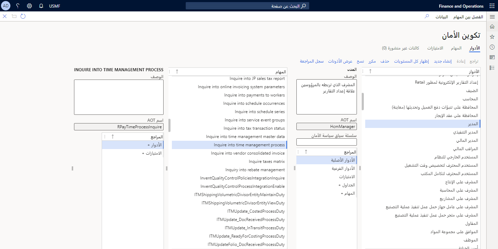

تمتلك تطبيقات التمويل والعمليات عدة طرق لتقييد وصول المستخدم إلى التقارير. يُستخدم التفويض لمنح حق الوصول إلى عناصر البرنامج من خلال أذونات الأمان. يتم دمج أذونات الأمان في الامتيازات التي يتم دمجها بعد ذلك في المهام‬. يمكن إضافة الأذونات، والامتيازات، والمهام إلى أحد الأدوار وتعيينها لأحد المستخدمين.
يمكنك استخدام هذا الأمان المستند إلى الدور لمنح المستخدم حق الوصول إلى التقارير التي تستند إلى الأدوار.

يمكنك عرض أدوار الأمان التي تم تعيينها للمستخدمين من صفحة **تكوين الأمان** في تطبيقات التمويل والعمليات. ومن خلال تحديد دور في هذه الصفحة، يمكنك عرض المهام‬، والامتيازات، والأذونات المرتبطة بالدور. يمكنك الوصول إلى صفحة "تكوين الأمان" من خلال الانتقال إلى **إدارة النظام > الأمان > تكوين الأمان**

يتم استخدام أمان البيانات لرفض وصول المستخدم إلى الجداول، والحقول، والصفوف في قاعدة البيانات. يستخدم أمان البيانات إطار عمل أمان البيانات المفصلة (XDS) للتحكم في الوصول إلى بيانات الحركات عن طريق تعيين سياسات أمان البيانات إلى أدوار الأمان. يمكن لهذه السياسات تقييد الوصول إلى البيانات، استناداً إلى تاريخ السريان أو بيانات المستخدم. ‏‫من المستحسن استخدام أمان البيانات المفصلة للمساعدة في تأمين البيانات.

بالإضافة إلى خيارات الأمان هذه، يمكن أن يساعد إطار عمل أذونات الجدول في حماية البيانات ويتم فرضه بواسطة Application Object Server‏ (AOS). يسمح لك إطار عمل أذونات الجدول بمنح أذونات إنشاء، أو قراءة، أو تحديث، أو حذف (CRUD) للبيانات الموجودة في جدول أو رفضها. يمكنك استخدام هذا لمنح أدوار معينة حق الوصول لعرض مجموعات بيانات معينة ومعالجتها. 

على سبيل المثال، قد ترغب في أن يتمكن بائع من عرض بيانات عميل وتحديثها، ولكن قد ترغب في رفض وصوله لإنشاء عملاء جدد أو حذف عملاء حاليين. للقيام بذلك، يجب منح أذونات القراءة والتحديث ورفض أذونات الإنشاء والحذف لهذا الدور في جدول العملاء.

## مثال على إطار عمل أذونات الجدول

يضيف إطار عمل أذونات الجدول أماناً على مستوى الجدول يتحقق من حقوق المستخدم بغض النظر عن أصل الطلب. على سبيل المثال، ضع في اعتبارك السيناريو التالي:

1.  قامت ABC Corporation بتنفيذ تطبيقات التمويل والعمليات. يمكن للمستخدمين الوصول إلى البيانات داخل التطبيق.
2.  قام المسؤول بتكوين دور أمان يسمى "الإدارة".
    يتمتع أعضاء هذا الدور بحق الوصول إلى البيانات المالية الحساسة. ويطلق على أحد الجداول التي تخزن البيانات المالية الحساسة اسم ManagerFinancialData. تمت إضافة هذا الجدول مسبقاً كجزء من التخصيص للتطبيق.
3.  يقوم المسؤول بتكوين جدول ManagerFinancialData بحيث يجب أن يقوم AOS بتخويل كل العمليات لهذا الجدول.
4.  قبل السماح بحق الوصول للقراءة إلى البيانات الموجودة في جدول ManagerFinancialData، سيقوم AOS بالتحقق من أن المستخدم عضو في دور الإدارة وأن أعضاء هذا الدور لديهم أذونات لقراءة البيانات. إذا لم يكن المستخدم عضواً في دور الإدارة، فسوف يرفض AOS عملية القراءة.
