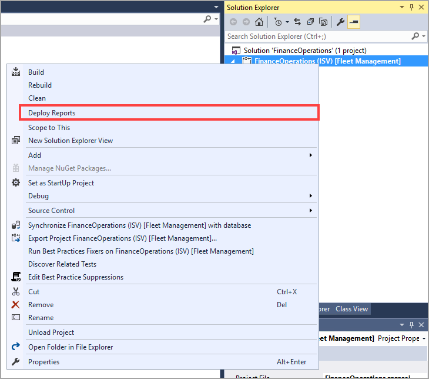

بعد إنشاء تقرير SSRS، يجب توزيعه قبل أن تتمكن من الوصول إليه في تطبيقات التمويل والعمليات. ويمكنك توزيع التقارير من PowerShell أو من Visual Studio. يمكن أن يكون توزيع التقارير من PowerShell مفيداً إذا كنت بحاجة إلى توزيع تقرير في بيئة لا يتوفر لديها حق الوصول إلى Visual Studio. ومع ذلك، يجب عدم القيام بذلك في بيئة تشغيل. 

يمكنك توزيع كل التقارير أو تقرير معين من PowerShell. لتوزيع كافة التقارير، افتح PowerShell كمسؤول، وشغِّل الأمر التالي:
```powershell
*C:\AosService\PackagesLocalDirectory\Plugins\AxReportVmRoleStartupTask\DeployAllReportsToSSRS.ps1 -PackageInstallLocation \"C:\AosService\PackagesLocalDirectory\" *
```
ووفقاً للبيئة التي تستخدمها، قد يختلف محرك الأقراص. بشكل عام، يكون محرك الأقراص هو C:\\ أو L:\\ أو K:\\.

لتشغيل تقرير محدد، ستحتاج إلى اسم التقرير. على الرغم من أنك ستفتح PowerShell كمسؤول، فستقوم بتشغيل سطر الأوامر التالي بدلاً من ذلك:
```powershell
*C:\AosService\PackagesLocalDirectory\Plugins\AxReportVmRoleStartupTask\DeployAllReportsToSSRS.ps1 -Module ApplicationSuite -ReportName TaxVatRegister.Report*
```
لنشر تقرير من Visual Studio، ستحتاج إلى إضافة التقرير إلى مشروعك. انقر بزر الماوس الأيمن فوق التقرير، وحدد خيار **التوزيع**.

[](../media/deploy-report.png#lightbox)


