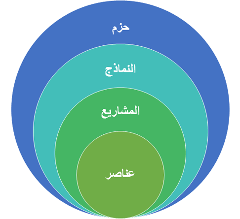
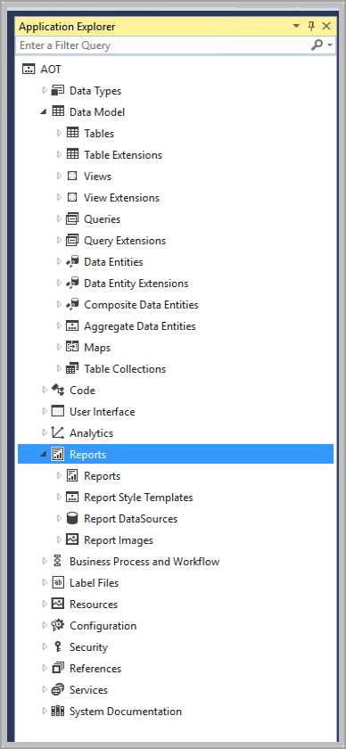

تمثل العناصر والنماذج والحزم التدرج الهرمي الهيكلي في Visual Studio لـ Finance and Operations. العناصر إما موجودة بشكل جاهز في مستكشف التطبيقات (AOT) في Visual Studio، أو يمكن إنشاؤها. العناصر عبارة عن بيانات تعريف وملفات مصدر، مثل التعدادات الأساسية والجداول. يتم استخدام مشروع **Finance Operations** لتنظيم وإدارة العناصر داخل نموذج. تحتوي النماذج على صفر أو أكثر من العناصر. على سبيل المثال، نموذج إدارة المستودعات عبارة عن مجموعة من العناصر التي تشكل حل إدارة المستودعات. 

تنتمي جميع النماذج إلى الحزم، والتي يمكن بعد ذلك تجميعها معاً لإنشاء حزمة قابلة للنشر ثم نشرها باستخدام LCS. تحتوي الحزمة القابلة للنشر على حزمة واحدة أو عدة حزم يتم استخدامها لبيئات وقت التشغيل. يتم استخدام المعالجات في Visual Studio لإنشاء النماذج والمشاريع، ويتم استخدام نافذة المصمم لتخصيص العناصر داخل المشاريع والنماذج. 

يتم نشر الحزم القابلة للنشر في بيئات Finance and Operations. تحتوي هذه الحزم على نماذج تمثل، في كثير من الحالات، الوحدات المرئية في واجهة المستخدم، مثل الحسابات الدائنة. تحتوي النماذج على العناصر التي تمثل كل حقل وقائمة وصفحة موجودة في واجهة المستخدم. يتم إنشاء هذه العناصر وإدارتها في Visual Studio. لذلك، التحكم في المصدر باستخدام Azure DevOps مطلوب لتطوير Finance and Operations.

تُظهر الصورة التالية نافذة **مستكشف التطبيقات** في Visual Studio.

## إنشاء نموذج جديد

لإنشاء نموذج جديد، اتبع هذه الخطوات

1.  من قائمة  **Dynamics 365** في Visual Studio، حدد  **إدارة النماذج > إنشاء النموذج** لفتح معالج إنشاء النموذج.
2.  أدخل **اسم النموذج**، و **ناشر النماذج**، و **الطبقة**، و **وصف النموذج**، و **اسم عرض النموذج**.
3.  حدد **التالي**.
4.  حدد **إنشاء حزمة جديدة**. سيؤدي هذا إلى إنشاء نموذج يندمج في التجميع الخاص به. يجب استخدام هذا لتخزين العناصر التي توسع التطبيق.
5.  حدد **التالي**.
6.  حدد النماذج المُشار إليها. توفر النماذج المرجعية إمكانية الوصول إلى جميع العناصر الموجودة داخل النماذج الأخرى. ستمنحك **مجموعة التطبيقن النظام الأساسي للتطبيق** و **أساس التطبيق** وصولاً إلى معظم العناصر.
7.  حدد **التالي**.
8.  في خطوة **الملخص**، تحقق من صحة المعلومات.
9.  بشكل اختياري، حدد **إنشاء مشروع جديد** لإنشاء مشروع عند إنشاء النموذج.
10. بشكل اختياري، حدد **اجعل هذا النموذج الافتراضي الخاص بي للمشاريع الجديدة**.
11. حدد **إنهاء**.

## إنشاء النماذج

قبل إنشاء حزمة قابلة للنشر، يجب عليك تنفيذ إنشاء النموذج. قد تحتاج أيضاً إلى تنفيذ نموذج لحل الأخطاء التي قد تواجهها أثناء العمل في مشروع تطوير. لإنشاء النماذج، اتبع الخطوات التالية.

1.  من قائمة  **Dynamics 365** في Visual Studio، حدد  **إنشاء النماذج**.
2.  في قائمة **الحزم**، حدد الحزم التي تريد إنشائها. يتم سرد النماذج المتعلقة بالحزم بين قوسين.
3.  بشكل اختياري، يمكنك تحديد **إنشاء الحزم المشار إليها** لإنشاء الحزم التابعة أولاً.
4.  في علامة التبويب **خيارات**، يمكنك التحديد من بين عمليات الإنشاء المتعددة. تزيد هذه العمليات من وقت الإنشاء، لذا إذا لم تكن بحاجة إلى تشغيل العملية، فاترك الخيارات التالية غير محددة.
    -   **إنشاء النماذج المجمعة مسبقاً** - يتم إنشاء HTML ثابت لكل نموذج أثناء الإنشاء للسماح بعرض أسرع للنماذج في وقت التشغيل.
    -   **إنشاء التقارير** - لإنشاء التقارير.
    -   **إنشاء القياسات المجمعة** - لإنشاء القياسات المجمعة.
    -   **تشغيل اختبارات أفضل الممارسات** - يتم إجراء فحوصات أفضل الممارسات أثناء الإنشاء.
    -   **مزامنة قاعدة البيانات** - تحديث مخطط قاعدة بيانات SQL أثناء الإنشاء.
    -   **Build cross reference data** - يتم تحديث البيانات الخاصة بميزة الإسناد الترافقي للسماح للمطورين بالعثور على مراجع للرمز وبيانات التعريف.
5.  حدد **إنشاء**.
6.  قم بتوسيع علامة التبويب **تفاصيل** للاطلاع على تفاصيل عملية الإنشاء.

شاهد هذا الفيديو لمعرفة المزيد حول تطوير بيانات التعريف في Visual Studio. 

> [!VIDEO https://www.microsoft.com/videoplayer/embed/RE4a8ie]
