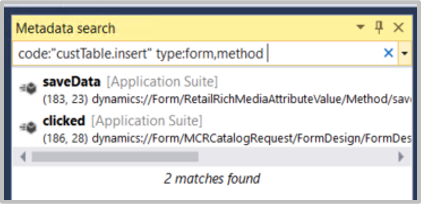

يستخدم Finance and Operations بيانات التعريف لتحديد العناصر. يمكن استخدام بيانات التعريف للبحث عن عناصر مثل النماذج والجداول والتعليمات البرمجية باستخدام ميزة **البحث عن بيانات تعريف**. يمكن الوصول إلى بحث بيانات التعريف من **Visual Studio > Dynamics 365 > البحث عن بيانات التعريف**. يتيح لك البحث على أساس بيانات التعريف العثور على العناصر ذات الصلة. 

على سبيل المثال، قد تحتاج إلى العثور على جدول ولكن لا يمكنك تذكر الاسم الكامل. أنت تعلم أن "cust" جزء من الاسم. يمكنك استخدام البحث في بيانات التعريف للعثور على جميع الجداول التي تحتوي على كلمة "cust" في الاسم. يمكنك البحث عن العناصر بناءً على اسم العنصر ونوع العنصر والنموذج الذي يوجد به العنصر وخصائص العنصر والقصاصات البرمجية.

البنية المراد البحث عنها في **البحث عن بيانات التعريف** هي:

`*<filter_1>:<filter_1_value> [<filter_2>:<filter_2_value>...
<filter_N>:<filter_N_value>]*`

تتضمن الكلمات الأساسية التي يمكنك استخدامها في **البحث عن بيانات التعريف**:

-   **الاسم** - قم بالتصفية حسب اسم العنصر. هذا هو أيضاً عامل التصفية الافتراضي إذا لم يتم تحديد كلمة أساسية. يمكن استخدام الفاصلة للبحث عن أسماء عناصر متعددة.
-   **النوع** - قم بالتصفية حسب نوع العنصر. يمكن استخدام الفاصلة بعد العنصر لتحديد العناصر الفرعية.
-   **النموذج** - قم بالتصفية حسب اسم النموذج. ستبحث كل قيمة مفصولة بفاصلة عن نموذج في تطبيقك.
-   **الخاصية** - تصفية الخصائص في النماذج. يجب أن تكون كل قيمة مفصولة بفاصلة خاصية في النموذج.
-   **التعليمة البرمجية** - قم بتصفية القصاصات البرمجية. يجب أن تكون القصاصة البرمجية في علامات اقتباس.
