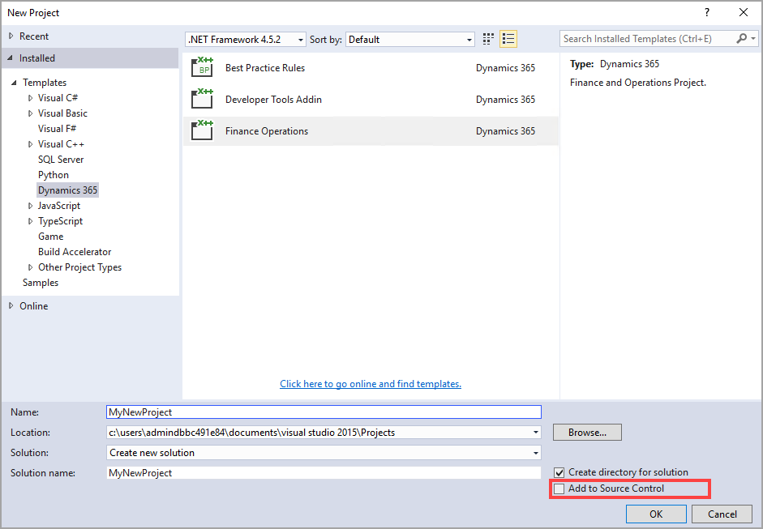

يعتمد المطورون على التحكم بالمصادر لتتبع تغييرات الأكواد واكتشاف الاختلافات بين المحتوى الذي تم إنشاؤه بواسطة مطورين مختلفين. Finance and Operations يستخدم Azure DevOps للتحكم بالمصادر، والذي يمكن الوصول إليه من خلال مستعرض ويب أو Visual Studio باستخدام مستكشف الفريق.

## Azure DevOps، المعروف سابقاً باسم Visual Studio Team Services.

Azure DevOps هو عرض قائم على السحابة، ومدعوم أيضاً باتفاقية مستوى الخدمة (SLA) بنسبة 99.9 بالمائة. بينما لا تختلف الخدمات الأساسية ما بين الحوسبة السحابية والحوسبة الداخلية، توفر السحابة أيضاً إمكانية الاستفادة الفورية من الميزات الجديدة، وتحسين الاتصال بالمواقع البعيدة، وإدارة الخادم المبسطة. 

## Azure DevOps

يُستخدم Azure DevOps كخدمة تحكم بالمصادر عند تطوير تطبيقات Finance and Operations. إذا كنت بصدد الترقية من إصدارات سابقة من Dynamics AX، فقد تكون على دراية بخدمات Team Foundation للتحكم بالمصادر، وقد تم استبدال هذا بـ Azure DevOps. بصفتك مطوراً، سيتعين عليك التأكد من إعداد Azure DevOps وتهيئته قبل البدء في التطوير. 

لتمكين التحكم بالمصادر من خلال Azure DevOps، ستحتاج إلى الانتقال إلى [https://visualstudio.microsoft.com/](https://www.visualstudio.com/?azure-portal=true"visualstudio.com") والاشتراك في Azure DevOps لإنشاء حسابك. عندما تنشئ حسابك، ستحدد عنوان URL له. سيكون هذا هو عنوان URL الذي ستتصل به من كمبيوتر التطوير الخاص بك عند قيامك بتكوين خدمة التحكم بالمصادر. عند إنشاء حسابك، أو إذا كان لديك حساب بالفعل، أنشئ مشروعاَ جديداَ.

لتكوين بيئة Visual Studio الخاصة بك للاتصال بمشروع فريقك، اتبع الخطوات التالية:

1. افتح **Visual Studio** كمسؤول.
2.  افتح **مستكشف الحلول** إذا لم يكن معروضاً بالفعل عن طريق تحديد **ملف > مستكشف الحلول**.
3.  حدد علامة التبويب **مستكشف الفريق** أسفل النافذة.
4.  حدد **إدارة الاتصالات**. 
5.  حدد **الاتصال بمشروع الفريق**. 
6.  حدد **خوادم...**.
7.  في نافذة **إضافة/إزالة Team Foundation Server**، حدد **إضافة**. 
8.  ستحتاج إلى لصق عنوان URL الخاص بمشروع Azure DevOps في حقل **الاسم** أو **URL** لـ **Team Foundation Server**. 
   > [!NOTE]
   > من المحتمل أن يبدو مثل هذا المثال: *https:\//projectname.visualstudio.com*

9.  حدد **موافق**.
10. حدد **إغلاق**. 
11. في نافذة **الاتصال بـ Team Foundation Server**، استخدم القائمة المنسدلة لتحديد المشروع الذي أضفته للتو. 
12. حدد **اتصال**.

عندما تكون متصلاً بـ Team Foundation Server، ستحتاج إلى تعيين مشروع Azure DevOps لمتجر النماذج المحلي ومجلدات المشروعات لديك.

1.  افتح **مستكشف التحكم بالمصادر** من **مستكشف الفريق**.
2.  قُم بتعيين مجلد بيانات التعريف لمشروع فريقك إلى المجلد الجذر لمتجر النماذج على محرك الأقراص المحلي لديك.
3.  حدد **تعيين**.
4.  في مربع الحوار التالي، حدد **لا**.
5.  كرر هذه الخطوات لمجلد المشاريع كذلك.

عند إنشاء مشروع Visual Studio جديد، يمكنك إضافة المشروع للتحكم بالمصادر. تُتيح خدمة التحكم بالمصادر بالتحكم في الإصدار للعناصر الموجودة في Visual Studio. يجبرك التحكم في الإصدار على التحقق من الكود أثناء إجراء المطورون تغييرات على الكود.

عند الانتهاء من إجراء التغييرات، يجب عليك إيداع تغييراتك.
تنشئ كل عملية إيداع إصداراً جديداً من هذا العنصر. تسمح هذه العملية للمطورين الآخرين بمعرفة من قام بإجراء التغييرات، وما التغييرات التي أجريت على عنصر ما، ومتى أجريت. كما تسمح لك بإعادة الكود إلى إصدار سابق في حالة العثور على أخطاء في الإصدار الحالي. عندما تقوم بإيداع الكود، يمكن للمطورين الآخرين أيضاً تحديد **الحصول على الأحدث** لدمج جميع أحدث الإصدارات المتاحة من الكود.

عند تحديد **الحصول على الأحدث**، فقد تصادف بعض تعارضات التغيير، حيث يتعارض إصدار جديد من الكود مع ما قمت بإنشائه حالياً في قاعدة الكود الخاصة بك. يمكنك عرض التعارض وحله في Visual Studio على صفحة **حل التعارضات**.

تتوفر ثلاثة أجزاء في صفحة **حل التعارضات**.

-   **الجزء الأيسر** - يعرض كودك الحالي
-   **الجزء الأيمن** - يعرض الكود الجديد
-   **الجزء السفلي** - يعرض الشكل الذي سيبدو عليه كود الدمج التلقائي

يمكنك تحديد قبول الدمج التلقائي أو قبول الكود الذي سيتم دمجه أو استبداله بشكل فردي.

## التفريع والدمج ##
Finance and Operations يستخدم التفريع لعزل أصول البرامج الفردية، مما يمكّنك من العمل بالتوازي مع المطورين الآخرين لزيادة الإنتاجية. يتطلب التفريع مجهوداً إضافياً لدمج الكود. لا توجد قاعدة محددة لطريقة إعداد الفروع، ولكن يوجد عادةً فرع للتطوير والاختبار والإنتاج أو الإصدار. يُستخدم فرع التطوير للأكواد غير الجاهزة للاختبار؛ ومع ذلك، تتم مشاركتها بين المطورين. وقد تستخدم بعض الفرق الكبيرة فروعاً متعددة للمطورين. يُستخدم فرع الاختبار لإجراء التغييرات الجاهزة للاختبار من قبل مستخدمين آخرين. سيحتفظ فرع الإنتاج بكافة أكواد المصدر تماماً كما تم نشرها في الإنتاج.

يجب عليك إنشاء حزمة قابلة للنشر لنقل تغييرات الكود من بيئة إلى أخرى. ونوصي باستخدام بيئة إنشاء لإنشاء حزم قابلة للنشر تحتوي على جميع التغييرات. يمكنك أيضاً إنشاء حزم قابلة للنشر من بيئة التطوير.

لإنشاء حزمة قابلة للنشر، اتبع الخطوات التالية:

1.  حدد **Dynamics 365 > نشر > إنشاء حزمة نشر**.
2.  حدد الحزم التي تحتوي على نماذجك.
3.  أدخل موقعاً لإنشاء الحزمة القابلة للنشر.
4.  بعد إنشاء الحزمة القابلة للنشر، سجّل الدخول إلى LCS.
5.  انتقل إلى مشروع LCS الخاص بك.
6.  حدد **مكتبة الأصول**.
7.  قُم بتحميل الحزمة القابلة للنشر التي قمت بإنشائها.

لنشر حزمة في بيئة غير إنتاجية أو بيئة إنتاج، ستستخدم LCS. تختلف عملية نشر الحزمة في بيئة عن البيئة الأخرى. أيضاً، يتطلب النشر في بيئة إنتاج أن يتم نشر الحزمة بنجاح في بيئة واحدة على الأقل من بيئات وضع الحماية في المشروع ذاته.

لنشر حزمة في بيئة غير إنتاجية، اتبع الخطوات التالية:

1.  افتح طريقة العرض **تفاصيل البيئة** للبيئة المطلوبة.
2.  حدد **صيانة > تطبيق التحديثات**.
3.  استخدم عامل التصفية لتحديد الحزمة المراد تطبيقها.
4.  حدد **تطبيق**. ستتغير الحالة في الزاوية العلوية اليمنى لطريقة عرض **تفاصيل البيئة** من "في قائمة الانتظار" إلى "قيد التقدم".
5.  عند تطبيق الحزمة، ستتغير حالة البيئة إلى "تم النشر" وتتغير حالة الخدمة إلى "مكتمل".

لنشر حزمة في بيئة إنتاج، اتبع الخطوات التالية:

1.  انتقل إلى مكتبة أصول مشروعك في Lifecycle Services. 
2.  في صفحة **مكتبة الأصول**، حدد علامة التبويب **حزمة قابلة للنشر للبرنامج‬‬‏‫**، ثم حدد الحزمة التي ترغب في نقلها إلى بيئة الإنتاج، 
3.  حدد **مرشح الإصدار**. يشير هذا إلى أن هذه الحزمة جاهزة لنشر الإنتاج.
4.  حدد الحزمة التي ترغب في تطبيقها في بيئة الإنتاج لديك، ثم حدد **جدولة** لإرسال طلب لتطبيقها.
5.  حدد **التاريخ** و **الوقت** لجدولة تطبيق الحزمة. 
6.  حدد **إرسال**، ثم حدد **موافق** للتأكيد. 
7.  في فترة التعطل المجدولة، سيبدأ نشر الحزمة.
8.  بعد صيانة البيئة، يمكنك مراقبة الحالة. يشير حقل حالة الخدمة إلى حالة تطبيق الحزمة. بالإضافة إلى ذلك، يُظهر مؤشر تقدم عدد الخطوات التي تم تنفيذها من إجمالي عدد الخطوات المتاحة.
9.  بعد اكتمال النشر بنجاح، يتم تعيين حقل **حالة الخدمة** على **مكتمل**.

> [!NOTE]
> إذا لم يكتمل تطبيق الحزمة بنجاح، ستتحقق Microsoft من المشكلة. سيُشير حقل حالة الخدمة إلى فشل تطبيق الحزمة. وستتم إعادة البيئة إلى حالة جيدة.

ولن تكون البيئة متاحة في أثناء تحديث بيئة الإنتاج. يمكنك مراقبة حقل **حالة الخدمة** لرصد حالة تطبيق الحزمة. عند اكتمال النشر، ستظهر حالة الخدمة **مكتملة**. لقد تم الآن تطبيق الحزمة القابلة للنشر على بيئة الإنتاج.
