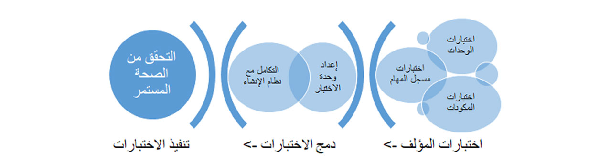

<span data-ttu-id="e5a8d-101">يأتي Visual Studio مع SysTest Framework الذي يسمح لك بكتابة كود اختبار الوحدة، ودمج الاختبارات، ثم تشغيل الاختبار لأتمتة اختبار الكود.</span><span class="sxs-lookup"><span data-stu-id="e5a8d-101">Visual Studio comes with a SysTest Framework that allows you to write unit test code, integrate the tests, and then run the test to automate code testing.</span></span> <span data-ttu-id="e5a8d-102">يمكنك إعداد SysTest Framework لإنشاء اختبار وحدة نمطية من الكود.</span><span class="sxs-lookup"><span data-stu-id="e5a8d-102">You can set up the SysTest Framework to create unit test from code.</span></span> <span data-ttu-id="e5a8d-103">يمكنك أيضاً استيراد تسجيلات مسجل المهام إلى Visual Studio لإنشاء كود اختبار.</span><span class="sxs-lookup"><span data-stu-id="e5a8d-103">You can also import Task recorder recordings into Visual Studio to generate test code.</span></span> <span data-ttu-id="e5a8d-104">يتم توفير مزيد من المعلومات حول مسجل المهام لاحقاً في هذه الوحدة النمطية.</span><span class="sxs-lookup"><span data-stu-id="e5a8d-104">More information about the Task recorder is provided later in this module.</span></span>  

<span data-ttu-id="e5a8d-105">يمكن بعد ذلك دمج اختبارك في وحدة اختبار نمطية يمكن استخدامها لإدارة كود الاختبار و`FormAdaptors`.</span><span class="sxs-lookup"><span data-stu-id="e5a8d-105">Your test can then be integrated into a test module which can be used to manage test code and `FormAdaptors`.</span></span> <span data-ttu-id="e5a8d-106">ستسمح لك إضافة وحدة الاختبار النمطية إلى عنصر التحكم في المصدر بدمج اختبارك مع عملية الإنشاء.</span><span class="sxs-lookup"><span data-stu-id="e5a8d-106">Adding the test module to the source control will allow you to integrate your test with the build process.</span></span> <span data-ttu-id="e5a8d-107">ستعمل هذه الإضافة بعد ذلك على تشغيل كود الاختبار أثناء الإنشاء للتحقق من أن جميع الوظائف تعمل بالشكل المتوقع.</span><span class="sxs-lookup"><span data-stu-id="e5a8d-107">This addition will then run your test code during the build to verify that all functionality is working as expected.</span></span>

<span data-ttu-id="e5a8d-108">يمكنك أيضاً تشغيل كود الاختبار بشكل فردي.</span><span class="sxs-lookup"><span data-stu-id="e5a8d-108">You can also run the test code individually.</span></span> <span data-ttu-id="e5a8d-109">يعد تشغيل أكواد الاختبار عملية قابلة للتكرار، لذلك عند إنشاء فئة الاختبار، يمكنك تشغيلها عدة مرات.</span><span class="sxs-lookup"><span data-stu-id="e5a8d-109">Running test codes is a repeatable process so, when the test class is created, you can run it multiple times.</span></span> <span data-ttu-id="e5a8d-110">تسمح لك هذه التكرارات بالتحقق من صحة تغييرات الأكواد باستمرار.</span><span class="sxs-lookup"><span data-stu-id="e5a8d-110">These iterations allow you to continuously validate your code changes.</span></span> <span data-ttu-id="e5a8d-111">بالإضافة إلى ذلك، يعد تشغيل الاختبارات بسرعة للتحقق مما إذا كانت وظيفتك لا تزال تعمل بعد تعديل مطور آخر للعنصر أمراً أساسياً لتحقيق الإنتاجية.</span><span class="sxs-lookup"><span data-stu-id="e5a8d-111">Additionally, quickly running tests to validate if your functionality still works after another developer has modified the element is key for productivity.</span></span> 

<span data-ttu-id="e5a8d-112">يمكن أن يكون خيار إعادة تشغيل الاختبارات مفيداً أيضاً لإنتاجية مؤسستك خلال الترقيات التي تم إصدارها بواسطة Microsoft.</span><span class="sxs-lookup"><span data-stu-id="e5a8d-112">The option to rerun tests can also be beneficial to your organization's productivity during upgrades that are released by Microsoft.</span></span> <span data-ttu-id="e5a8d-113">بدلاً من طلب موارد المستخدم لاختبار انحدار جميع الوظائف من واجهة المستخدم، يمكنك تشغيل اختبارات الوحدة النمطية هذه التي ستدخل البيانات المطلوبة وتشغيل عمليات الاختبار لتحديد ما إذا كانت الوظيفة تعمل على النحو المتوقع.</span><span class="sxs-lookup"><span data-stu-id="e5a8d-113">Instead of requiring user resources to regression test all the functionality from the user interface, you can run these unit tests that will enter the required data and run testing processes to determine if functionality is performing as expected.</span></span>



<span data-ttu-id="e5a8d-115">لإنشاء حالة اختبار جديدة لاختبار الوظائف في أحد التطبيقات، اتبع الخطوات التالية:</span><span class="sxs-lookup"><span data-stu-id="e5a8d-115">To create a new test case to test functionality in an application, follow these steps:</span></span>

1.  <span data-ttu-id="e5a8d-116">افتح Visual Studio كمسؤول.</span><span class="sxs-lookup"><span data-stu-id="e5a8d-116">Open Visual Studio as an administrator.</span></span>
2.  <span data-ttu-id="e5a8d-117">قم بإنشاء مشروع جديد.</span><span class="sxs-lookup"><span data-stu-id="e5a8d-117">Create a new project.</span></span>
3.  <span data-ttu-id="e5a8d-118">أضف فئة جديدة إلى المشروع.</span><span class="sxs-lookup"><span data-stu-id="e5a8d-118">Add a new Class to the project.</span></span>
4.  <span data-ttu-id="e5a8d-119">قم بتوسيع فئة **SysTestCase** في إقرار الفئة.</span><span class="sxs-lookup"><span data-stu-id="e5a8d-119">Extend the **SysTestCase** class in the class declaration.</span></span>
5.  <span data-ttu-id="e5a8d-120">أضف أساليب إلى الفئة لتحديد الاختبار.</span><span class="sxs-lookup"><span data-stu-id="e5a8d-120">Add methods to the class to define the test.</span></span> <span data-ttu-id="e5a8d-121">ويجب أن تستخدم هذه الأساليب سمة **[SysTestMethodAttribute]**.</span><span class="sxs-lookup"><span data-stu-id="e5a8d-121">These methods should use the **[SysTestMethodAttribute]** attribute.</span></span>
6.  <span data-ttu-id="e5a8d-122">يمثل الكود التالي مثالاً لفئة اختبار باستخدام نموذج "إدارة الأسطول".</span><span class="sxs-lookup"><span data-stu-id="e5a8d-122">The following code represents an example test class by using the Fleet Management model.</span></span>

```xpp
class FMUnitTestSample extends SysTestCase
 {
   public void setup()
   {
     // Reset the test data to be sure things are clean
     FMDataHelper::main(null);
   }
    
  [SysTestMethodAttribute]
   public void testFMTotalsEngine()
   {
      FMRental rental;
      FMTotalsEngine fmTotals;
      FMRentalTotal fmRentalTotal;
      FMRentalCharge rentalCharge;
      FMRentalTotal expectedtotal;
      str rentalID = '000022';

      // Find a known rental
      rental = FMRental::find(rentalID);

     // Get the rental charges associated with the rental
     // Data is seeded randomly, so this will change for each run
     select sum(ExtendedAmount) from rentalCharge
         where rentalCharge.RentalId == rental.RentalId;

     fmTotals = FMTotalsEngine::construct();
     fmTotals.calculateRentalVehicleRate(rental);

     // Get the totals from the engine
     fmRentalTotal = fmTotals.totals(rental);

     // Set the expected amount
     expectedTotal = rental.VehicleRateTotal + rentalCharge.ExtendedAmount;

     this.assertEquals(expectedTotal,fmRentalTotal);

   }

   [SysTestMethodAttribute]
   public void testFMCarValidateField()
   {
     FMCarClass fmCar;

     fmCar.NumberOfDoors = -1;
     this.assertFalse(fmCar.validateField(Fieldnum("FMCarClass", "NumberOfDoors")));
  }

 }
```
7.  <span data-ttu-id="e5a8d-123">احفظ الفئة.</span><span class="sxs-lookup"><span data-stu-id="e5a8d-123">Save the class.</span></span> <span data-ttu-id="e5a8d-124">ستتوفر حالتا اختبار في "مستكشف الاختبارات".</span><span class="sxs-lookup"><span data-stu-id="e5a8d-124">Two test cases will be available in the Test Explorer.</span></span>
8.  <span data-ttu-id="e5a8d-125">أنشئ المشروع.</span><span class="sxs-lookup"><span data-stu-id="e5a8d-125">Build the project.</span></span>
9. <span data-ttu-id="e5a8d-126">في قائمة **الاختبار**، افتح **Windows > "مستكشف الاختبارات"**.</span><span class="sxs-lookup"><span data-stu-id="e5a8d-126">On the **Test** menu, open **Windows > Test Explorer**.</span></span>
10. <span data-ttu-id="e5a8d-127">حدد **تشغيل الاختبار المحدد** لتشغيل حالة اختبار محددة.</span><span class="sxs-lookup"><span data-stu-id="e5a8d-127">Select **Run selected test** to run a specific test case.</span></span> <span data-ttu-id="e5a8d-128">سيتم عرض النتائج بعد اكتمال **مستكشف الاختبارات**.</span><span class="sxs-lookup"><span data-stu-id="e5a8d-128">The results will display after the **Test Explorer** is complete.</span></span>

<span data-ttu-id="e5a8d-129">يمكنك إنشاء وحدة اختبار نمطية للمساعدة في إدارة أكواد الاختبار.</span><span class="sxs-lookup"><span data-stu-id="e5a8d-129">You can create a test module to help manage your test codes.</span></span> <span data-ttu-id="e5a8d-130">تسمح إضافة وحدات اختبار نمطية للتحكم في المصادر لعملية الإنشاء بالعثور على الوحدات النمطية التي تحتوي على كلمة "اختبار" في الاسم وتنفيذ تشغيل الاختبار.</span><span class="sxs-lookup"><span data-stu-id="e5a8d-130">Adding test modules to source control allows the build process to find modules that contain the word "test" in the name and implement the test run.</span></span>

<span data-ttu-id="e5a8d-131">لإنشاء وحدة اختبار نمطية، اتبع الخطوات التالية:</span><span class="sxs-lookup"><span data-stu-id="e5a8d-131">To create a test module, follow these steps:</span></span>

1.  <span data-ttu-id="e5a8d-132">في Visual Studio، افتح **Dynamics 365 > إدارة النماذج > إنشاء نموذج**.</span><span class="sxs-lookup"><span data-stu-id="e5a8d-132">In Visual Studio, open **Dynamics 365 > Model Management > Create model**.</span></span>
2.  <span data-ttu-id="e5a8d-133">أدخِل اسم النموذج الذي يتضمن كلمة "اختبار".</span><span class="sxs-lookup"><span data-stu-id="e5a8d-133">Enter the model name that includes the word "test."</span></span>
3.  <span data-ttu-id="e5a8d-134">أضف مراجع إلى النماذج التالية:</span><span class="sxs-lookup"><span data-stu-id="e5a8d-134">Add references to the following models:</span></span>
    -   <span data-ttu-id="e5a8d-135">النظام الأساسي للتطبيق</span><span class="sxs-lookup"><span data-stu-id="e5a8d-135">Application Platform</span></span>
    -   <span data-ttu-id="e5a8d-136">أساس التطبيق</span><span class="sxs-lookup"><span data-stu-id="e5a8d-136">Application Foundation</span></span>
    -   <span data-ttu-id="e5a8d-137">أساسيات الاختبار</span><span class="sxs-lookup"><span data-stu-id="e5a8d-137">Test Essentials</span></span>
    -   <span data-ttu-id="e5a8d-138">محول نموذج أساس التطبيق</span><span class="sxs-lookup"><span data-stu-id="e5a8d-138">Application Foundation Form Adaptor</span></span>
    -   <span data-ttu-id="e5a8d-139">محول نموذج النظام الأساسي للتطبيق</span><span class="sxs-lookup"><span data-stu-id="e5a8d-139">Application Platform Form Adaptor</span></span>
    -   <span data-ttu-id="e5a8d-140">تكامل التقارير الإلكترونية لمجموعة التطبيقات</span><span class="sxs-lookup"><span data-stu-id="e5a8d-140">Application Suite Electronic Reporting Integration</span></span>
    -   <span data-ttu-id="e5a8d-141">محول نموذج مجموعة التطبيقات</span><span class="sxs-lookup"><span data-stu-id="e5a8d-141">Application Suite Form Adaptor</span></span>
4.  <span data-ttu-id="e5a8d-142">حدد **التالي**.</span><span class="sxs-lookup"><span data-stu-id="e5a8d-142">Select **Next**.</span></span>
5.  <span data-ttu-id="e5a8d-143">حدد **إنهاء**.</span><span class="sxs-lookup"><span data-stu-id="e5a8d-143">Select **Finish**.</span></span>
