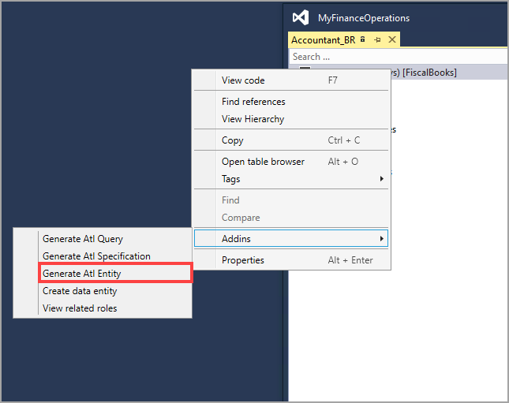

مكتبة اختبار القبول (ATL) هي مكتبة اختبار X++‎ التي تسمح للمطورين بإنشاء بيانات اختبار متسقة. فهي تجعل كود الاختبار أكثر قابلية للقراءة، ويصبح اكتشاف الطرق التي تنشئ بيانات الاختبار أكثر سهولة. تدعم ATL أيضاً الأداء العالي لحالات الاختبار. يمكنك استخدام الفئات داخل ATL لإنشاء اختبارات قابلة للتكرار من شأنها كتابة بيانات الاختبار وتشغيل العمليات باستخدام تلك البيانات. يمكن لهذه الميزة تبسيط بعض عمليات إعداد البيانات الأكثر تعقيداً والعمليات التي ستكون مطلوبة للاختبار من خلال واجهة المستخدم (UI).

عند إنشاء الفئات والطرق في ATL، يتعين عليك اتباع هيكلة وتسمية صارمة. يتم تجميع الفئات في المفاهيم التالية:

-   **التنقل** - اكتشاف الكيانات و‏‫أساليب بيانات الاختبار‬.
-   **أساليب بيانات الاختبار** - تُستخدم هذه الطرق لإعداد بيانات الاختبار.
-   **الكيانات** - تمثيل البيانات والسلوك المرتبط بها والذي يُنظر إليه على أنه وحدة واحدة.
-   **المنشئون** - يتيحون لك إنشاء بيانات اختبار محددة.
-   **الأوامر** - تشغيل عمليات الأعمال.
-   **الاستعلامات** - البحث عن الكيانات.
-   **المواصفات** - وصف الكيانات المتوقعة في نهاية الاختبار.
 
يقوم منشئ أكواد ATL بإنشاء وتحديث كيانات واستعلامات ومواصفات ATL جديدة سريعاً استناداً إلى الجداول وكيانات البيانات.

تساعدك الخطوات التالية في إنشاء فئة كيان ATL باستخدام إنشاء الكود:

1.  في Visual Studio، افتح الجدول الذي تريد استخدامه في نافذة المصمم.
2.  في قائمة **الوظائف الإضافية**، حدد **إنشاء كيان ATL**.
3.  حدد الحقول التي يجب تضمينها في فئة كيان ATL.
4.  حدد **إضافة**.
5.  أعد تسمية الكيان والحقول حسب الحاجة.
6.  حدد **إنشاء** لإنشاء الفئة.

لإنشاء فئة استعلام ATL باستخدام المعالج، اتبع الخطوات التالية:

1.  في Visual Studio، افتح الجدول الذي تريد استخدامه في نافذة المصمم.
2.  في قائمة **الوظائف الإضافية**، حدد **إنشاء استعلام ATL**.
3.  حدد الحقول والعلاقات التي يجب تضمينها في فئة استعلام ATL.
4.  حدد **إضافة**.
5.  أعد تسمية الكيان والحقول والعلاقات حسب الحاجة.
6.  حدد **إنشاء** لإنشاء الفئة.

لإنشاء فئة مواصفات ATL باستخدام المعالج، اتبع الخطوات التالية:

1.  في Visual Studio، افتح الجدول الذي تريد استخدامه في نافذة المصمم.
2.  في قائمة **الوظائف الإضافية**، حدد **إنشاء مواصفات ATL**.
3.  حدد الحقول التي يجب تضمينها في فئة مواصفات ATL.
4.  حدد **إضافة**.
5.  أعد تسمية الكيان والمواصفات حسب الحاجة.
6.  حدد **إنشاء** لإنشاء الفئة.

لمعرفة المزيد حول مكتبة اختبار القبول (ATL)، انتقل إلى [موارد مكتبة اختبار القبول](https://docs.microsoft.com/dynamics365/fin-ops-core/dev-itpro/perf-test/acceptance-test-library/?azure-portal=true).
