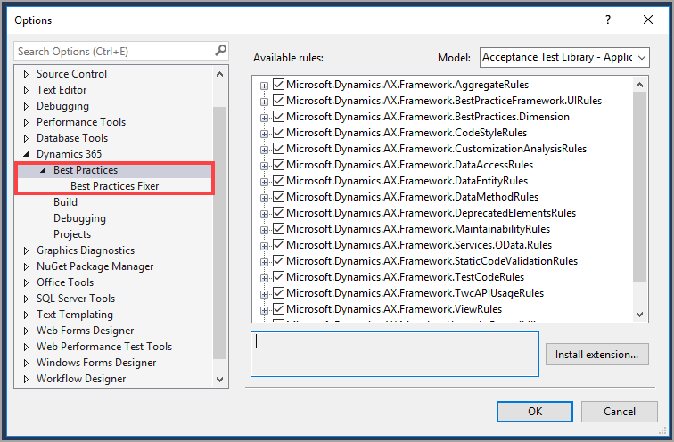

يمكن استخدام أداة "أفضل الممارسات" للحفاظ على بقاء الكود X++ نظيفاً وموحداً حتى يتمكن المطورين المستقبليين من قراءة الكود لمعرفة التخصيصات التي تم إجراؤها. إضافة إلى ذلك، يمكن أن تساعد أداة "أفضل الممارسات" على مواكبة الكود لعمليات الترقية المستقبلية للحد من المشاكل. لتمكين فحص أداة "أفضل الممارسات"، يمكنك الانتقال إلى **Visual Studio > Dynamics 365 > خيارات > أداة "أفضل الممارسات"** وعرض أفضل الممارسات لكل نموذج. يمكنك أيضاً إيقاف تشغيل أداة "أفضل الممارسات" لنماذج معينة في صفحة **أداة "أفضل الممارسات"**.



يتم تشغيل فحص أداة "أفضل الممارسات" في أثناء عملية البناء. في نافذة **النتائج**، يمكنك رؤية كافة مشاكل أداة "أفضل الممارسات" وموقع كل مشكلة. يمكنك أيضاً تشغيل فحص أداة "أفضل الممارسات" من موجه الأوامر. يمكنك تشغيل أداة "أفضل الممارسات" لكافة النماذج وعناصر معينة وكافة العناصر الموجودة في النموذج، والعناصر الموجودة في كافة النماذج ثم كتابة الإخراج في ملف السجل. تعرض القائمة الآتية بعض القصاصات البرمجية لكيفية تشغيل أداة "أفضل الممارسات" مقابل العناصر المختلفة في موجه الأوامر.

-   **تشغيل أداة "أفضل الممارسات" في كافة النماذج في وحده نمطيه** - `xppbp     -module:FleetManagement form:*`

-   **تشغيل أداة "أفضل الممارسات" في عناصر معينة** - `xppbp  -module:FleetManagement class:MyClass form:MyForm`

-   **تشغيل أداة "أفضل الممارسات" في كافة العناصر الموجودة في النموذج (ولهذا النموذج الواحد فقط الموجود في الوحدة النمطية)** - `xppbp -module:FleetManagement -model:FleetManagement -all`

-   **تشغيل أداة "أفضل الممارسات" على كافة العناصر في جميع النماذج الموجودة في الوحدة النمطية** - `xppbp -module:FleetManagement -all`

-   **كتابة إخراج أداة "أفضل الممارسات" في ملفات السجل** - `xppbp -module:FleetManagement -all -xmllog=Log.xml -log=Log.txt`

يمكنك منع عمليات فحص أداة "أفضل الممارسات" لكل نموذج. ولتنفيذ ذلك، يمكنك النقر بزر الماوس الأيمن فوق مشروع وتحديد **تحرير عمليات منع أداة "أفضل الممارسات"**. سيؤدي ذلك إلى فتح ملف XML حيث يمكنك منع أداة "أفضل الممارسات". ستحتاج إلى إضافة النموذج الذي ترغب في منعه باستخدام العلامات `DiagnosticType` و`Severity` و`Path` و`Moniker` و`Justification`. يجب أن تتمكن من نسخ المعلومات من ملف BuildModelResult.xml الخاص بالنموذج الذي تم إنشاؤه في أثناء عملية البناء في ملف **Edit Best Practice Suppressions XML‎**. قد تحتاج رسالة التبرير إلى تعديل حتى تصبح أكثر وضوحاً.
```xml
<Diagnostic>
     <DiagnosticType>BestPractices</DiagnosticType>
     <Severity>Warning</Severity>
     <Path>AxForm/AssetWarehouseTransfer/Design</Path>
     <Moniker>BPErrorFormDesignPatternUnspecified</Moniker>
     <Justification>Microsoft surely assigns a pattern  soon.</Justification>
</Diagnostic>
```
