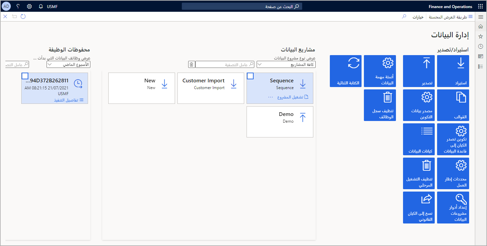

تُعد البيانات الدقيقة عاملاً أساسياً لقياس نجاح الكود.Accurate data is key to measuring the success of code. وستحتاج إلى إعداد بيئة الاختبار وإعداد البيانات المراد اختبارها في Visual Studio.You will need to set up the test environment and prepare data to be tested in Visual Studio. كما ستحتاج إلى توزيع بيئة اختبار للمستخدمين لاختبار التخصيص للكود.You will also need to deploy a testing environment for users to test customization to code. يجب أن تكون بيئة الاختبار بيئة من المستوى الأول لتنفيذ اختبارات الوحدة فيها.A testing environment should be a Tier-1 environment to perform unit tests in. لمعرفة المزيد حول توزيع البيئة، راجع [استكشاف البنية التقنية للوحدة النمطية لتطبيقات Finance and Operations](https://docs.microsoft.com/learn/modules/explore-technical-architecture-finance-operations/?azure-portal=true).To learn more about deploying an environment, review the [Explore the technical architecture of Finance and Operations apps](https://docs.microsoft.com/learn/modules/explore-technical-architecture-finance-operations/?azure-portal=true) module. 

لإعداد بيئة الاختبار باستخدام البيانات الصحيحة، يمكنك استخدام مساحة العمل **إدارة البيانات** (**إدارة النظام > إدارة البيانات**).To prepare the test environment with proper data, you can use the **Data management** workspace (**System administration > Data management**).

تستخدم أداة إدارة البيانات كيانات البيانات التي تمثل بيانات جدول واحد أو أكثر.The data management tool uses data entities that represent the data of one or more tables. ويمكنك إنشاء مشروع بيانات لاستيراد البيانات في كيان واحد أو أكثر.You can create a data project to import data into one or more entities. سيتم دفع البيانات التي تم دفعها إلى الكيان إلى الجدول الرئيسي للتطبيقات Finance and Operations.The data that is pushed into the entity will be pushed to the main table of Finance and Operations apps. يمكنك استيراد البيانات من خلال أنواع ملفات متعددة، بما في ذلك ‎.csv أو ‎.xlsx أو ‎.txt أو الحزمة.You can import data through multiple file types, including .csv, .xlsx, .txt, or a package. وتحتوي الحزمة على العديد من ملفات استيراد البيانات مع بيانات التعريف لتحديد التسلسل الذي يتم به إدخال ملفات الاستيراد في النظام.A package holds several data import files with metadata to specify the sequence in which the import files are inserted into the system.

كما يمكنك استخدام LCS مع إطار عمل إدارة البيانات لاستيراد التكوينات والبيانات بين البيئات.You can also use LCS together with the data management framework to import the configurations and data between environments.
