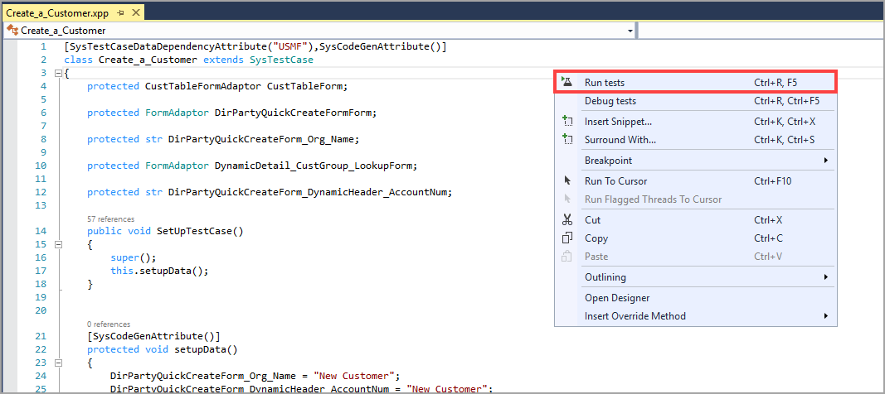

يمكن أن تتضمن المشاريع الكبيرة على العديد من المطورين الذين يقومون بإنشاء أكواد في بيئاتهم الخاصة. وقبل دفع تغييرات الأكواد إلى بيئة التشغيل، يجب إجراء اختبارات الوحدة للتحقق من الأكواد. يجب أن تتبع اختبارات الوحدة بناء جملة محدد. يجب تعمل الفئة على توسيع نطاق الفئة `SysTestCase`. يجب أن تكون أساليب الاختبار عامة، ولا يمكن أن تحتوي علي معلمات، ويجب أن ترجع قيمة فارغة، ويجب تزيينها باستخدام `SysTestMethod`.
 
يمكن أن يتضمن أسلوب الاختبار أساليب أخرى لا تتبع هذه القواعد. عادةً ما يكون لأساليب الاختبار ثلاثة أساليب مختلفة: الترتيب والعمل والتأكيد. يقوم أسلوب "الترتيب" بإعداد كافة المتغيرات.
ويقوم الأسلوب "العمل" بإجراء بعض المعالجة. كما يتحقق أسلوب "التأكيد" من توقع النتيجة. يمكنك استخدام أسلوب `setup()` الذي تم تضمينه في إطار العمل لترتيب المتغيرات التي سيتم استخدامها خلال أساليب الاختبار. على سبيل المثال، إذا كان لديك متغير `currencyAmt` الذي يستخدم في أساليب اختبار متعددة، فبدلاً من إنشاء متغير `currencyAmt` لكل أسلوب اختبار، ما عليك سوى إنشائه في الأسلوب `setup()`.

يمكنك الاختيار من أساليب التأكيد المختلفة المتعددة للتحقق من الاختبار. `AssertEquals()` يعد الأسلوب الأكثر شيوعاً، لكن تتوفر أساليب أخرى مثل `assertTrue()` و`assertNotNull()` ويمكنك أيضاً استخدام الكود `this.parmExceptionExpected(true)` للتأكيد على أن الخطأ الذي تم طرحه هو السلوك الصحيح.

بعد إنشاء فئة الاختبار، يمكنك النقر بزر الماوس الأيمن فوق الفئة وتحديد **تشغيل الاختبارات**. سيؤدي هذا التحديد إلى فتح شريط أدوات اختبار الوحدة. يمكن أن يكون استخدام اختبارات الوحدة طريقة سريعة ويمكن الاعتماد عليها لإعداد الكود. ومع مرور الوقت، ستقوم بإنشاء اختبارات جديدة عند إضافة وظيفة جديدة. يسمح لك هذا بتشغيل اختبارات الوحدة بسرعة للتأكد من سير الأمور على النحو المتوقع. للحصول على معلومات، راجع [تصفية SysTest باستخدام سمات الفئات والأساليب](https://docs.microsoft.com/dynamics365/fin-ops-core/dev-itpro/perf-test/systest-filtering/?azure-portal=true).

