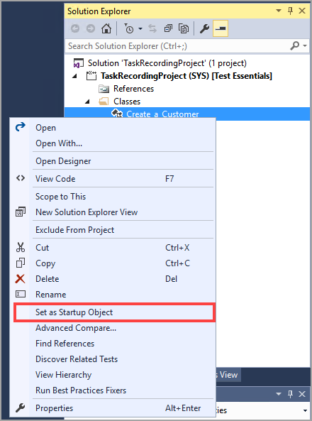

تأتي Visual Studio مع مصحح أخطاء يقوم بفحص الكود أثناء تشغيله. وغالباً ما يتم استخدام مصححات الأخطاء من قِبل المطورين لمعرفة الأخطاء في الكود. وعند تصحيح الأخطاء، يمكنك رؤية عمليات سحب القيمة والاستعلامات التي يتم استدعاؤها ومكدس الاستدعاءات لكل الفئات والأساليب التي تم تشغيلها. كما يمكنك مراقبة متغيرات محددة لتعقب القيمة. بالإضافة إلى تحديد الأخطاء، يمكنك استخدام مصحح الأخطاء للفهم بشكل أفضل كيفية معالجة الكود لقيم المتغيرات والترتيب الذي يتم به تشغيل عمليات معينة. ويمكن أن يساعدك هذا على الفهم الأفضل لعمليات معينة، مثل رؤية عمليات التحقق التي يتم إجراؤها أثناء إدخال الصنف.

لاستخدام مصحح أخطاء Visual Studio، ستحتاج إلى تعيين نقاط توقف وكائن بدء تشغيل في مشروعك. تُعد نقطة التوقف إحدى التعيينات في الكود حيث سيتوقف تنفيذ الكود عند تشغيله في مصحح الأخطاء. يتم تمثيل نقطة التوقف كنقطة حمراء برقم السطر في الكود. يمكنك تعيين العديد من نقاط التوقف حسب الحاجة ولكن نقاط التوقف الزائدة يمكن أن تجعل تصحيح الأخطاء يستغرق وقتاً طويلاً بسبب أن الكود يبدأ ويتوقف باستمرار. يحتوي شريط أدوات مصحح الأخطاء على الخيارات التي يمكنك فيها تعيين نقاط التوقف وإزالة نقاط التوقف وإزالة جميع نقاط التوقف.

عندما يأتي الكود إلى نقطة توقف، يمكنك أيضاً تحديد خيارات في شريط أدوات مصحح الأخطاء **الدخول** في الكود سطراً بسطر. وسيؤدي ذلك أيضاً إلى أي استدعاءات أسلوب في الكود. ويمكنك تحديد **تخطي** للمتابعة إلى السطر التالي دون الانتقال إلى أي استدعاء للأسلوب. كما يمكنك تحديد **خروج**، والذي سيقوم بتشغيل الوظيفة الحالية لإكمالها.
باستخدام الزر **تشغيل**، يمكنك متابعة تشغيل التنفيذ حتى الإكمال أو حتى يصل الكود إلى نقطة توقف أخرى. كما أن أداة تصحيح الأخطاء لها أداة **إيقاف** لإنهاء الكود الذي يتم تشغيله وإنهاء وضع مصحح الأخطاء.

يلزم وجود كائن بدء التشغيل لمعرفة الفئة التي سيتم تشغيلها عند بدء مصحح الأخطاء. يمكنك تحديد كائن بدء التشغيل بالنقر بزر الماوس الأيمن فوق كائن في المشروع، ثم تحديد **تعيين ككائن بدء التشغيل**.
وعادةً ما يكون هذا النموذج أو الفئة. عندما تقرر تشغيل مصحح الأخطاء للكائن، من القائمة **تصحيح الأخطاء**، حدد **بدء** وسيتم فتح نافذة جديدة، مع تشغيل كائن بدء التشغيل الذي قمت بتحديده.

