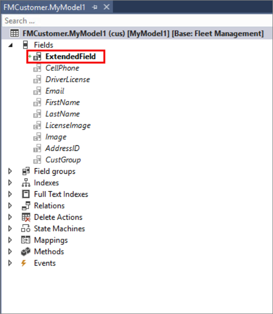

<span data-ttu-id="1de6a-101">إذا كنت تريد تعديل الحقول أو مجموعات الحقول أو الفهارس أو التعيينات أو العلاقات الخاصة بالجدول، فيمكنك إنشاء ملحق للجدول وإجراء التغييرات اللازمة.</span><span class="sxs-lookup"><span data-stu-id="1de6a-101">If you want to modify the fields, field groups, indexes, mappings, or relations of a table, you can create an extension of the table and make the necessary changes.</span></span> <span data-ttu-id="1de6a-102">بالإضافة إلى ذلك، يمكنك إضافة الحقول إلى مجموعات الحقول.</span><span class="sxs-lookup"><span data-stu-id="1de6a-102">Additionally, you can add fields and add fields to field groups.</span></span> 

<span data-ttu-id="1de6a-103">يمكن إضافة الحقول إما بالنقر بزر الماوس الأيمن فوق عقدة **الحقول** في الجدول وتحديد **جديد** أو عن طريق تحديد حقل أو سحبه من AOT أو نافذة **مستكشف الحلول** إلى عقدة **الحقول** في الجدول.</span><span class="sxs-lookup"><span data-stu-id="1de6a-103">Fields can be added by either right-clicking the **Fields** node of the table and selecting **New**, or by selecting and dragging a field from the AOT or **Solution Explorer** window to the **Fields** node of the table.</span></span> <span data-ttu-id="1de6a-104">بعد إضافة الحقل إلى الجدول، يمكنك تحديده وسحبه إلى مجموعة حقول موجودة، أو يمكنك إنشاء مجموعة حقول جديدة وسحب الحقل إليها.</span><span class="sxs-lookup"><span data-stu-id="1de6a-104">After the field is added to the table, you can select and drag it to an existing field group, or you can create a new field group and drag the field to it.</span></span> <span data-ttu-id="1de6a-105">سيتم عرض الحقل المضاف و/أو مجموعة الحقول بخط عريض، بينما سيتم عرض الحقول ومجموعات الحقول الموجودة بخط مائل.</span><span class="sxs-lookup"><span data-stu-id="1de6a-105">The added field and/or field group will be shown in bold type, while the existing fields and field groups will be displayed in italic type.</span></span>

<span data-ttu-id="1de6a-106">فيما يلي مثال على إضافة حقل **`AccountNum`** من **AOT > أنواع البيانات > أنواع البيانات الموسعة** إلى عقدة **الحقول** في جدول **`FMCustomer.myExtension`**.</span><span class="sxs-lookup"><span data-stu-id="1de6a-106">The following is an example of adding the **`AccountNum`** field from **AOT > Data Types > Extended Data Types** to the **Fields** node of the **`FMCustomer.myExtension`** table.</span></span>



## <a name="table-indexes"></a><span data-ttu-id="1de6a-108">فهارس الجدول</span><span class="sxs-lookup"><span data-stu-id="1de6a-108">Table indexes</span></span>

<span data-ttu-id="1de6a-109">يمكن **للفهرس** تسريع عمليات البحث في قاعدة البيانات.</span><span class="sxs-lookup"><span data-stu-id="1de6a-109">An **index** can speed up database searches.</span></span> <span data-ttu-id="1de6a-110">إذا قمت بإضافة حقول إلى جدول، فقد ترغب أيضاً في إضافة فهرس مخصص.</span><span class="sxs-lookup"><span data-stu-id="1de6a-110">If you add fields to a table, you might also want to add a dedicated index.</span></span> <span data-ttu-id="1de6a-111">يمكنك استخدام الحقول الموجودة والحقول الجديدة في إنشاء الفهرس.</span><span class="sxs-lookup"><span data-stu-id="1de6a-111">You can use existing fields and new fields in creating the index.</span></span> <span data-ttu-id="1de6a-112">بعد إنشاء ملحق للجدول الذي تريده، يمكنك إضافة فهرس بنفس الطريقة التي تضيف بها فهرساً إلى جدول جديد.</span><span class="sxs-lookup"><span data-stu-id="1de6a-112">After you have created an extension of your desired table, you can add an index in the same manner that you would add an index to a new table.</span></span> <span data-ttu-id="1de6a-113">لا يمكنك استخدام ملحق لإنشاء فهرس فريد.</span><span class="sxs-lookup"><span data-stu-id="1de6a-113">You cannot use an extension to create a unique index.</span></span> <span data-ttu-id="1de6a-114">هذا النوع من التطوير تدخلي وبالتالي غير مسموح به.</span><span class="sxs-lookup"><span data-stu-id="1de6a-114">That type of development is intrusive and therefore not allowed.</span></span> 

<span data-ttu-id="1de6a-115">مثل إضافة فهرس إلى جدول بعد إضافة حقول جديدة، قد تحتاج أيضاً إلى إنشاء علاقة إذا كان يجب ربط الحقل الجديد بجدول آخر.</span><span class="sxs-lookup"><span data-stu-id="1de6a-115">Like adding an index to a table after adding new fields, you might also need to create a relation if the new field should be linked to another table.</span></span> <span data-ttu-id="1de6a-116">يمكن أن يساعدك تحديد العلاقات في ضمان التكامل المرجعي من خلال وصف الارتباط بين الجدولين.</span><span class="sxs-lookup"><span data-stu-id="1de6a-116">Defining relations can help you guarantee referential integrity by describing the link between the two tables.</span></span> <span data-ttu-id="1de6a-117">تؤدي إضافة علاقة جديدة إلى جدول موسع إلى تتبع نفس العملية مثل إضافة علاقة إلى جدول جديد.</span><span class="sxs-lookup"><span data-stu-id="1de6a-117">Adding a new relation to an extended table follows the same process as adding a relation to a new table.</span></span>

<span data-ttu-id="1de6a-118">يمكنك ضبط تسمية الجدول أو حقل فردي أو نص التعليمات، بالإضافة إلى الخصائص الأخرى المتاحة.</span><span class="sxs-lookup"><span data-stu-id="1de6a-118">You can adjust the table's or the individual field's label or help text, as well as other available properties.</span></span> <span data-ttu-id="1de6a-119">في حالة قيامك بتعيين خاصية **تم الإنشاء بواسطة** أو **وقت وتاريخ الإنشاء** أو **تم التعديل بواسطة** أو **وقت وتاريخ التعديل** إلى **نعم**، فستضيف معلومات التتبع المقابلة حول المستخدم في الجدول عند إنشاء السجلات أو تحديثها.</span><span class="sxs-lookup"><span data-stu-id="1de6a-119">If you set the **Created By**, **Created Data Time**, **Modified By**, or **Modified Date Time** property to **Yes**, it will add corresponding tracking information about the user to the table when records are created or updated.</span></span> <span data-ttu-id="1de6a-120">لا يمكن تعديل كل خاصية مدرجة في نافذة **الخصائص**.</span><span class="sxs-lookup"><span data-stu-id="1de6a-120">Not every property that is listed in the **Properties** window can be adjusted.</span></span> <span data-ttu-id="1de6a-121">على سبيل المثال، لا يمكن تغيير خصائص التتبع المذكورة إلى **لا** إذا تم تعيينها إلى **نعم** في الجدول الأساسي.</span><span class="sxs-lookup"><span data-stu-id="1de6a-121">For example, the tracking properties that were mentioned cannot be changed to **No** if they are set to **Yes** on the base table.</span></span> <span data-ttu-id="1de6a-122">إذا ظهرت خاصية بشكل باهت، فهي غير قابلة للتحرير.</span><span class="sxs-lookup"><span data-stu-id="1de6a-122">If a property appears dimmed, it isn't editable.</span></span>

## <a name="table-business-logic"></a><span data-ttu-id="1de6a-123">منطق أعمال الجدول</span><span class="sxs-lookup"><span data-stu-id="1de6a-123">Table business logic</span></span>

<span data-ttu-id="1de6a-124">يمكن أيضاً تنفيذ معالجات الأحداث ويتم استدعاؤها من عمليات التنفيذ الأساسية لطرق الجدول.</span><span class="sxs-lookup"><span data-stu-id="1de6a-124">Event handlers can also be implemented and are called from the base implementations of the table methods.</span></span> <span data-ttu-id="1de6a-125">أولاً، أنت بحاجة إلى إنشاء فئة جديدة تقوم بتوسيع الجدول المرغوب وتمكين الوصول إلى حقوله وأساليبه.</span><span class="sxs-lookup"><span data-stu-id="1de6a-125">First, you need to create a new class that extends the desired table and enables access to its fields and methods.</span></span> <span data-ttu-id="1de6a-126">يجب تزيين الفئة بسمتي `final` و`[ExtensionOf()]` ويجب أن تشتمل على اللاحقة `_Extension`.</span><span class="sxs-lookup"><span data-stu-id="1de6a-126">The class should be decorated with the `final` and `[ExtensionOf()]` attributes and have the `_Extension` suffix.</span></span> <span data-ttu-id="1de6a-127">يُظهر نموذج التعليمات البرمجية التالي كيفية إنشاء فئة جديدة تعمل على توسيع الجدول InventTable.</span><span class="sxs-lookup"><span data-stu-id="1de6a-127">The following code sample shows how to create a new class that extends the table InventTable.</span></span>
```xpp
[ExtensionOf(tableStr(InventTable))]
final class InventTableMy_Extension
{
    public void myDefaultInventLocationId()
    {
        //Contains organization-specific logic to initialize the new field here.
        this.MyInventLocationID = this.inventLocationId();
    }
}
```
<span data-ttu-id="1de6a-128">بعد ذلك، ستضيف طرقاً إلى الفئة المعززة وستستخدم طريقتك الجديدة من معالج الأحداث.</span><span class="sxs-lookup"><span data-stu-id="1de6a-128">Next, you will add methods to the augmented class and use your new method from an event handler.</span></span> <span data-ttu-id="1de6a-129">فيما يلي مثال لمعالج أحداث فئة `InventTable`.</span><span class="sxs-lookup"><span data-stu-id="1de6a-129">The following is an example of an `InventTable` class event handler.</span></span>
```xpp
class InventTableMy_EventHandler
{
    [DataEventHandler(tableStr(InventTable), DataEventType::Inserting)]
    public static void InventTable_onInserting(Common sender, DataEventArgs e)
    {
        InventTable inventTable = sender as InventTable;
        // Call the method as if it was defined directly on InventTable.
        inventTable.myDefaultInventLocationId();
    }
}
```
