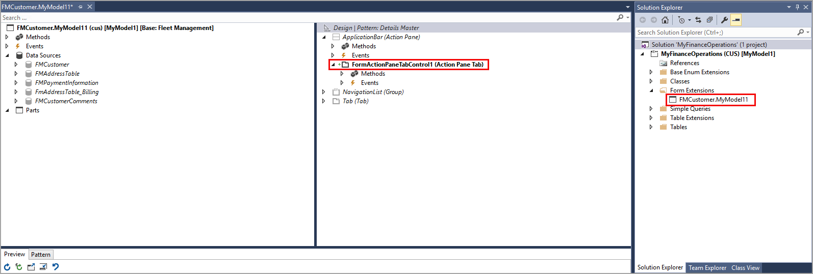

لإضافة وظيفة جديدة إلى نموذج، تحتاج إلى إنشاء ملحق لهذا النموذج. من بين الأسباب العديدة التي تدفعك إلى توسيع النموذج، يمكنك إضافة عنصر تحكم جديد أو تمكين عنصر تحكم موجود أو تعطيله أو تغيير رؤية عنصر تحكم. على سبيل المثال، يمكنك إضافة **علامة تبويب سريعة** جديدة إلى نموذج **التفاصيل الرئيسية** أو إنشاء **علامة تبويب سريعة** غير مرئية. 

يمكنك تعديل خصائص النموذج وعناصر التحكم الخاصة به، مثل **التسيمة** أو **التسمية التوضيحية** أو **نص التعليمات**. سيؤدي تعديل التسمية التوضيحية إلى تغيير صياغة الصفحة في واجهة المستخدم على شريط عنوان المتصفح. يمكنك أيضاً إضافة مصدر بيانات أو جزء من النموذج.

يمكنك توسيع نموذج لتطبيق معالجات الأحداث التي يتم استدعاؤها من عمليات التنفيذ الأساسية لأساليب النموذج. معالج الأحداث هو طريقة لكتابة التعليمات البرمجية أو نسخها إلى نموذج يتم تشغيله عند حدوث حدث معين، كما هو الحال عند تعديل البيانات. لا يمكن تحرير جميع الخصائص أو عناصر التحكم عند إنشاء ملحق نموذج. على سبيل المثال، تظهر خاصية **الاسم** بلون خافت في نافذة **الخصائص**، مما يشير إلى أنه لا يمكنك تغييرها.

لا يمكن تنفيذ بعض المهام باستخدام امتداد، على سبيل المثال، إذا كنت تحتاج إلى نمط نموذج مختلف ولا تتوفر جميع أنماط النماذج بملحق. في هذه الحالة، يمكنك إنشاء نموذج جديد، وتطبيق النمط اللازم، ثم إنشاء النموذج وفقاً لعلامة التبويب **النمط** في نافذة مصمم النموذج.

تُظهر لقطة الشاشة التالية إضافة علامة تبويب إلى جزء الإجراءات لملحق نموذج `FMCustomer`، المسمى **FMCustomer.myExtension**. كما تمت إضافة **مجموعة الأزرار** و **زر عنصر القائمة** إلى عنصر تحكم **علامة تبويب جزء الإجراءات**. تظهر العناصر الموجودة في ملحق النموذج بخط مائل، بينما يتم عرض العناصر التي تم تغييرها أو إضافتها بخط غامق.

إذا كان النموذج لا يحتوي على مصادر البيانات أو الحقول المطلوبة، يمكنك إنشاء ملحق نموذج لإجراء التعديلات اللازمة. بعد إنشاء ملحق للنموذج، أضف مصدر بيانات بنفس الطريقة التي تضيف بها مصدر بيانات إلى نموذج جديد. اعتماداً على نمط النموذج المستخدم، يمكنك استخدام الحقول في الجدول الجديد أو كيان البيانات لملء عنصر تحكم **الشبكة**.

اتبع هذه الخطوات لإنشاء ملحق نموذج وإضافة مصدر بيانات جديد:

1.  حدد موقع النموذج الذي تريد توسيعه في نافذة **مستكشف التطبيقات** بواسطة توسيع **AOT > واجهة المستخدم > النماذج**.
2.  انقر بزر الماوس الأيمن فوق وحدد **إنشاء ملحق**. إذا ظهر هذا الخيار معتماً، فستحتاج إلى تعيين مشروعك للإشارة إلى النموذج الذي يحتوي على هذا النموذج.
3.  في نافذة **مستكشف الحلول**، انقر بزر الماوس الأيمن فوق ملحق النموذج وحدد **إعادة تسمية**. أضف لاحقة خاصة بالشركة، مثل `.myExtension` أو `.abcExtension`.
4.  في نافذة **مستكشف الحلول**، انقر بزر الماوس الأيمن فوق ملحق النموذج وحدد **فتح**.
5.  في نافذة **مستكشف التطبيقات**، قم بتوسيع **AOT > نموذج البيانات > الجداول**.
6.  حدد واسحب الجدول المطلوب من قائمة **الجداول** إلى عقدة **مصادر البيانات** من النموذج.
7.  بدلا من ذلك، يمكنك تحديد جدول من المشروع في نافذة **مستكشف الحلول** وسحبه إلى عقدة **مصادر البيانات** في النموذج.
8.  الآن بعد أن تمت إضافة مصدر البيانات الجديد، يمكنك توسيع عقدة الجدول وتوسيع عقدة **الحقول** داخلها لتحديد وسحب الحقول إلى عنصر تحكم **الشبكة** في جزء التصميم.
