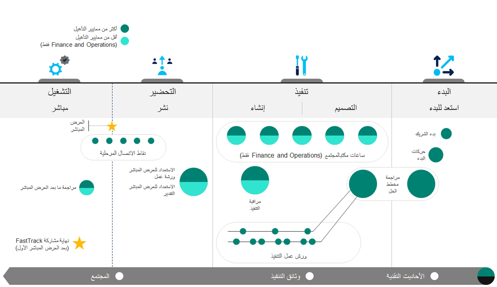

يمثل Microsoft FastTrack لـ Finance and Operations برنامجاً مخصصاً لنجاح العملاء يساعدك في الانتقال إلى Dynamics 365 بطريقة واثقة وسلسة، بما في ذلك Finance and Operations، بحيث تتمكن من تحقيق قيمة الأعمال بشكل أسرع.Microsoft FastTrack for Finance and Operations  is a customer success program that helps you move smoothly and confidently to Dynamics 365, including Finance and Operations, so that you can realize business value faster.

عند المشاركة في برنامج FastTrack، ستتلقى إرشادات لتنفيذ أفضل الممارسات وكيفية التخطيط لإجراء عمليات طرح ناجحة وتوسيع نطاق الإمكانات.When participating in the FastTrack program, you receive guidance for implementing best practices, planning for successful rollouts, and expanding capabilities. ومع ذلك، يمكنك التنفيذ بالوتيرة التي تناسبك.However, you can implement at your own pace. وتمتلك أيضاً حق الوصول إلى مهندسي حلول Microsoft الملتزمين بإنجاح تجربتك في استخدام Finance and Operations.You also have access to Microsoft Solution Architects who are committed to making your experience with Finance and Operations a success.

يحتوي برنامج FastTrack علي مستويين مختلفين من مستويات الخدمة.The FastTrack program contains two different service levels. إذا لم تكن علي دراية ببرنامج FastTrack، فانتقل إلى [Microsoft FastTrack](https://docs.microsoft.com/dynamics365/fin-ops-core/fin-ops/get-started/fasttrack-dynamics-365-overview/?azure-portal=true).If you aren't familiar with FastTrack, go to [Microsoft FastTrack](https://docs.microsoft.com/dynamics365/fin-ops-core/fin-ops/get-started/fasttrack-dynamics-365-overview/?azure-portal=true).

فيما يلي الأهداف الرئيسية لبرنامج FastTrack:The FastTrack program’s main goals are to: 

-   تقليل الوقت للاستخدام للمساعدة في تقليل تأخيرات المشاريع والوقت اللازم لتقديم القيمة بلا داعٍ.Reduce time to usage to help minimize needless project delays and time to value.
-   تعزيز الاستخدام والاعتماد للمساعدة في تطوير الحلول التي تلبي احتياجات الأعمال على النحو الأفضل وتعمل على النحو الأمثل.Drive use and adoption to help with the development of solutions that best meet business needs and function optimally. 
-   توفير رضا العملاء بشكل عام.Provide overall customer satisfaction.

الجهات المشتركة في تطبيق Dynamics 365 هي العملاء والشركاء وشركة Microsoft، حيث تلعب كلها أدواراً ومسؤوليات مختلفة:The parties that are involved in a Dynamics 365 implementation are customers, partners, and Microsoft, all of which play different roles and responsibilities: 

-   **العميل** - يشرف على إدارة المشاريع والبرامج الشاملة، وهو الذي يضع المتطلبات التي تلبي رؤية البرنامج وأهدافه.**Customer** - Oversees the overall program and project management, who makes the requirements that meet the program vision and objectives. يدير العميل الموارد والوثائق ومشروعات التنفيذ في Lifecycle Services‏ (LCS).The customer manages resources, documentation, and implementation projects in Lifecycle Services (LCS). 
-   **الشريك** - ينفّذ أنشطة التنفيذ بما في ذلك تحليل المتطلبات وتصميم الحلول والوثائق والتطوير والتكوين والإعداد.**Partner** - Carries out the implementation activities including requirement analysis, solution design, documentation, development, configuration, and setup. ويوفر الشريك دعماً من المستوى الأول.The partner provides first-level support. 
-   **Microsoft** - توفر إرشادات معمارية وتقنية وموارد عامة لإرشاد أعمق حول ممارسات التنفيذ وخرائط طريق التطبيق.**Microsoft** - Provides architectural and technical guidance, public resources for deeper guidance on implementation practices, and application roadmaps. 

## كيفية مشاركة FastTrackHow FastTrack engages 
يشارك FastTrack بنسبة 100 في المائة من مشاريع Finance and Operations منذ اللحظة التي يشتري فيها العميل الاشتراك بحد أدنى 20 ترخيص جهاز من متطلبات الترخيص ويقوم بإعداد مشروع Lifecycle Services‏ (LCS) الخاص به.FastTrack engages for 100 percent of the Finance and Operations projects from the moment that a customer purchases the subscription with a 20-seat minimum license requirement and sets up their Lifecycle Services (LCS) project. هدف FastTrack هو المشاركة مبكراً في العملية للمساعدة في تحديد التوقعات وإعلام التخطيط لجعل العميل يبدأ بداية جيدة.The FastTrack goal is to engage early in the process to help set expectations and to inform the planning to get the customer off to a good start.

يخدم FastTrack جميع عمليات التنفيذ من خلال خدمات ذات مستويين لبرنامج Finance and Operations FastTrack، بناءً على الإيرادات:FastTrack serves all the implementations through two-tiered services for the Finance and Operations FastTrack program, based on revenue: 

- إذا كان لديك إجمالي إيرادات سنوية معدلة تبلغ 300000 دولار أمريكي (USD) أو أكثر، يتم تعيين مهندس حلول Microsoft لمشروعك، والذي يدير ورش عمل متنوعة مع العميل والشريك أثناء التنفيذ.If you have a combined annual adjusted revenue of 300,000 U.S. Dollars (USD) or more, a Microsoft Solution Architect is assigned to your project, who drives various workshops with the Customer and Partner during the implementation.  
- إذا كان لديك إجمالي إيرادات سنوية معدلة أقل من 300000 دولار أمريكي، فإن جميع الاتصالات مع فريق FastTrack تكون عبر البريد الإلكتروني.If you have a combined annual adjusted revenue less than 300,000 USD, all the communication with the FastTrack team is via email. 

لمعرفه المزيد حول ‏‫الأهلية لاستخدام FastTrack‬، راجع [‏‫الأهلية لاستخدام FastTrack‬](https://docs.microsoft.com/dynamics365/fin-ops-core/fin-ops/get-started/fasttrack-dynamics-365-overview/?azure-portal=true#eligibility-for-fasttrack).To learn more about FastTrack eligibility, review [Eligibility for FastTrack](https://docs.microsoft.com/dynamics365/fin-ops-core/fin-ops/get-started/fasttrack-dynamics-365-overview/?azure-portal=true#eligibility-for-fasttrack).

قد تختلف الأنشطة الموجودة على مدار المشروع، في كل مرحلة، وفقاً لمستوى الخدمة:Activities along the project, in every phase, might vary according to the service level:
-   **البدء** - خلال هذه المرحلة، سيتعين على العميل استعراض أداة إعداد المشروع في Lifecycle Services‏ (LCS)، لإكمال عملية الإعداد، مما يساعد في تعيين الحد الأدنى من الإعداد المطلوب لـ LCS لديك، وسيوفر المعلومات التي ستحتاجها لبدء مشروع التنفيذ الخاص بك.**Initiate** – During this phase, the customer will have to go through the Project Onboarding Tool in Lifecycle Services (LCS), to complete the onboarding process, which helps to set the minimum required setup of your LCS, and will provide information that you will need to start your implementation project. راجع [مساحة عمل مشروع تنفيذ LCS](https://docs.microsoft.com/dynamics365/fin-ops-core/fin-ops/imp-lifecycle/onboard/?azure-portal=true#lcs-implementation-project-workspace).See [LCS implementation project workspace](https://docs.microsoft.com/dynamics365/fin-ops-core/fin-ops/imp-lifecycle/onboard/?azure-portal=true#lcs-implementation-project-workspace).
-   **التنفيذ** – إذا كان المشروع مؤهلاً لهذه الخدمة المرتبطة بمستوى، فسينفّذ الشريك والعميل التنفيذ من خلال تصميم وإنشاء الحل معاً أثناء عقد ورش عمل متكررة مع مهندس حلول FastTrack.**Implement** – If the project is eligible for this tiered service, the partner and customer carry out the implementation by designing and building the solution together while having recurrent workshops with a FastTrack solution architect. 
-   **التحضير** - هذه المرحلة هي تحضير لأحداث العرض المباشر، حيث تكمل جميع متطلبات ما قبل العرض المباشر، وسيقوم مهندس حلول FastTrack بتقييم استعدادك لبدء العرض المباشر، استناداً إلى قائمة التحقق الخاصة بالعرض المباشر التي ترسلها.**Prepare** - This phase is preparation for the go-live events, where you complete all the pre go-live requirements, and the FastTrack Solution Architect will evaluate your go-live readiness, based on the go-live checklist that you send. 
-   **التشغيل** - عندما تكون بالفعل في العمليات المباشرة.**Operate** - When you are already in live operations. 

توضح الصورة التالية منهجي FastTrack المنطقي.The following image shows the FastTrack logical approach.

 

تتوفر لك موارد التعلم المتنوعة للاستعانة بها، والتي ستزودك بالمعلومات وتدعم الحل الخاص بك لكل موضوع من مواضيع التنفيذ الخاصة بك.Various learning resources are available for you to consult, which will provide you with information and support your solution for every topic of your implementation.

-   [الأحاديث التقنية حول [Microsoft Dynamics 365 FastTrack]](https://community.dynamics.com/365/b/techtalks?tagsToFilter=Finance%20and%20Operations/?azure-portal=true)[Microsoft Dynamics 365 FastTrack Tech Talks](https://community.dynamics.com/365/b/techtalks?tagsToFilter=Finance%20and%20Operations/?azure-portal=true)
-   وثائق تطبيق [Finance and Operations](https://docs.microsoft.com/dynamics365/fin-ops-core/fin-ops/?azure-portal=true).[Finance and Operations application documentation](https://docs.microsoft.com/dynamics365/fin-ops-core/fin-ops/?azure-portal=true).
-   [مدونة مجتمع Dynamics 365Dynamics 365 Community blog](https://community.dynamics.com/365/financeandoperations/f/dynamics-365-for-finance-and-operations-forum/?azure-portal=true) 
