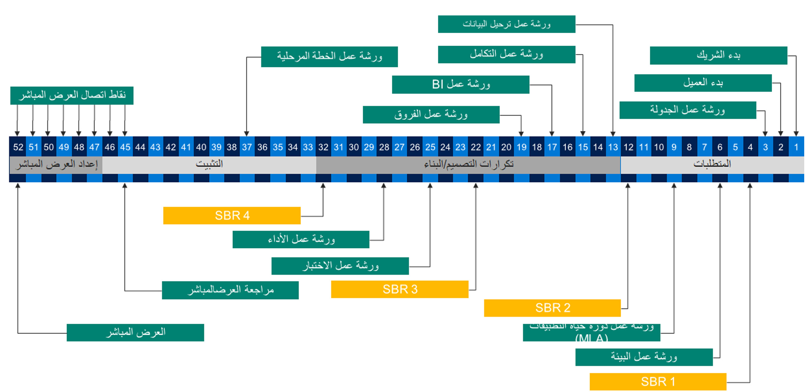

يتم إجراء مراجعة مخطط الحل بواسطة مهندس الحلول في Microsoft الذي تم تعيينه للمشروع. يتم إجراء هذه المراجعة من خلال ورشة عمل، حيث يتم وصف تفاصيل العمليات التجارية ومتطلبات النظام، والتي سيقدم مهندس الحلول توصيات وإجراءات مقترحة للتنفيذ الأكثر كفاءة. تتم جدولة ورش العمل بشكل دوري أثناء التنفيذ، مما سيساعد المؤسسات فيما يلي: 

-   ضمان نتائج العميل. 
-   تحديد المخاطر.
-   تشجيع التواصل المبكر. 
-   ضمان فهم العميل. 
-   تحديد المواضع التي يمكن لـ Microsoft الإفادة بها.

## مخطط بنية حل السحابة 
تعمل أنواع متعددة من البنى على تشكيل مخطط بنية الحلول السحابية الكاملة. تتكوّن كل بنية من عناصر رئيسية مختلفة يجب مراجعتها خلال ورش العمل هذه.

-   **بنية العمليات** - إدارة النطاق، وتحليل الأعمال، وإدارة الملاءمة والفجوات والمتطلبات، وإدارة الاختبار، والتدريب 
-   **بنية التطبيقات** - مكونات Microsoft والشركاء والعملاء 
-   **بنية البيانات** - الكيانات، والتدفقات، واستراتيجية الترحيل / الترقية، واستراتيجية الصيانة، وتغيير الحجم 
-   **بنية التكامل** - كتالوج التكامل، وتصميم الواجهة، وتصميم البرنامج الوسيط، والتصميم التشغيلي 
-   **بنية المعلومات** - العملية التحليلية، والاستعلام، والتنبيه، والتشغيل التلقائي 
-   **بنية الأمان** - المصادقة، والتحكم بالوصول، والشبكة، والتشفير 
-   **بنية التحديث المستمر** - إدارة دورة حياة التطبيق (ALM)، واستراتيجية البيئة، وتصميم اختبار التراجع، والتصميم التنظيمي 
-   **بنية النظام الأساسي** - استراتيجية المثيل، والأداء، واستمرارية الأعمال، ونموذج التوزيع 
-   **الجدول الزمني/النهج** - إدارة المتطلبات، ومنهجية الاختبار، ونموذج المشاركة في الأعمال، وإدارة التغيير / خطة الطرح، وفحوصات السلامة المجدولة 

## عند حدوث مراجعات المخطط
يعرض الرسم التخطيطي التالي نموذج مشاركة مألوفاً مع فريق FastTrack وتنفيذ المراجعة. عندما لا يتفاعل المشروع مع مهندس FastTrack المخصص، نوصيك بمراعاة نقاط التحقق هذه كجزء من التخطيط بين الشريك والعميل. 

