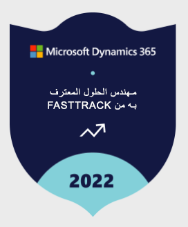

يمنح الفريق الهندسي Dynamics 365 التعيين **مهندس الحلول المعترف به من FASTTRACK‬** لمهندسي حلول المؤسسات الذين يظهرون باستمرار خبرة هندسية عميقة ويقومون بإنشاء حلولاً عالية الجودة للعملاء أثناء التفاعلات التي تحكم Dynamics 365 FastTrack. إنهم يعملون عادةً مع شركاء تكامل الأنظمة، الذين قد يرشحون مهندسي الحلول للتعرف على خبراتهم.

> [!div class="mx-imgBorder"]
> 

لمزيد من المعلومات حول عملية الترشيح، راجع  [ترشيح مهندس الحلول المعترف به من Microsoft FastTrack – Dynamics 365](https://dynamics.microsoft.com/en-us/fasttrack/recognized-solution-architects/nomination/dynamics/?azure-portal=true) الرجاء زيارة: مهندس الحلول المعترف به من FastTrack | Microsoft Dynamics365
