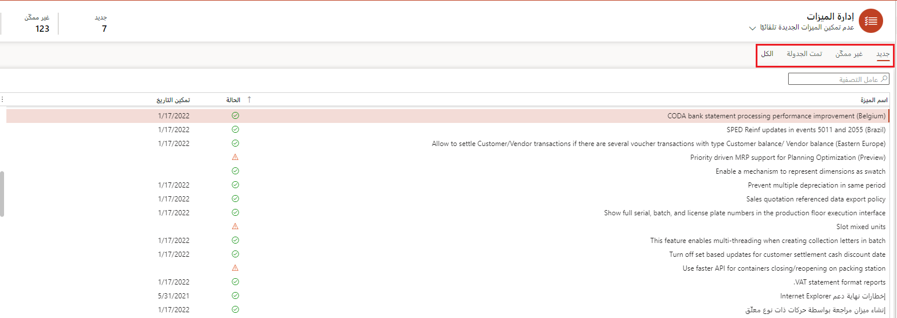

يمكنك فتح مساحة العمل **إدارة الميزات** عن طريق تحديد المربع المناسب على لوحة المعلومات. سيتم عرض صفحة توضح قائمة بالميزات لجميع الإصدارات التي تدعمها تجربة إدارة الميزات. 

تتضمن قائمة الميزات المعلومات التالية:

- **اسم الميزة** – وصف للميزة التي تمت إضافتها.
- **الحالة** – يشير الرمز إلى ما إذا كانت الميزة قيد التشغيل (علامة اختيار)، أو متوقفة عن التشغيل (فارغة)، أو مجدولة للتشغيل (الساعة)، أو إلزامية (قفل)، تتطلب الانتباه قبل أن تقوم بتشغيلها (رمز تحذير)، أو لا يمكن تشغيلها (X). يتم استخدام الإعداد لجميع الكيانات القانونية. وعند تشغيل الميزة، فإنها تظل تحت سيطرة الأمان. لذلك، ستكون الميزة متاحة فقط للمستخدمين الذين يمكنهم الوصول إليها بناءً على دورهم الأمني. كما سيتاح فقط في الكيانات القانونية التي يمتلك المستخدم حق الوصول إليها.
- **تاريخ التمكين** – التاريخ الذي تم فيه تشغيل الميزة أو جدولتها للتشغيل.
- **تمت إضافة الميزة** – التاريخ الذي تمت فيه إضافة الميزة إلى بيئتك. يتم إدخال هذا التاريخ تلقائياً عندما تقوم بتحديث بيئتك أثناء دورات الإصدار الشهرية.
- **حالة الميزة** – حالة دورة الحياة الحالية للميزة: **إصدار أولي**، و **تم إطلاقها** (تظهر فارغة)، و **قيد التشغيل بواسطة الافتراضي**، و **إلزامي**. تتم تغطية الحالات بمزيد من التفاصيل لاحقًا في هذا الموضوع. 
- **الوحدة النمطية** – الوحدة التي تتأثر بالميزة الجديدة.

عند تحديد ميزة، تظهر المزيد من المعلومات في جزء التفاصيل على يمين قائمة الميزات. يعرض الجزء العلوي من الجزء اسم الميزة، وتاريخ إضافة الميزة، والوحدة النمطية المتأثرة بالميزة، ورابط **معرفة المزيد**. حدد هذا الرابط لعرض وثائق الميزة. في حالة عدم توفر الوثائق، يتم توجيهك إلى صفحة مؤقتة. يتضمن جزء التفاصيل أيضًا حقل **التعليقات** حيث يمكنك إضافة تعليقاتك الخاصة حول الميزة.

تحتوي مساحة عمل **إدارة الميزات** أيضًا على عدة علامات تبويب، تعرض كل واحدة منها قائمة بالميزات:

- **جديد** – تعرض علامة التبويب هذه جميع الميزات التي تمت إضافتها منذ التحديث الشهري الأخير. إذا كنت قد تخطيت أي تحديثات شهرية، فستُظهر علامة التبويب جميع الميزات الجديدة التي تمت إضافتها منذ آخر مرة قمت فيها بالتحديث. تظهر أحدث الميزات أعلى القائمة. يتم عرض إجمالي عدد الميزات الجديدة أيضاً على الإطار المتجانب بأعلى الصفحة.
- **غير ممكّن** – تعرض علامة التبويب هذه جميع الميزات التي لم يتم تشغيلها. تظهر أحدث الميزات أعلى القائمة. بالإضافة إلى ذلك، يعرض الإطار المتجانب في أعلى الصفحة العدد الإجمالي للميزات الجديدة التي تم إيقاف تشغيلها حالياً.
- **مجدول** – تعرض علامة التبويب هذه جميع الميزات التي تمت جدولتها للتشغيل في المستقبل. تظهر الميزات التي لها أقرب تاريخ مجدول في أعلى القائمة. بالإضافة إلى ذلك، يعرض مربع في أعلى الصفحة العدد الإجمالي للميزات المجدولة.
- **الكل** – تعرض علامة التبويب هذه جميع الميزات. تظهر أحدث الميزات أعلى القائمة.

> [!div class="mx-imgBorder"]
> 
