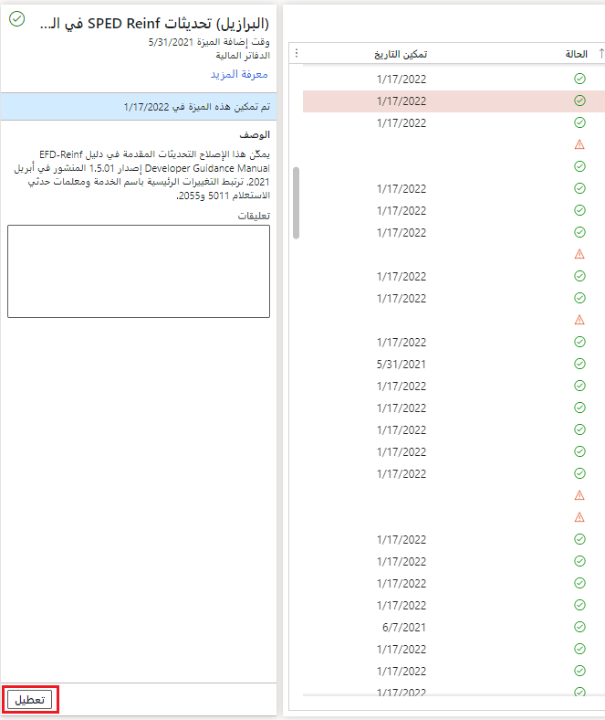

إذا تم تمكين الميزة، فسيظهر زر **تعطيل** في جزء "التفاصيل". يمكنك استخدام هذا الزر لتعطيل الميزة. لا يتوفر الزر **تعطيل** في حالة عدم وجود إمكانية تعطيل الميزة. 

بعد تعطيل الميزة، ستظهر رسالة أسفل رابط **معرفة المزيد** في جزء "التفاصيل". تشير هذه الرسالة إلى أنه لم يتم تمكين الميزة، وستظهر عندما تحدد الميزة في قائمة الميزات. ستظهر الميزات التي لم يتم تمكينها في علامة التبويب **لم يتم تمكينها**.

> [!div class="mx-imgBorder"]
> 
