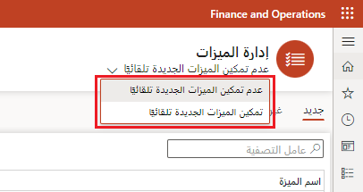

يمكنك تمكين جميع الميزات عن طريق تحديد زر **تمكين الكل**. 

عند تحديد **تمكين الكل**، سيظهر خيارًا يجب عليك فيه تقديم المعلومات الآتية:

- قائمة بجميع الميزات التي تتطلب التأكيد قبل التمكن من تمكينها. إذا كنت تريد تمكين الميزات الموجودة في القائمة، فحدد **نعم** للزر **تمكين الميزات التي تتطلب التأكيد**.
- سيتم عرض قائمة بجميع الميزات التي لا يمكن تمكينها. لن يتم تمكين هذه الميزات.

سيتم تمكين جميع الميزات التي يمكن تمكينها. إذا تمت جدولة ميزة بالفعل ليتم تمكينها في المستقبل، فلن يتغير الجدول. 

## قم بتمكين جميع الميزات تلقائياً

إذا كنت تريد تمكين جميع الميزات الجديدة تلقائيًا، فيمكنك استخدام القائمة المنسدلة أسفل عنوان مساحة العمل لتغيير ما يحدث عند إضافة ميزات جديدة.

- حدد **تمكين الميزات الجديدة تلقائياً** لتمكين جميع الميزات الجديدة تلقائياً عند إضافتها إلى بيئتك.
- حدد **عدم تمكين الميزات الجديدة تلقائيًا** إذا كان يجب إيقاف تشغيل جميع الميزات الجديدة القابلة للتطبيق افتراضيًا عند إضافتها إلى بيئتك.

> [!div class="mx-imgBorder"]
> 

عندما تقوم بتمكين جميع الميزات تلقائيًا، فسيتم تمكين جميع الميزات التي سيتم تمكينها عند تحديد الزر **تمكين الكل**. لن يتم تمكين الميزات التي تتطلب التأكيد أو الميزات التي لا يمكن تمكينها حتى يتم اتخاذ إجراء.
