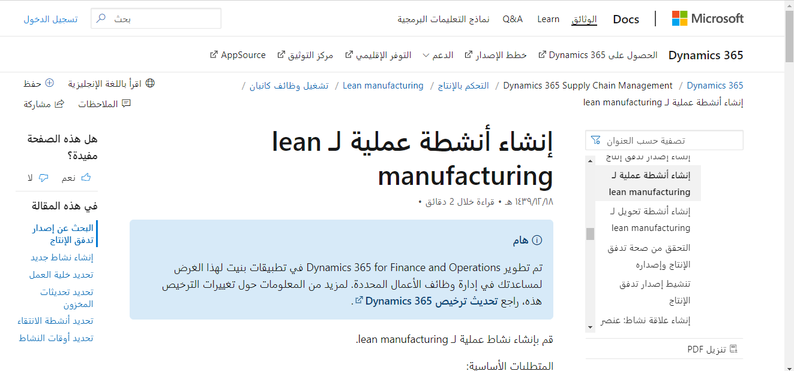

تُعد [وثائق تطبيق التمويل والعمليات](/dynamics365/fin-ops-core/fin-ops/?azure-portal=true) في Microsoft Learn هو المصدر الأساسي لمساعدة المنتج لتطبيقات التمويل والعمليات.

يوفر Microsoft Learn:

- مجموعة غنية من موضوعات تعليمات المنتجات التي يمكن تحسينها بواسطة أعضاء المجتمع داخل Microsoft وخارجها.
- طريقة سريعة للوصول إلى أنواع مختلفة من المحتوى حول النظام، بما في ذلك الموضوعات ومقاطع الفيديو.

موقع ويب Microsoft Learn عام تماماً، ولا يتطلب تسجيل الدخول البحث عنه. يمكنك استخدام محرك البحث المفضل للبحث عن المحتوى.

في ما يلي مثال لمقالة Microsoft Learn حول lean manufacturing:

إذا كان لديك اقتراح حول الوثائق، فنحن نرحب بك لتسجيل الدخول لترك تعليقات لنا. يمكنك حتى تحرير الوثائق بنفسك.

للمساهمة بالمحتوى أو اقتراح تغيير، ستحتاج إلى حساب GitHub، وستحتاج أيضاً إلى توقيع اتفاقية ترخيص المساهم. بعد إرسال التغييرات المقترحة، ستتم مراجعتها.

شاهد هذا الفيديو لمعرفة كيفية المساهمة في وثائق Dynamics 365 الخاصة بنا.

> [!VIDEO https://www.microsoft.com/videoplayer/embed/RE36liB]

لمزيد من المعلومات، راجع [نظام التعليمات](/dynamics365/fin-ops-core/fin-ops/get-started/help-overview/?azure-portal=true).
