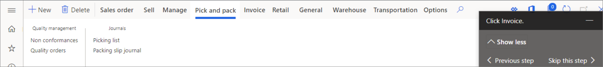

يمكنك رؤية أوصاف الحقول في واجهة المستخدم (UI).You can see field descriptions in the user interface (UI). بالإضافة إلى ذلك، من جزء **التعليمات**، يمكنك الوصول إلى كلا الموضوعين في موقع المستندات ودلائل المهام.Additionally, from the **Help** pane, you can access both topics on the Docs site and task guides.

## عرض أوصاف الحقول وتصديرهاView and export field descriptions

يمكنك عرض أوصاف الحقول في واجهة المستخدم بالمرور فوق أحد الحقول.You can view field descriptions in the UI by hovering over a field. يمكنك أيضاً استخدام صفحة **أوصاف الحقل** لعرض أوصاف الحقول وتصديرها لصفحة محددة.You can also use the **Field descriptions** page to view and export field descriptions for a specific page.

لمزيد من المعلومات، راجع [عرض أوصاف الحقول وتصديرها](https://docs.microsoft.com/dynamics365/fin-ops-core/fin-ops/get-started/view-export-field-descriptions/?azure-portal=true).For more information, see [View and export field descriptions](https://docs.microsoft.com/dynamics365/fin-ops-core/fin-ops/get-started/view-export-field-descriptions/?azure-portal=true).

## الوصول إلى الموضوعات في موقع المستنداتAccess topics on the Docs site

لفتح جزء **التعليمات** في تطبيقات Finance and Operations، يمكنك إما تحديد زر **التعليمات** (**؟**) ثمّ تحديد **التعليمات**، أو الضغط على Ctrl+Shift+?‎.To open the **Help** pane in Finance and Operations apps, you can either select the **Help** button (**?**) and then select **Help**, or press Ctrl+Shift+?. من جزء **التعليمات** يمكنك الوصول إلى كلا الموضوعين في موقع المستندات ودلائل المهام.From the **Help** pane, you can access both topics on the Docs site and task guides.

عندما تقوم بفتح جزء **التعليمات** لأول مرة، تعرض علامة التبويب **التعليمات** قائمة بالموضوعات التي تنطبق على الصفحة التي تقوم بتشغيلها حالياً في تطبيقات Finance and Operations.When you first open the **Help** pane, the **Help** tab shows a list of the topics that apply to the page that you're currently on in Finance and Operations apps. إذا لم يتم العثور على أي موضوعات، فيمكنك البحث عن المحتوى الذى يثير اهتمامك.If no topics are found, you can search for the content that interests you.

عند تحديد عنوان موضوع في جزء **التعليمات**، يتم فتح الموضوع في علامة تبويب مستعرض جديدة.When you select a topic title in the **Help** pane, the topic is opened on a new browser tab.

## الوصول إلى دلائل المهامAccess task guides

يُعد **دليل المهام** تجربة تفاعلية خاضعة للرقابة ومُوجهة تقودك خلال خطوات مهمة أو عملية تجارية.A **task guide** is a controlled, guided, interactive experience that leads you through the steps of a task or business process. يمكنك فتح أدلة المهام وتشغيلها من جزء **التعليمات**.You can open and play task guides from the **Help** pane.

افتح جزء **التعليمات** وحدد علامة التبويب **دلائل المهام**. وسترى قائمة بدلائل المهام التي تنطبق على الصفحة التي تتصفحها حالياً في تطبيقات Finance and Operations.Open the **Help** pane, and select the **Task Guides** tab. You'll see a list of task guides that apply to the page that you're currently on in Finance and Operations apps. إذا لم يتم العثور على دلائل مهام، يمكنك إدخال كلمات أساسية لتحسين البحث.If no task guides are found, you can enter keywords to refine your search.

إذا كنت لا ترى أي دلائل مهام، فقد تحتاج إلى مطالبة مسؤول النظام بإعداد نظام التعليمات لمؤسستك.If you don't see any task guides, you might need to ask a system admin to set up the Help system for your organization.

عند تحديد دليل مهام لأول مرة، سيعرض جزء **التعليمات** الإرشادات خطوة بخطوة للمهمة.When you first select a task guide, the **Help** pane shows the step-by-step instructions for the task. لبدء التجربة التفاعلية الموجهة، يمكنك تحديد **بدء دليل المهام** في الجزء السفلي من جزء **التعليمات**.To begin the guided, interactive experience, select **Start task guide** at the bottom of the **Help** pane. يظهر مؤشر باللون الأسود ويشير إلى الإجراءات التي يجب تنفيذها.A black pointer appears and indicates the actions that you must perform. اتبع الإرشادات التي تظهر في واجهة المستخدم، وأدخل البيانات حسب التوجيهات.Follow the directions that appear in the UI, and enter data as directed.

توضح لقطة الشاشة التالية كيف يشير دليل المهام إلى ما يلي في إجراء.The following screenshot shows how the task guide points out what to do next in a procedure.

> [!NOTE]
> تكون البيانات التي تقوم بإدخالها عند تشغيل دليل مهام حقيقية.The data that you enter when you play a task guide is real. إذا كنت في بيئة تشغيل، سيتم إدخال البيانات في الشركة التي تستخدمها حالياً.If you're in a production environment, the data will be entered in the company that you're currently using.
 
